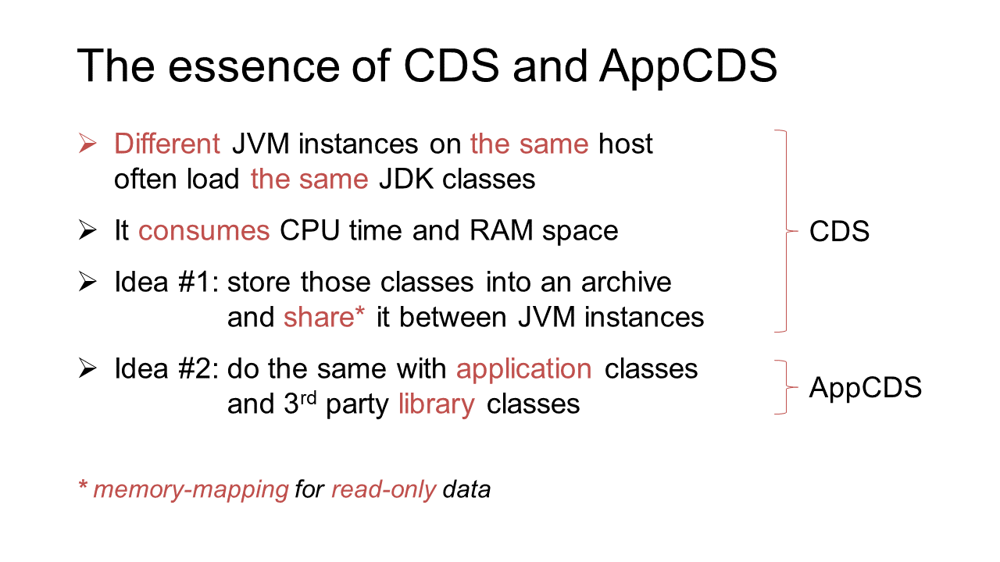
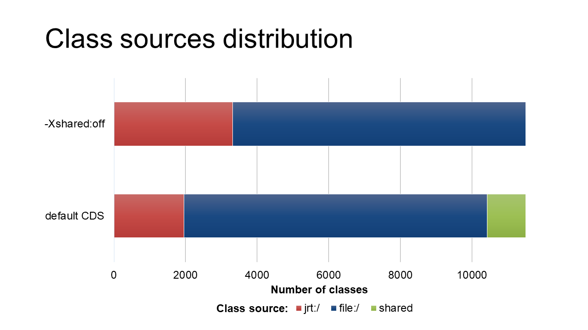
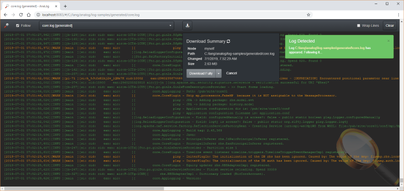
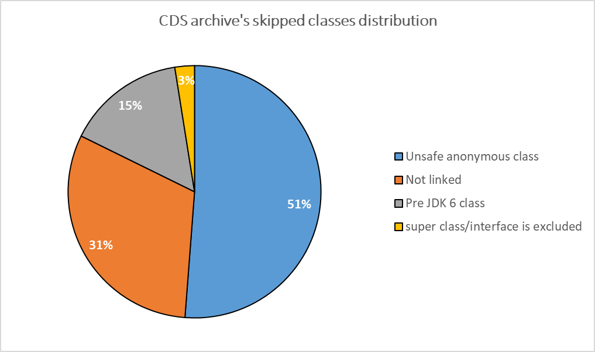
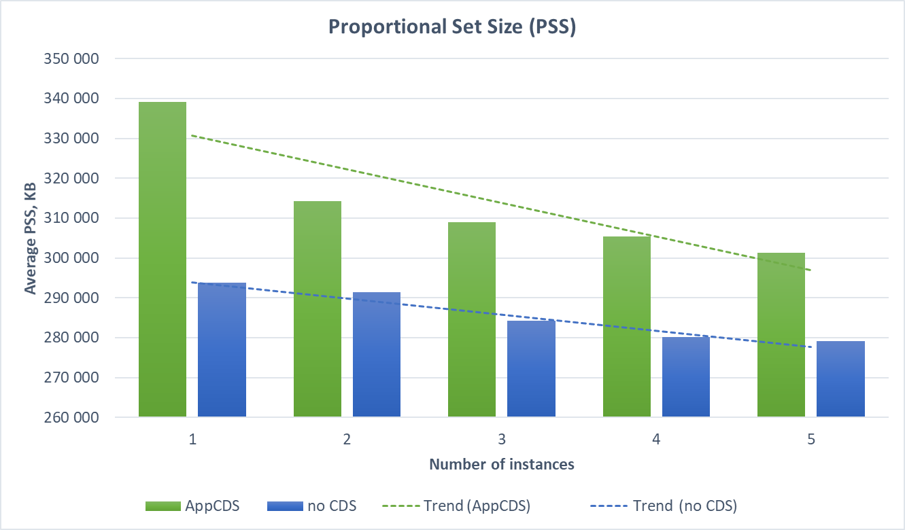
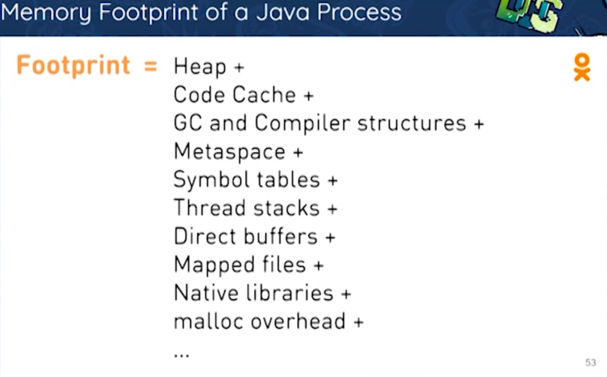
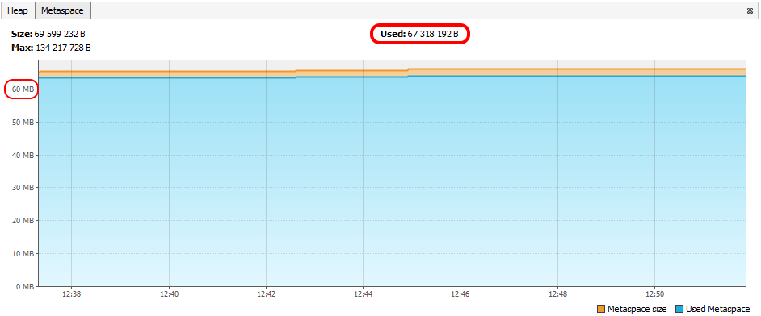
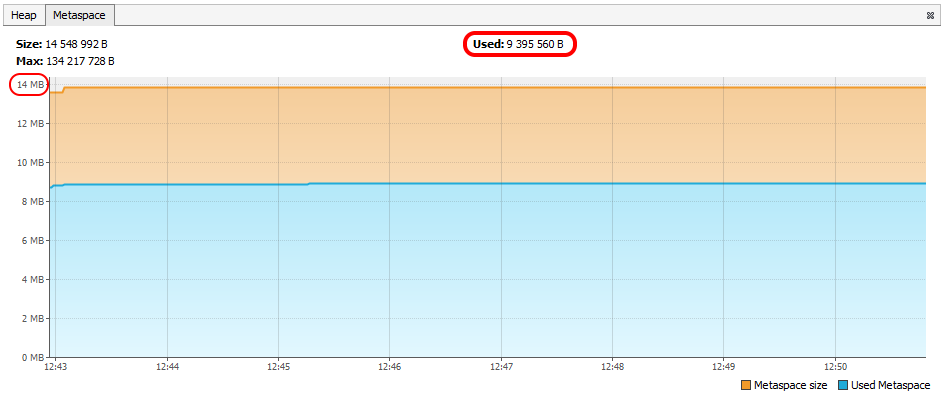

**Application Class Data Sharing (AppCDS)** is a JVM feature for startup acceleration and memory saving. [Originated](https://docs.oracle.com/javase/1.5.0/docs/guide/vm/class-data-sharing.html) from HotSpot of JDK 1.5 (back in 2004), it had been [staying](https://simonis.github.io/JBreak2018/CDS/cds.xhtml#/3) quite limited and partly commercial for a long time. But in OpenJDK 10 (2018), it became widely available and significantly more applicable. Moreover, recently [released](https://www.azul.com/jdk-13-81-new-features-and-apis/) Java 13 made the feature application even more simple.

The idea behind AppCDS is to “share” once loaded classes between JVM instances on the same host. It seems that it should be fit for microservices, especially for Spring Boot “broilers” that have thousands of library classes, because the JVM would not need to load (parse and verify) those classes on every start of every instance, and those classes would not duplicate in memory. Consequently, the startup should become faster and memory footprint should be smaller. Sounds great, doesn’t it?

That’s right. But if you're used to not believing street banners but checked facts and measures, then welcome aboard! Let’s find out what it’s like truly…

---

&nbsp;

{}

## Instead of disclaimer

This article is not a tutorial on AppCDS usage, but a result of personal research. I was interested in the usage of this JVM feature for my job project, and I tried to evaluate it from the enterprise developer’s point of view. The results were collected into this article. Note that I did not cover here such topics as using AppCDS on module path, CDS implementation in JVMs other than HotSpot, or tricks for using the feature in containers. Instead, I’ve provided the article with a theoretical introduction to the topic as well as a practical part, written in a way that you can repeat it yourself. None of the gained results have been used in my production environment yet, but who knows what tomorrow will bring us?

&nbsp;

## Theory

### A short intro to AppCDS

You might have already met the basics of AppCDS in some sources; for example:

* Nicolai Parlog’s [article](https://blog.codefx.org/java/application-class-data-sharing/) (with Java 13 new features, but without Spring Boot)
* Volker Simonis’ [talk](https://www.youtube.com/watch?v=erK5r8xpoAQ) and [article](https://simonis.github.io/cl4cds/) (without Java 13, but with more details) and
* my [talk](https://youtu.be/fmLW7VkSuN8?t=2499) (without Java 13, but with Spring Boot, in Russian).

To avoid retelling these sources, I’d like to highlight several important things only.

First, AppCDS is just an extension of a long-lived HotSpot feature called CDS:



In general, to implement these ideas, we should take the following steps:

1. Obtain a list of classes that we want to share between application instances
1. Store the classes into an archive suitable for memory mapping
1. Attach the archive to every application instance on its startup

At first glance, it seems quite easy – just 3 simple steps! But here we get some nuances. The negative one is that every single step may turn into at least one JVM launch with its specific options (in the worst case). As a result, the whole algorithm may look like a skillful juggling with tricky options and files. On the other hand, the algorithm is [constantly improved](https://bugs.openjdk.java.net/browse/JDK-8230168?jql=project%20%3D%20JDK%20AND%20issuetype%20in%20(Enhancement%2C%20JEP)%20AND%20labels%20in%20(appcds%2C%20cds)%20ORDER%20BY%20cf%5B11003%5D%20ASC) and each new Java release makes it easier to use. For instance:

* In OpenJDK 10 and 11 you can **omit step #1** if you want to share just default JDK classes because the list of them is already composed and provided as `$JAVA_HOME\lib\classlist` (&approx;1200 classes).
* In OpenJDK 12 you can **omit step #2** for the same purpose because JDK distribution [included](https://bugs.openjdk.java.net/browse/JDK-8204247) a ready-to-use archive (which is used by default, “out of the box”).
* In case you want to share everything else (usually that’s the case), OpenJDK 13 [provides](https://openjdk.java.net/jeps/350) Dynamic CDS Archives. The classes for these archives are being collected during application runtime and the archives are saved on JVM shutdown. It allows the **merging of steps #1 and #2** into a single, quite simple, step (though it’s not always so simple and we’ll talk about it later).

Thus, whatever AppCDS preparation looks like, it is always based on the aforementioned 3 steps, but in some cases, the steps are hidden.

As you might have noticed, with AppCDS, many application classes begin to live a double life: they are both in their former places (usually JAR files) and in the new shared archive. However, a developer keeps changing/removing/appending the classes in their former place, while JVM takes them from the new one. You don’t need to be a diviner to see the danger of the situation: If it stays the same, then sooner or later the copies of the classes would mismatch and you’d get into many issues of typical “JAR hell.” Obviously, the JVM cannot prevent classes changing at all, but it should be able to detect the mismatch at the proper time. However, the detection shouldn’t be done by pairwise comparison of classes (even by their checksum) because it can eliminate all the performance profit. Perhaps the latter became the reason why JVM engineers [decided](https://docs.oracle.com/en/java/javase/13/docs/specs/man/java.html#creating-a-shared-archive-file-and-using-it-to-run-an-application) to compare not separate classes but the entire classpath:

> Note that the classpath used at archive creation time must be the same as (or a prefix of) the classpath used at run time.

But this is quite an ambiguous statement because classpath may be formed in several different ways; for instance:

* by loading “raw” `.class`-files from directories with compiled packages,  
  e.g. `java com.example.Main`
* by scanning directories with JAR files when a wildcard is used,  
  e.g. `java -cp mydir/* com.example.Main`
* by explicit listing of JAR and/or ZIP files,  
  e.g. `java -cp lib1.jar;lib2.jar com.example.Main`

(This doesn’t account that classpath can be set in many ways as well; for example, with `-cp/-classpath/--class-path` JVM options, with `CLASSPATH` environment variable or with `Class-Path` attribute of the executable JAR file.)

Among these ways, the only one that is supported by AppCDS is the explicit listing of JAR files. Apparently, HotSpot JVM engineers considered that the comparison of classpaths between AppCDS archive and the application would be fast and reliable enough only if those classpaths are set as clearly [as possible](https://bugs.openjdk.java.net/browse/JDK-8211723) – in the form of a plain list:

> CDS/AppCDS supports archiving classes from JAR files only.

It should be stressed that this statement is not recursive, i.e. it doesn’t extend to JAR files inside other JAR files (except some Dynamic CDS cases; see below). It means that our usual Spring Boot “fat” JARs will not work with ordinary AppCDS out of the box; it should be crafted.

One more caveat about CDS/AppCDS is that shared archives are mapped into memory at fixed addresses (usually starting with `0x80000000`). This may be a problem because most of operating systems use Address Space Layout Randomization (ASLR) so that a memory range required by JVM may be already partly occupied. What the JVM should do in such situation (as well as how to work with CDS in general) is controlled with `-Xshare` option which offers 3 values:

* `-Xshare:on` – Turns on CDS/AppCDS forcibly. If the required address range is already occupied, the JVM exits with an error. This mode is **not recommended for use in production** because it can cause unpredictable startup failures.
* `-Xshare:off` – Turns off CDS/AppCDS fully. Disables any usage of shared archives (including built-in ones).
* `-Xshare:auto` – Default mode: If the required address range cannot be allocated, the JVM gives up and loads classes as usual (like `-Xshare:off` does).

On the day this article is being written (Nov 10, 2019), Oracle has been [working](https://bugs.openjdk.java.net/browse/JDK-8231610) on smoothing that problem. However, the release number is not assigned yet.

We’ll use the aforementioned option a little later, but now let’s look at…

### AppCDS use cases

There are several ways in which AppCDS can ~~spoil your life~~ optimize your microservices’ performance. The ways vary in complexity and potential profit, so  it is important to state which one will be examined further.

The easiest way is to not even use AppCDS, but use pure CDS, i.e. make the shared archive include platform classes only (see [Intro](#a-short-intro-to-appcds)). We reject this use case right away because being applied to Spring Boot microservices, it gives skimpy profit. You can see it in the size of shared classes part (green segment) among overall classes distribution of a real microservice:



Quite more complicated, yet promising, is the usage of full-featured AppCDS, i.e. including both library and application classes into the same shared archive. This is actually a family of use cases derived from combinations of the number of participating applications and the number of their instances. The following is my own estimations of profit and complexity of various AppCDS use cases:

| #     | Applications | Instances    | CPU profit | RAM profit | Complexity |
| ----- | ------------ | ------------ | ---------- | ---------- | ---------- |
| 1     | One          | Single       | 👍          | 👎          | 🔹 Low      |
| **2** | **One**      | **Multiple** | 👍👍         | 👍👍         | 🔹 **Low**  |
| 3     | Several      | Single       | 👍👍         | 👍👍         | 🔶 High     |
| 4     | Several      | Multiple     | 👍👍👍        | 👍👍👍        | 🔶 High     |

Take note:

* In the “one-to-single” use case (see #1) the CPU profit may appear close to zero or even negative (particularly when measuring [in Windows](https://docs.oracle.com/en/java/javase/12/vm/class-data-sharing.html#GUID-EC975B2E-B4AB-45B4-B91F-51C3A264D0CE)).
* Properly shared archive creation requires a set of actions whose complexity doesn’t depend on the number of further launched instances (compare pairs #1-2 and #3-4).
* On the other hand, the transition from a single instance to multiple ones has a positive impact on both profit values (but, again, it doesn’t affect the preparation complexity).
* The only parameter that defines the complexity is the number of distinct applications involved in the process. The main reason is that the last 2 use cases require careful detection of common parts among both classes and libraries of all of the applications.

In the practical chapter of this article, we’ll dive into **#2 use case only** (through #1) because: (1) it is simple enough to get acquainted with AppCDS and (2) it is suitable for recently released [JEP-350](http://openjdk.java.net/jeps/350) (Dynamic CDS Archives) – the one we’d like to see in action.

### Dynamic CDS Archives

JEP-350 (Dynamic CDS Archives) is one of Java 13’s new features. It’s meant to simplify the usage of AppCDS. To feel the simplification you should understand the complexity. Recall that classic “pure” algorithm of AppCDS usage consists of 3 steps: :one: obtain the list of classes to share, :two: create the shared archive from the classes and :three: run the target application with the archive attached. Among these steps, the only actually useful one is :three:. All the rest are just preparations. While the obtaining of the class list (:one:) may seem easy (in some cases it’s even unnecessary), in practice, this step often becomes most troublesome when applied to non-trivial applications, especially on Spring Boot. That’s where JEP-350 comes in. It tries to eliminate this step, or to be precise, automate it. The idea behind the feature is to make JVM compose the list of required classes itself and then create a so-called “dynamic” shared archive out of the list (automatically as well). Sounds great, doesn’t it? However, it’s not clear when to stop accumulating the classes and store them into the archive. With classic AppCDS, we could choose that moment ourselves and we could even change something in the class list before its transformation into the archive. But now, with Dynamic AppCDS, all of this happens at once and automatically. The moment for this to happen was chosen by JVM engineers, as, perhaps, the only compromise – normal JVM termination. It means that the archive would not be created until the application stops. Such an approach has a couple of important consequences:

* In case of abnormal JVM termination, the archive will not be created, whatever the class list looks like by the termination moment (and there is no way to extract it normally).
* The archive includes only those classes that were loaded during the application work session. For web applications, this means that the shared archive should not be created by means of starting and immediate stopping of the application because in this case, the archive would miss a lot of important classes. Instead, there should be at least one HTTP request to the application (but plenty of requests is better) in order to load all the really used classes.

An important difference of dynamic archives from static ones is that dynamic archives are extensions built upon base static archives. The last can be either [a part](http://openjdk.java.net/jeps/341) of Java distribution or separately created through the classic 3-step algorithm (see above).

Formally, the application of Dynamic CDS Archives involves 2 launches of JVM:

1. Trial run with `-XX:ArchiveClassesAtExit=archive.jsa` option.
   This should end up with the creation of a dynamic shared archive having the specified name (full or relative path can also be set; the file extension doesn’t matter).
1. Main run with `-XX:SharedArchiveFile=archive.jsa` option.
   Here the archive will be used.

The second option implicitly relies on base static archive whose location is supposed to be the default one for current JDK. If an alternative location is needed, it can be prepended to the option value, separated with a colon:

```bash
-XX:SharedArchiveFile=base.jsa:dynamic.jsa
```

*(use a semicolon “;” as path separator when doing it in Windows)*

&nbsp;

## Practice

### Test subject

In order to make our AppCDS practice go beyond a typical “HelloWorld” example, let’s take a real Spring Boot application. I and my colleagues often need to watch application logs from remote test servers and to do that “live”, as they are being written. Full-featured log aggregator (like ELK) is often not suitable for such cases; endless downloading of file logs is too long; staring at gray console output of `tail` utility is frustrating as well. That is why I created a web application which renders the logs in real-time right into a browser, highlights log levels (formatting XML, by the way), aggregates several logs into a single one, and does some other tricks. It’s called **AnaL&oacute;g** (derived from “analyzer of logs,” though it’s not true) and is available [on GitHub](https://github.com/Toparvion/analog).

[](images/analog-screenshot-full.png)

Technically, this is an application built upon Spring Boot and Spring Integration frameworks. Under the hood, it uses `tail`, `docker`, and `kubectl` programs to support fetching logs from files, Docker containers, and Kubernetes resources accordingly. AnaLog ships in the form of classic Spring Boot “fat” JAR file. During runtime, the application has about 10K classes in memory and most of them are Spring and JDK classes. Obviously, such classes stay unchanged most of the time so that they can be placed into a shared archive and then reused by all application instances, thus saving RAM and CPU.

### Single-instance experiment

Now let’s apply what we’ve learned early to the test subject. Because it’s easier to understand something new by comparison, we need a reference point – a program state with which we’ll compare the results of the experiment. But before, let’s outline some preconditions.

#### Preparatory notes

* All the following console commands are given as for Linux. The variations for Windows and Mac OS are not critical.
* The gained results may be significantly affected by JIT compilation, so for the sake of experiment purity, it should be disabled (with `-Xint` option like in the aforementioned [article](https://simonis.github.io/cl4cds/)). But we won’t do that to make our experiment closer to real conditions.
* The time values given below were obtained on a quite performant test server. Ordinary workstations usually show more modest results. However, we consider this difference acceptable because we are interested not in absolute values but in their changes (expressed in percent).
* To avoid preliminary diving into the complexity of shared memory measurements, we’ll omit obtaining exact values in bytes for a while. Instead, we introduce the notion of “**CDS potential**” – a percent ratio of shared classes number to the overall loaded classes number. While this is quite an abstract value, it directly affects actual memory consumption. Besides, it can be determined independently of OS and can be computed from JVM logs only.

#### Reference Point

Let the point be a state of just downloaded AnaLog application i.e. without any AppCDS. To evaluate it we need to:

1. Install OpenJDK 13 (for example Bellsoft [Liberica](https://bell-sw.com/pages/java-13/), but *not lite* version).
   It also must be included into  `PATH` and/or `JAVA_HOME` environment variables, e.g.:

   ```bash
   export JAVA_HOME=~/tools/jdk-13
   ```

1. [Download](https://github.com/Toparvion/analog/releases/tag/v0.12.1) AnaL&oacute;g (by the time of writing the latest version was v0.12.1)
   If needed, you can define your server’s external hostname in `server.address` parameter of `config/application.yaml` file (by default the name is `localhost`).

1. Enable JVM class loading logging.
   It can be done by setting the `JAVA_OPTS` environment variable:

   ```bash
   export JAVA_OPTS=-Xlog:class+load=info:file=log/class-load.log
   ```

   The `-Xlog` option will be passed to the JVM and tell it [to log](https://docs.oracle.com/en/java/javase/13/docs/specs/man/java.html#enable-logging-with-the-jvm-unified-logging-framework) the source of every class.

1. Perform a control run:

   1. Launch the application with `bin/analog` script
   1. Open http://localhost:8083 in a browser, click some buttons and checkboxes
   1. Stop the application by hitting Ctrl+C in `bin/analog` script’s console

1. Gather the results (from files of `log/` directory)

   - Total number of loaded classes (from `class-load.log` file)

     ```bash
     cat class-load.log | wc -l
     10463
     ```

   - Part of them that is loaded from the shared archive (from the same file):

     ```bash
     grep -o 'source: shared' -с class-load.log
     1146
     ```

   - Average startup time (after several launches; from `analog.log`)

     ```bash
     grep -oE '\(JVM running for .+\)' analog.log | grep -oE '[0-9]\.[0-9]+' | awk '{ total += $1; count++ } END { print total/count }'
     4.5225
     ```

     

Well, on this step the CDS potential is `1146/10463=0.1095` **&approx;11%**. You might be surprised where the shared classes came from while we didn’t enable any AppCDS. Recall that starting from version 12, the JDK [includes](http://openjdk.java.net/jeps/341) ready-to-use CDS archive `$JAVA_HOME/lib/server/classes.jsa` that is created from the equally ready class list:

```bash
cat $JAVA_HOME/lib/classlist | wc -l
1170
```

Now that we’ve estimated the initial state of the test subject (AnaLog), we can apply AppCDS to it and interpret the results by comparing them to the reference point.

#### The main test

As stated in the [documentation](https://docs.oracle.com/en/java/javase/13/docs/specs/man/java.html#dynamic-cds-archive), to create a dynamic CDS archive we need just one trial run of the application with `-XX:ArchiveClassesAtExit` JVM option. Starting from the second run, the archive should become usable and give some profit. Let’s check it on the same test subject (AnaLog):

1. Add the aforementioned option to the launch command:

   ```bash
   export JAVA_OPTS="$JAVA_OPTS -XX:ArchiveClassesAtExit=work/classes.jsa"
   ```

1. Extend the logging:

   ```bash
   export JAVA_OPTS="$JAVA_OPTS -Xlog:cds=debug:file=log/cds.log"
   ```

   This option will provide us with logs when the CDS archive creation process starts (at the application exit).

1. Perform the same control run as with the reference point:

   - Run the application with `bin/analog` script
   - Open http://localhost:8083 in a browser and click some buttons and checkboxes
   - Stop the application by hitting `Ctrl+C` in `bin/analog` script’s console.
     At this moment, there should be many `warning` log messages in the console while `log/cds.log` file should be filled with more details (but they are not interesting for us yet).

1. Switch from trial run to effective one:

   ```bash
   export JAVA_OPTS="-XX:SharedArchiveFile=work/classes.jsa -Xlog:class+load=info:file=log/class-load.log -Xlog:class+path=debug:file=log/class-path.log"
   ```

   Note that `JAVA_OPTS` variable is not appended but replaced here. Now it includes: (1) using of the shared archive, (2) source logging for classes, and (3) logging of class path checking.

1. Perform the effective run just like in step #3.

1. Gather the results (from files of `log/` directory)

   - Check that AppCDS is really applied (from `class-path.log`):

     ```text
     [0.011s][info][class,path] type=BOOT 
     [0.011s][info][class,path] Expecting BOOT path=/home/upc/tools/jdk-13/lib/modules
     [0.011s][info][class,path] ok
     [0.011s][info][class,path] type=APP 
     [0.011s][info][class,path] Expecting -Djava.class.path=/home/upc/tmp/analog/lib/analog.jar
     [0.011s][info][class,path] ok
     ```

     The `ok` marks after  `type=BOOT` and `type=APP` lines indicate the successful opening, checking, and loading both bundled and application CDS archives. 

   - Total number of loaded classes (from `class-load.log`):

     ```bash
     cat class-load.log | wc -l
     10403
     ```

   - Part of them that is loaded from the shared archive (from the same file):

     ```bash
     grep -o 'source: shared' -c class-load.log
     6910
     ```

   - Average startup time (after several launches; from `analog.log`):

     ```bash
     grep -oE '\(JVM running for .+\)' analog.log | grep -oE '[0-9]\.[0-9]+' | awk '{ total += $1; count++ } END { print total/count }'
     4.04167
     ```

On this step the CDS potential is `6910/10403≈0.66` **=66%** i.e. increased **by 55%** comparing to the reference point. The average startup time decreased by `(4.5225- 4.04167)=0.48` seconds, i.e. the startup became **&approx;10.6%** faster than initially.

#### Result analysis

We’ve done everything right but the archive has included far not all classes. The number of shared classes affects startup time as much as the computing power of the testing machine so that we will focus on this number only.

As you remember, we’ve left unaddressed the `log/cds.log` file that was created during the shutting down of the target application after the trial run. In this file, the HotSpot JVM kindly marked with a `warning` every class that wasn’t included in the CDS archive. Here’s the total number of such marks:

```bash
grep -o '[warning]' cds.log -c
3591
```

Taking into account that there are 10K+ classes mentioned in `class-load.log` file and 66% of them are loaded from the archive, it’s easy to see that 3600 classes enumerated in `cds.log` are those “missing” 44% of CDS potential. Now it’s time to find out why they were skipped.

If we analyze `cds.log` file thoroughly, we’d find that there are just 4 distinct reasons for classes to be skipped. Here are examples of each of them:

```text
Skipping org/springframework/web/client/HttpClientErrorException: Not linked
Pre JDK 6 class not supported by CDS: 49.0 org/jrobin/core/RrdUpdater
Skipping java/util/stream/Collectors$$Lambda$554: Unsafe anonymous class
Skipping ch/qos/logback/classic/LoggerContext: interface org/slf4j/ILoggerFactory is excluded
```

Among all 3591 skipped classes, these reasons are distributed in the following way:



Let’s look at them a little closer:

* ` Unsafe anonymous class`  
  With these words the JVM expresses all kinds of classes that are “unsafe” for archiving due to their dynamic nature e.g. anonymous classes of lambda expressions and others.

* `Not linked`  
  This reason "spoiled” a significant part of all classes, both library and application. With the help of [almighty StackOverflow](https://stackoverflow.com/questions/58072964/what-does-not-linked-mean-in-dynamic-cds-archive-log), I’ve found that there is an [OpenJDK issue](https://bugs.openjdk.java.net/browse/JDK-8232081) addressing exactly the same problem but having no solution yet. However, I’ve found a workaround by launching the application from “thin” (converted) JAR file with non-dynamic (i.e. static) AppCDS. But because this is a considerably more complicated way, we’ll leave it out of the scope (I would tell about it separately).

* `Pre JDK 6 class`  
  As you remember, the very first CDS mentions appeared in Java 5. In those days, the `class` file format had been provided with changes that have been serving for CDS to this very day. That is why classes compiled on Java prior to version 6 cannot be stored in the shared archive. Many libraries keep staying on very old byte code versions in order to be compatible with most runtime environments (for example slf4j logging facade).

* `Skipping ... : super class/interface ... is excluded`  
  These are the classes that happened to be inheritors of other excluded classes. In other words, if a base class or interface is skipped by the CDS archiving process then all its inheritors are skipped too. For example:

  ```text
  [warning][cds] Pre JDK 6 class not supported by CDS: 49.0 org/slf4j/spi/MDCAdapter
  [warning][cds] Skipping ch/qos/logback/classic/util/LogbackMDCAdapter: interface org/slf4j/spi/MDCAdapter is excluded
  ```


**Resume**

{}
CDS potential of a non-trivial application cannot reach 100%.
{}

Of course, we can aspire to this ideal value but let’s rather look at the benefits of the existing result. For this purpose, we need to make one more test.

### Multi-instance experiment

Based upon [JEP-310](https://openjdk.java.net/jeps/310) description, the AppCDS should give a profit when running multiple instances of the same application on the same host from the same JDK installation. Let’s check it.

The startup time here is not so important so that we can leave it out of scope. Moreover, CDS potential obviously does not depend on the number of running instances, therefore we cannot rely on it anymore. Instead, we should focus on more concrete memory consumption indicators.

#### Preparation

In order to clone the test subject (i.e. run AnaLog in multiple instances), we need to change some of its settings to make the running processes unaware of each other. Thanks to Spring Boot, we can do it without even touching any files on the disk; everything can be done through environment variables and JVM options. The Analog’s startup script generated by Gradle is capable of translating the `ANALOG_OPTS` environment variable into `java` executable arguments, thus we can use it for overriding all the needed settings:

```bash
export ANALOG_OPTS="-Djavamelody.enabled=false -Dlogging.config=classpath:logging/logback-console.xml"
export ANALOG_OPTS="$ANALOG_OPTS -Dnodes.this.agentPort=7801 -Dserver.port=8091"
```

The first line above disables built-in JavaMelody monitoring (to prevent a data mess in its working directory) as well as makes application logs be written into console only to prevent them from mixing in the same file. The second line sets separate TCP ports for the current application instance. The ports are subject to change on every new instance launching.

Besides, we’d like to make class loading and AppCDS logging write into separate files for every new application instance. For this, we can use the `JAVA_OPTS` environment variable (mentioned above) and a feature from [JVM Unified Logging Framework](https://docs.oracle.com/en/java/javase/13/docs/specs/man/java.html#enable-logging-with-the-jvm-unified-logging-framework):

```bash
export JAVA_OPTS="-Xlog:class+load=info:file=log/class-load-%p.log -Xlog:class+path=debug:file=log/class-path-%p.log"
export JAVA_OPTS="$JAVA_OPTS -XX:SharedArchiveFile=work/classes.jsa"
```

In the first line, it is the `%p` character sequence that will be replaced with OS process ID (PID) by the JVM. The second line enables AppCDS and sets the path to take the shared archive from. The path must be the same for all the instances.

#### Main test

Being on this stage we could arguably launch several application instances at once and try to measure something on them. But instead, it’s rather interesting to launch the instances one by one and evaluate the memory consumption on every iteration. We can do it the following way:

1. Set free ports in `server.port` and `nodes.this.agentPort` parameters (just like we did [above](#preparation)):

   ```bash
   export ANALOG_OPTS="$ANALOG_OPTS -Dnodes.this.agentPort=7801 -Dserver.port=8091"
   ```

   Of course, it can be done any other way (or even in “automate & forget” fashion).

1. Launch AnaLog with `bin/analog ` script
   *(optional)* Open http://localhost:8091 in a browser and hit some buttons and checkboxes.

1. Find out the PID of the process (or several processes), e.g.:

   ```bash
   pgrep -f analog
   13792
   ```

1. Query memory consumption map with `pmap` utility (the following magic syntax is taken from that [article](https://simonis.github.io/cl4cds/)):

   ```bash
   pmap -XX 13792 | sed -n -e '2p;$p'
            Address Perm   Offset Device   Inode    Size KernelPageSize MMUPageSize    Rss    Pss Shared_Clean Shared_Dirty Private_Clean Private_Dirty Referenced Anonymous LazyFree AnonHugePages ShmemPmdMapped Shared_Hugetlb Private_Hugetlb Swap SwapPss Locked ProtectionKey                   VmFlagsMapping
                                                 3186952           1548        1548 328132 325183         3256            0         10848        314028     212620    314024        0             0              0              0               0    0       0 325183             0 KB 
   ```

   This should be done for all running instances and just saved for a while. We will analyze it later. 

1. Repeat steps 1-4 for several new instances (e.g. four).


#### Results analysis

The `pmap` utility we’ve used outputs detailed information about memory consumption of the specified process from the OS perspective. The utility use cases for CDS’s memory saving are properly described in the aforementioned [Volker Simonis’s article](https://simonis.github.io/cl4cds/). Instead of retelling, I’d like to highlight that one of the most indicative values is PSS:

> The "proportional set size" (PSS) of a process is the count of pages it has in memory, where each page is divided by the number of processes sharing it. So if a process has 1000 pages all to itself, and 1000 shared with one other process, its PSS will be 1500.

Roughly speaking, PSS is a memory consumption indicator that takes account of the memory “sharing degree.” It describes not the whole picture of memory distribution (of course), but it seems enough for high-level evaluation.

If we collect PSS values from 5 iterations of the last experiment into a table, we’d see something like that:

|     Iteration: | 1       | 2       | 3       | 4       | 5       |
| -------------: | ------- | ------- | ------- | ------- | ------- |
| PSS of inst#1: | 339 088 | 313 778 | 305 517 | 301 153 | 298 604 |
| PSS of inst#2: |         | 314 904 | 306 567 | 302 555 | 299 919 |
| PSS of inst#3: |         |         | 314 914 | 311 008 | 308 691 |
| PSS of inst#4: |         |         |         | 306 563 | 304 495 |
| PSS of inst#5: |         |         |         |         | 294 686 |
|     *Average:* | 339 088 | 314 341 | 308 999 | 305 320 | 301 279 |

While this kind of result representation is not very straightforward, it still can be used to make some observations:

* Each new launch of an instance is usually “cheaper” than the previous one (see bottom value in each column).
* As new instances start, the PSS of old ones becomes lower.
* The “older” a process is becoming, the lower its PSS is getting as the new instances start (see the 1st row for example).

Such observations are curious but not very useful in isolation. We’d rather compare them with analogous measures without AppCDS. For this, we need to repeat previous test series but with `-Xshare:off` option instead of `-XX:SharedArchiveFile=work/classes.jsa` , i.e. we’ll disable CDS completely. After bringing the results together with the average values from the table above, we should see a picture like this:



Here we can make some more concrete observations:

* PSS values of AppCDS mode evidently surpass the same values of no CDS mode.
  There are evidence and a partial explanation for this in the aforementioned [article](https://simonis.github.io/cl4cds/). In particular, it shows that even in a HelloWorld program, the CDS-enabled JVM allocates 2 MB more heap than with no CDS. However, when transiting from one instance to two, PSS decreasing is much more noticeable for CDS case than for no-CDS case. The same can be seen in our case as well:

* The most significant PSS decreasing is observed on AppCDS when launching the 2nd instance. Third and successive launches have way smaller effect. If we mentally discard the first pair of bars and imagine what the trend lines would look like, it should be easy to understand that the lines would be virtually parallel. It means that the profit of memory sharing, both with AppCDS and without it, stays roughly the same for the 3rd and all successive launches of application instances.
  However, you might be interested where we get the shared memory from if CDS is not enabled. It’s a good question that has the answer in the following observation:

* Even with disabled CDS/AppCDS, the JVM processes do share the memory between each other so that PSS value is decreasing as the new application instances start. To find out the nature of this sharing, it’s enough to use that `pmap` utility without collapsing its result with `sed`. In shortened and reduced form (for a single process) the result may look like:

  ```bash
  pmap -X `pgrep -f analog`
  14981: # ...
           Address Perm   Offset Device   Inode    Size    Rss    Pss ... Mapping
      # ...                                                               ...
      7faf5e31a000 r-xp 00000000  08:03  269427   17944  14200  14200 ... libjvm.so
      # ...                                                               ...
      7faf5f7f9000 r-xp 00000000  08:03 1447189    1948   1756     25 ... libc-2.27.so
  ```

  The rightmost column (`Mapping`) contains libraries that are mapped into the memory and used by various processes. The libraries may be JVM specific (like `libjvm.so` in this example) as well as more general (like `libc-2.27.so`). In his article, Volker Simonis [explains](https://simonis.github.io/cl4cds/) this quite simply and clear:

  >  For the Java VM, the read-only parts of the loaded shared libraries (i.e. `libjvm.so`) can be shared between all the VM instances running at the same time. This explains why, taking together, the two VM’s consume less memory (i.e. have a smaller memory footprint) than the simple sum of their single resident set sizes when running alone.

The above observations refer to quite rough and sometimes ambiguous values. However, for the high-level estimation they seem acceptable. On the other hand, if we dive into the deep analysis of memory consumption of several application instances, we’d soon find ourselves stuck in the maze of JVM internals and OS memory management details because the memory footprint of a Java process comprises many different components. This complexity was perfectly demonstrated in [Andrei Pangin’s recent talk](https://vimeo.com/364039638#t=2760s) on GeekOut conference:



So far we’ve done a lot to evaluate the profit of AppCDS from the OS perspective i.e. from the outside of a Java application. However, it shouldn’t be missed that the metadata being shared have quite a concrete place in the JVM memory model as well. Thus, there also must be some internally observed changes.

That’s right. If we connect to the test subject with VisualVM and watch the Metaspace levels both with AppCDS and without it, then we’d find the following difference:

**With no AppCDS**



**With AppCDS**



We can see here that in spite of fixed upper value of 128 MB, the actually used Metaspace level with AppCDS can be `64.2 MiB / 8.96 MiB` **&approx;7.2 times smaller** than without CDS at all. This, however, doesn’t prevent the JVM from reserving much more memory (see bottom graph), thus decreasing the actual difference to ` 66.4 MiB / 13.9 MiB` **&approx;4.8 times**. The reason for the difference itself is that due to AppCDS, the JVM doesn’t need to parse, verify, and locate the classes in Metaspace anymore. Lots of classes are already processed and therefore taken not from Metaspace but from the memory region where the CDS archive is mapped to.

&nbsp;

## Instead of conclusion

In this article, I’ve tried to share with you my experience in using Spring Boot with AppCDS – a JVM feature for memory footprint and startup time optimization.

* We have briefly observed theoretical [basics](#a-short-intro-to-appcds) of the topic and looked a little [closer](#dynamic-cds-archives) at JEP-350 Dynamic CDS Archives – a JDK 13 new feature.
* Then we’ve conducted [an experiment](#single-instance-experiment) with [AnaL&oacute;g](https://github.com/Toparvion/analog) (a Spring Boot application) to measure the startup time and CDS potential (the relative size of shared classes part). It turned out that when using dynamic archives, the CDS potential cannot reach 100% and stays **about 66%**. Startup acceleration is also not amazing – **about 11%** (up to 15% in some cases but still not fantastic).
* We’ve also performed the [second experiment](#multi-instance-experiment) where we run the test application in 5 instances at the same time and measured their PSS (a part of memory pages accounting shared ones). Here we’ve found out that AppCDS really yields some memory saving but it **is not very big** and reveals its best only when transiting from one instance to two, hitting **8%** PSS at max. In all other cases, the difference stays the same as without CDS at all, i.e. when non-metadata memory is shared only. By the way, absolute values in the AppCDS case appeared to be **quite higher** than in case of no explicit sharing.
* We’ve also [observed](#results-analysis) the same changes from the Metaspace perspective and it turned out that the used part of this region is **almost 5 times smaller** with AppCDS than without it.

Of course, such results do not allow AppCDS to pretend to be a “killer feature” for such a use case. However, its application field is obviously not limited to Spring Boot microservices. I assume there are lots of other use cases with more resource-intensive applications where AppCDS may prove itself effectively. Besides, I’d like to remind that we haven’t observed the AppCDS use case for multiple *different* Spring Boot applications. I tried to do it in my job project and found some interesting side effects. But this is a completely different topic…

{}
This article was initially [published](https://medium.com/@toparvion/appcds-for-spring-boot-applications-first-contact-6216db6a4194) on Medium.
{}