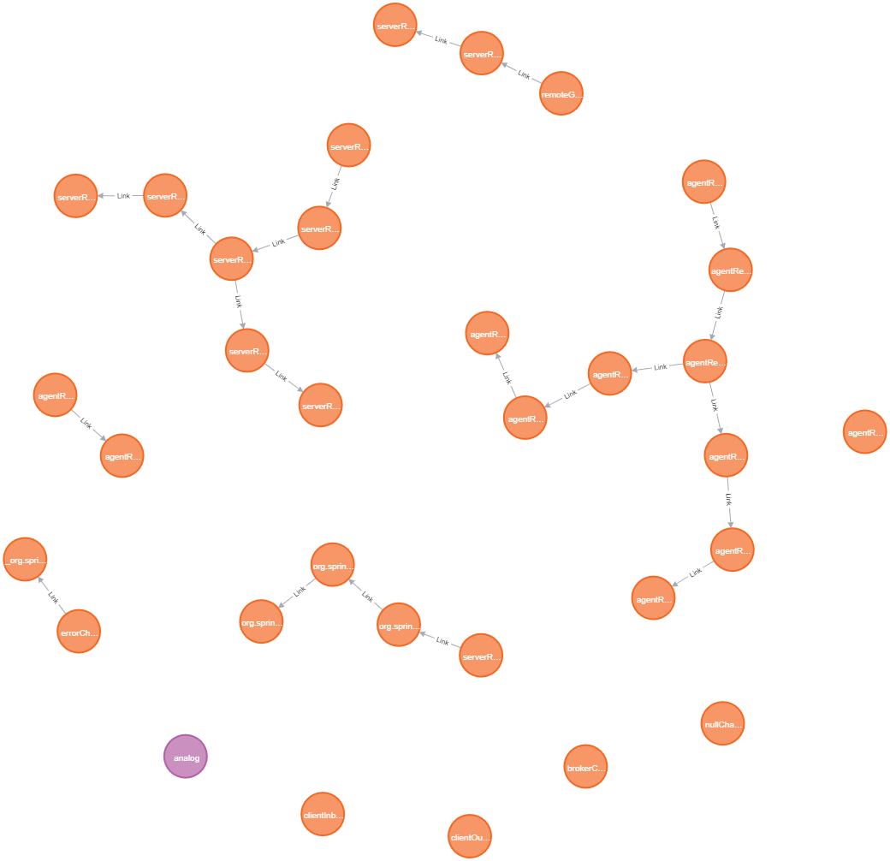

Spring Integration framework is able to [represent](https://docs.spring.io/spring-integration/docs/5.2.5.RELEASE/reference/html/system-management.html#integration-graph) the current state of all [EIP](https://www.enterpriseintegrationpatterns.com/) components and their relations in the form of a JSON graph. It seems useful for learning and debugging but unfortunately none of the googleable tools (which are just [1st](https://github.com/spring-projects/spring-flo/tree/angular-1.x/samples/spring-flo-si) and [2nd](https://ordina-jworks.github.io/architecture/2018/01/27/Visualizing-your-Spring-Integration-components-and-flows.html)) gives enough flexibility for visualization and analysis of such a graph. In this article I’ll show you how to address this problem by importing the graph into the [Neo4j](https://neo4j.com/neo4j-graph-database/) graph database where such abilities are the first class citizens.

### TL;DR (for the impatient)

Short story long, all you need to do is:

1. Provide the graph [output](#obtaining-the-graph-as-json) in JSON format from a known URL;
1. Execute [this](#the-importing-script) Cypher script in the Neo4j Browser (pasting the URL).

Hope this would be enough. If not, welcome the rest of the article.

{}

The following content supposes you are familiar with the Spring ecosystem and have a basic notion of the Neo4j graph database and its Cypher query language. But if there’s no such notion, it’s OK – there are links to the explaining resources along the text.

{}

### Obtaining the graph as JSON

There are 2 complementary ways to get the graph from a running application:

1. If using the `spring-integration-http` (or `spring-integration-webflux`) module, then the graph can be obtained from the [Integration Graph Controller](https://docs.spring.io/spring-integration/docs/5.2.5.RELEASE/reference/html/system-management.html#integration-graph-controller).
1. If using `spring-integration-core` **together with** Spring Boot [Actuator](https://docs.spring.io/spring-boot/docs/2.2.5.RELEASE/reference/html/production-ready-features.html#production-ready), then the graph can be obtained from the Actuator’s `integrationgraph` [endpoint](https://docs.spring.io/spring-boot/docs/2.2.5.RELEASE/reference/html/production-ready-features.html#production-ready-endpoints) (which is not available from the web [by default](https://docs.spring.io/spring-boot/docs/2.2.5.RELEASE/reference/html/production-ready-features.html#production-ready-endpoints-exposing-endpoints)).

In both cases the response should look like:

```json
{
  "contentDescriptor": {
    "providerVersion": "5.2.4.RELEASE",
    "providerFormatVersion": 1.1,
    "provider": "spring-integration",
    "name": "analog"
  },
  "nodes": [
    {
      "nodeId": 3,
      "componentType": "ExecutorSubscribableChannel",
      "name": "brokerChannel"
    },
    // ...
  ],
  "links": [
    {
      "from": 19,
      "to": 8,
      "type": "output"
    },
    // ...
  ]
}
```

There are always 3 fields on the top level: a single object named `contentDescriptor` and two arrays named `nodes` and `links` for vertices and edges accordingly. The idea behind this representation is quite straightforward: `from` and `to` fields of each element  in the `links` array refer to the `nodeId` field of certain elements in the `nodes` array. The graph’s model is described in detail in the [corresponding chapter](https://docs.spring.io/spring-integration/docs/5.2.5.RELEASE/reference/html/system-management.html#integration-graph) of Spring Integration documentation.

 *Note that **channels** (in terms of EIP) **are not edges** in the graph.*
Instead, they are just vertices much like adapters, filters, etc, though their `componentType` values usually end with *“channel”* suffix.

{}

Hereinafter, we’ll use terms “vertices” and “nodes” as well as “edges” and “links” interchangeably to make a closer reference to the domain. No semantic difference is hidden here.

{}

#### Just in case

Before fetching the graph right from Neo4j database, I’d recommend you to do it from something simpler, say, from your web browser by means of navigating to [http://localhost:8080/actuator/integrationgraph](http://localhost:8080/actuator/integrationgraph) (in case of Spring Boot Actuator). If the response is not similar to the JSON shown above, then there’s no sense to proceed, we must fix the problem right here.

Usually the reason is either [CORS](https://ru.wikipedia.org/wiki/Cross-origin_resource_sharing) restrictions or unavailability of the graph producing component. If you have a locally deployed application on Spring Boot Actuator, then both issues can be eliminated by adding the [following lines](https://docs.spring.io/spring-boot/docs/2.2.5.RELEASE/reference/html/production-ready-features.html#production-ready-endpoints-cors) into the application configuration:

```yaml
management:
  endpoints:
    web:
      exposure:
        include: '*'
      cors:
        allowed-origins: '*'
        allowed-methods: '*'
```

*(but please don’t do this in production! :pray:)*

And if your application uses pure Spring Integration, see [this page](https://docs.spring.io/spring-integration/docs/5.2.5.RELEASE/reference/html/system-management.html#integration-graph-controller) of the documentation.

### Importing the graph into Neo4j

#### Prerequisites

To upload the graph into the graph database we need just 2 things:

1. **Neo4j** DBMS itself *(unexpectedly, isn’t it?)*
   Any free distribution is suitable:
   - Developer-friendly [Neo4j Desktop](https://neo4j.com/download-center/#desktop)
   - Nothing-extra [Neo4j Community Server](https://neo4j.com/download-center/#community)
   - For-the-lazy [Neo4j Sandbox](https://neo4j.com/sandbox/)  *(no installation required)*
1. **APOC** – a set of useful Cypher procedures
   This is de-facto standard library from Neo4j authors so that you can find and install it right from the [official site](https://neo4j.com/docs/labs/apoc/current/introduction/#installation). Cloud-hosted Neo4j Sandbox already has the library pre-installed.

This article is using Neo4j version **4.0.1**. But since we don’t rely on any database internals here, everything should work on other versions as well.[^1] If installing APOC manually, please ensure that its first 2 digits of the version (e.g. 4.0) are equal to the same digits of Neo4j itself.

#### Visualization concerns

Since the JSON provided by Spring Integration contains all the info required for visualization, we could have taken it “as is” (`nodes` to vertices, `links` to edges, nested fields to properties) and translated it into the Cypher script to produce exactly the same graph in Neo4j. Then, if we execute the script with [this](export/analog.json) example in the [Neo4j Browser](https://neo4j.com/developer/neo4j-browser/), the result might look like:



That’s not bad but far from perfect because:

- Almost all nodes are rendered with the same color and size so there is no sense in their visual appearance. Also, many node names start with the same prefix (e.g. `agentR`) so that we have to hover over every node to see its full name in the status bar of the result panel.
- All the edges have the same `Link` label which is not informative at all. The real type of the link is hidden in the edge’s `type` property.
- There is no relation between the descriptor and the nodes it describes.

With these observations in mind, we can make our nodes and links more informative by providing them with visual distinction, depending on their type. For this, we can leverage the Neo4j Browser’s support of Graph Style Sheets ([**GraSS**](https://neo4j.com/developer/neo4j-browser/#browser-styling-adv)) – CSS-like files describing color, size (but not shape) and other visual properties of graph vertices and edges. This article comes with an [example](export/style.grass) of such a file for Spring Integration graphs.

However, it’s not a trivial task because those visual properties in GraSS files are bound to nodes’ labels and links’ types but not to the properties of either. Since we now have the same node label and the same link type for all graph elements, we can’t use distinct styling. Of course, we should use different labels for nodes (depending on their `componentType` field) and different types for links (depending on their `type` field) to overcome the restriction, but it is not trivial either. The thing is, “out-of-the-box” Cypher language does not allow to generate neither vertex labels nor edge types dynamically, e.g. those values must be specified before the script is executed. It’s bad news because we get to know our nodes and links just after the JSON gets loaded which is a part of our Cypher script. The good news, however, is that the APOC library has `apoc.merge.node` and `apoc.merge.relationship` [procedures](https://neo4j.com/docs/labs/apoc/current/graph-updates/data-creation/)[^2] that can create/update nodes and links by taking the labels (types) as variables:

>  `apoc.merge.node` – merge **nodes with dynamic labels**, with support for setting properties ON CREATE or ON MATCH
>
>  `apoc.merge.relationship` – merge **relationship with dynamic type**, with support for setting properties ON CREATE or ON MATCH[^1]

Sounds great, doesn’t it? Yes, in general. But speaking of nodes we should be careful, there shouldn’t be too many distinct labels as they can make the graph a variegated mess of different-sized circles.  To prevent this, we’ll provide our script with a filter stage that will “collapse” similar EIP-types to a general form, for example, all channel varieties to a single `channel` label. This can be achieved with the Cypher `CASE` [expression](https://neo4j.com/docs/cypher-manual/4.0/syntax/expressions/#query-syntax-case).

At last, in our new script we’ll connect the descriptor node to all other nodes to make it easy to understand which graph elements it describes. This will also allow us to store multiple graphs in the same database independently.

#### The importing script

So, if we translate the above into Cypher language, the result may look like:[^3]

```cypher
// (1) load JSON from URL:
WITH "http://localhost:8080/actuator/integrationgraph" AS url
CALL apoc.load.json(url) YIELD value
WITH value AS json, value.contentDescriptor AS jsonDesc
// (2) descriptor:
MERGE (descriptor:Descriptor {name: jsonDesc.name})
  ON CREATE SET
    descriptor.providerVersion = jsonDesc.providerVersion,
    descriptor.providerFormatVersion = jsonDesc.providerFormatVersion,
    descriptor.provider = jsonDesc.provider,
    descriptor.updated = localdatetime()
  ON MATCH SET
    descriptor.updated = localdatetime()
// (3) nodes:
WITH json, descriptor
UNWIND json.nodes AS jsonNode
CALL apoc.merge.node(
  /*labels*/ ['Node',
    CASE
      WHEN jsonNode.componentType IS NULL THEN "<unknown>"
      WHEN toLower(jsonNode.componentType) ENDS WITH "channel" THEN "channel"
      WHEN toLower(jsonNode.componentType) ENDS WITH "adapter" THEN "adapter"
      WHEN jsonNode.componentType CONTAINS '$' THEN "<other>"
      ELSE jsonNode.componentType
    END],
  /*identProps*/   {nodeId: jsonNode.nodeId, appName: descriptor.name},
  /*onCreateProps*/{name: jsonNode.name, componentType: jsonNode.componentType},
  /*onMatchProps*/ {}
) YIELD node
MERGE (descriptor)-[:DESCRIBES]->(node)
// (4) links:
WITH json, descriptor, node
UNWIND json.links AS jsonLink
MATCH (a:Node {nodeId: jsonLink.from})<-[:DESCRIBES]-(descriptor)-[:DESCRIBES]->(b:Node {nodeId: jsonLink.to})
CALL apoc.merge.relationship(a, toUpper(jsonLink.type), {}, {}, b, {}) YIELD rel
// (5) result:
RETURN descriptor
```

 *[Open the script as file](export/integraph.cypher)*

Skipping the details of [Cypher syntax](https://neo4j.com/docs/cypher-refcard/4.0/), let’s review the parts of this script following their numbers in comments:

1. First we use the `apoc.load.json(url)` [procedure](https://neo4j.com/docs/labs/apoc/current/import/load-json/) from the APOC library to fetch raw JSON from inside the script. Here we also introduce a couple of aliases by means of the `WITH` clause for brevity.

1. Create or update the `Descriptor` node from corresponding JSON object and literally transfer all the properties. Additionally set `updated` property to save the timestamp of the last modification (just for convenience).

1. Create/update each node assigning 2 labels: the first one with the `Node` value (just to keep something in common between all nodes) and the second one with a value chosen as:

   - `unknown`, if corresponding JSON node has no `componentType` field (which is abnormal but still happens e.g. with `UnzipTransformer` EIP component);
   - `channel`, if the full component type value ends with a “*channel*” suffix like `ExecutorSubscribableChannel`;
   - `adapter`, if it ends with “*adapter*” like  `inbound-channel-adapter`;
   - `<other>`, if the type contains a `$` character which denotes anonymous class with a dynamic (thus useless for us) name like `ServerConfig$$Lambda$994/0x00000008010fd440`;
   - the value of the `componentType` field itself, if none of the conditions above match.

   Note that we also keep the original value of each component type in the like-named property in order to support searching through the graph by exact matching. Here we also connect the descriptor to each newly created node.

1. Create/update links choosing the type from the JSON’s `type` field and casting it to upper case as the best practices [recommended](https://neo4j.com/docs/cypher-manual/4.0/syntax/naming/#_recommendations).
   Note that when `MATCH`ing nodes to connect, we also specify their relations to the descriptor. This is needed just to prevent the mess when storing multiple graphs in the same database. Otherwise, these relations (as well as `appName` property of nodes) can be omitted.

1. Return the descriptor as the result of the whole script.
   Of course, it might be better to return the graph at whole but for some reason it made the script execution substantially slower in all of my tests. A subject to research.

Depending on the Spring Integration graph size, the execution of the script can take significant time (couple of dozens of seconds on my developer machine for a graph with 350+ nodes and 330+ links, see it [below](#additional-examples)). It heavily depends on RAM volume available to Neo4j. You can tune it with built-in `bin/neo4j-admin memrec` command.

Remember that we should also apply the graph styling by dragging a GraSS file (e.g. [this one](export/style.grass)) to Neo4j Browser’s panel opened with `:style` command.

#### Graph visualization

When all is said and done, we can finally ask the Neo4j Browser to build the visual representation of our graph. In case of a single graph it can be as simple as `MATCH (a) RETURN a` query. But in a general case it would be better to consciously select all the nodes and links that have relations to a particular descriptor defined by the application name, e.g.:

```cypher
WITH "analog" AS appName
MATCH (:Descriptor {name: appName})-[:DESCRIBES]->(n:Node)-[l*0..1]-(:Node)
RETURN n, l
```

For the same [sample graph](export/analog.json) the result may look like:



Note that apart from colors and sizes this graph version employs a `componentType` property as node name instead of `name` property. This makes nodes more readable (because types are usually shorter than names) but requires the graph user to hover over each node to find out its full name. This can be changed with `Node` label visual properties either from the Neo4j Browser UI or from the GraSS file:

```scss
node.Node {
  defaultCaption: "<id>";
  caption: "{name}";
}
```

If node names are changed back to `name` property, then the user should also look at the colors legend which is at the top of the Neo4j Browser’s result panel:



Now that we’ve enhanced the visual representation of the graph, it should become easy and fun to work with. If not, then this is probably a matter of the Neo4j Browser capabilities rather than graph representation itself. Fortunately, there are several alternative [visualization tools](https://neo4j.com/developer/tools-graph-visualization/) compatible with Neo4j graph storage.

#### Additional examples

Being carefully applied, Neo4j can become a valuable helper for graph visualization of Spring Integration applications. This is especially useful when it comes to some complicated and/or confused graphs like I had occasions to meet:



### Resume & Prospects

In this article we have learned how to [obtain](#obtaining-the-graph-as-json) a JSON graph of EIP components from a Spring Integration application. We’ve also defined [prerequisites](#prerequisites) for Neo4j DBMS to import the graph to. Then we’ve [outlined](#visualization-concerns) some concerns around the visualization. It helped us to compose a [Cypher script](#the-importing-script) for importing the graph into the Neo4j database. With this script in hand, we have used the Neo4j Browser to [query and visualize](#graph-visualization) the graph in different ways. At last, we’ve seen some [examples](#additional-examples) of graphs built with the script.

While the script shown in this article is not ideal from many points of view, it can still serve as a starting point for building more sophisticated scripts ideally suited for particular tasks. It is also important to realize that visualization is definitely not the only benefit of using Neo4j with integration graphs. There are plenty of tasks that can be solved by leveraging [graph algorithms](https://neo4j.com/docs/graph-data-science/current/). For example: find longest/shortest link chains, reveal unreachable parts, detect most dependent/important components (aka “bottle necks”), determine excess points, etc.

 I would be glad to hear from you about any experience around Spring Integration and Neo4j collaboration. Please feel free to leave comments below and/or share the article with others to make it really helpful :+1:

&nbsp;

[^1]: APOC procedures like `apoc.merge.(relationship|node)` in their **3.x** version (which is used in Neo4j Sandbox on April’20) do not support `onMatchProps` argument. Therefore it should be removed from the examples given here.
[^2]: Hereinafter, we use `MERGE` [clause](https://neo4j.com/docs/cypher-manual/4.0/clauses/merge/) and procedures to make the script idempotent, i.e. repeatable without errors and duplicates. If it’s not required, `CREATE` [clause](https://neo4j.com/docs/cypher-manual/4.0/clauses/create/) and procedures can be used instead.
[^3]: When executed on a remote Neo4j instance (e.g. in cloud Sandbox), the script will fail because of another meaning of `localhost` there. In this case you should either provide an external URL for the JSON graph source or (at least) use the URL of this [example](export/analog.json) taken from my [AnaLog](https://github.com/Toparvion/analog) application.
