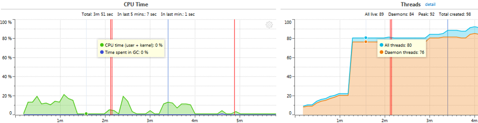
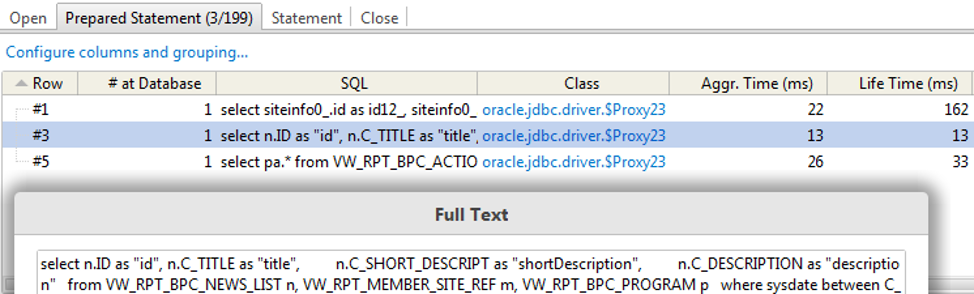
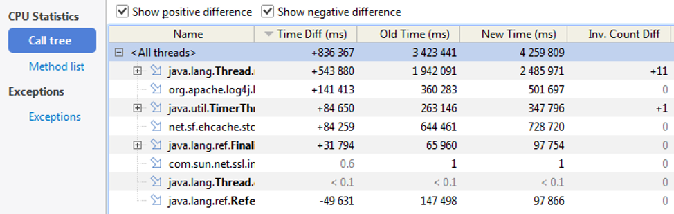

{}

## Вместо предисловия

Накопленный опыт выпуска версий развивающегося приложения (в частности, универсального интернет-банка для множества партнеров) показал, что чаще всего сквозь тестирование в промышленную эксплуатацию просачиваются ошибки, связанные с производительностью приложения. Это объясняется тем, что в тестовом окружении чрезвычайно сложно эмулировать нагрузку приложения, тесно интегрированного со многими сторонними сервисами и работающее с крупными объемами персональных данных. Как следствие, в тестовом окружении (пока) не представляется возможным организовать полноценное нагрузочное тестирование для оценки изменения производительности выпускаемых версий.

В данной статье к рассмотрению предлагается одно из возможных решений – применение профилировщика YourKit Java Profiler (YJP) для:

-   выявления потенциальных проблем производительности с помощью встроенных в профилировщик инспекций;

-   выявления деградаций путем сравнения снимков производительности между версиями приложения.

Статья ориентирована преимущественно на разработчиков, тестировщиков и технологов, занятых в развитии нагруженных веб- и автономных приложений на Java.

Если частота и амплитуда зевания при прочтении до этого места еще остаются приемлемыми, можно приступить к основной части...

## Несколько вопросов о предметной области

Чтобы не быть голословными, мы построим изложение статьи на более или менее конкретном примере – будем проводить ***удаленное профилирование веб-приложения*** (интернет-банка) ***в тестовом окружении***. Проясним некоторые вопросы выбора такого примера.

##### Что такое профилирование?

[http://ru.wikipedia.org/wiki/Профилирование\_(информатика)](http://ru.wikipedia.org/wiki/Профилирование_(информатика))  
Статья не ставит целью объяснить, как работает само профилирование, но стремится ответить на вопрос: «Что нужно сделать, чтобы оно заработало для нас?» Кроме того, мы не стремимся рассказать, как его правильно выполнять; этому отнюдь нетривиальному вопросу посвящено множество статей в Интернете, например, [эта](http://habrahabr.ru/post/143468/). Мы лишь опишем один, довольно частный случай применения известного инструмента для (частичного) решения возникшей проблемы.

##### Почему именно удаленное?

Потому что:

-   Необходимость профилирования чаще всего возникает для приложений, работающих на серверах с ОС без графического интерфейса, то есть наблюдать за результатами на самом сервере крайне неудобно или невозможно.

-   Запуск профилируемых приложений на локальной машине зачастую невозможен/недопустим/затруднителен. Например, если речь идет о профилировании некоторого обработчика очереди в базе данных, единой для всего окружения, то для его запуска на локальной машине потребуется выключить его же экземпляр на оригинальном сервере, а это отнюдь не обрадует коллег, работавших с этим сервером.

-   Так интереснее.

##### Почему именно веб-приложения?

Потому что:

-   Сюжет статьи основан на реальных событиях.

-   Больше ни почему.
    Т.е. в остальном описываемый подход вполне применим и к автономным приложениям.

##### Почему именно в тестовом окружении?

Потому что:

-   Сама идея профилирования нагруженного боевого приложения пахнет авантюрой.

-   Для полноценного профилирования потребуется совершить несколько магических действий, вытворения которых в промышленном окружении никто не допустит. В частности, потребуются:

    -   Удаленный доступ по SSH к серверу с приложением, причем под пользователем с правами на создание (исполняемых) скриптов в директории приложения;

    -   Физическое и моральное право на останов и запуск приложения;

-   Профилируемое приложение из-за инструментации профилировщиком может терять в производительности (особенно в режиме подробной записи стектрейсов аллокаций памяти).

-   Тестовое окружение позволяет получить существенно больший контроль над профилируемым приложением, чем промышленное.

> Вообще говоря, ни один из перечисленных пунктов не является непреодолимым в промышленном окружении, но это совсем другая тема...

##### Что такое YourKit Java Profiler и почему именно он?

YourKit Java Profiler (далее для краткости **YJP**, читается «уай-джей-пи») является программным инструментом профилирования Java приложений. Почему выбран он – вопрос дискуссионный, и все же осмелимся привести несколько аргументов. YJP был выбран, кроме прочего, потому, что:

-   Обладает богатейшей телеметрией, включающей, помимо стандартных сведений, сбор данных о вызовах JSP/Servlet, о работе с сокетами, об открытии соединений с БД;

-   Позволяет легко экспортировать во множество форматов любой фрагмент многочисленных таблиц или таблицы целиком;

-   Позволяет наглядно сравнивать снимки производительности (snapshots), сделанные в произвольное время;

-   Включает богатый набор встроенных инспекций по выявлению потенциальных проблем производительности;

-   Бесшовно интегрируется со всеми популярными средами разработки, в том числе с IntelliJ IDEA, позволяя:

    -   Настраивать и запускать профилирование прямо из IDE;

    -   Переходить к интересующему участку кода в IDE прямо из таблиц профилировщика;

-   Является одним из лучших продуктов своего класса на мировом рынке, а разрабатывается в России, г. Санкт-Петербург;

-   Выпадает первым в Гугле по запросу "java profiler".

## Установка YJP

Коль скоро мы собрались профилировать удаленное приложение, нам понадобится два компонента профилировщика. Один – это GUI-интерфейс с подробными интерактивными таблицами, визуальными представлениями процессов (например, потоки во времени), графиками изменения основных параметров во времени и прочими ништяками. К счастью, графическая часть YJP таковыми изобилует (видимо, в связи с чем и требует ввода лицензионного ключа). Второй – это агент, снимающий данные с профилируемого приложения. Вместе эти два компонента организуют телеметрию – удаленное измерение и визуализацию заданных параметров исследуемого объекта (в нашем случае – приложения).

Установка GUI-компонента (на Windows) тривиальна: <http://yourkit.com/java/profiler/index.jsp>. Единственным значимым моментом является запрос лицензионного ключа. Помимо легальной покупки продукта можно воспользоваться 15-дневным пробным периодом, а также принять участие в программе раннего доступа (EAP), то есть бесплатно получить полноценную новейшую версию продукта, но без техподдержки и без единой гарантии, что версия рабочая, ибо это сырец. Автор статьи, к примеру, получил окно с «Internal Application Error» на второй минуте эйфории от ухваченной халявы; к счастью, разработчики дружелюбно ответили и устранили баг уже в следующей сборке. Данная статья писалась с использованием обоих вариантов условно бесплатных версий.

Установка агента предполагает повторное скачивание дистрибутива всего профилировщика, но уже под целевую платформу (если она отлична от платформы для GUI), например, под Solaris (сюда входит поддержка архитектур SPARC, x86, x64). После скачивания его необходимо распаковать в директорию на целевом сервере и выдать права на запуск скрипта `./bin/yjp.sh` (права потребуются, только если мы намереваемся воспользоваться автоматизированными средствами подключения агента, а не вручную прописать к нему путь в скрипте запуска приложения).

Далее щепотка теории. Профилирование с помощью YJP (да и не только с ним) может проводиться двумя путями: :one: подключением агента профилировщика к уже работающему приложению и :two: запуском (стартом) приложения с этим агентом. Второй путь предоставляет гораздо бОльшие возможности телеметрии, однако не всегда реализуем по тем или иным причинам (например, отсутствие прав на запуск/останов или недопустимость простоев приложения), поэтому профилировщики предлагают пользователям оба пути на выбор. И в том, и в другом случае подключение GUI-компонента производится аналогично – вы указываете в нем хост и порт машины, по которым можно достучаться до агента профилируемого приложения (не важно, на каком этапе был подключен агент). Разница заключается лишь в подключении самого агента к приложению. Поскольку мы будем играться в тестовом окружении, пойдем по второму пути. Касательно первого стоит отметить лишь, что для него нужно из консоли удаленного сервера вызвать команду `./bin/yjp.sh --attach`, а дальше следовать инструкциям мастера (оказывается, под консолями тоже бывают wizard'ы).

## Подключение агента

Теперь к практике. Для подключения профилирующего агента к приложению на этапе запуска необходимо при этом самом запуске указать специальную опцию виртуальной машины, а именно `-agentpath`. После нее через двоеточие нужно указать путь к двоичному файлу агента, причем выбираться файл должен в строгом соответствии с ОС и архитектурой машины, на которой будет выполняться профилирование (пример чуть ниже). Поскольку запуск приложения на удаленной машине, скорее всего, производится специальным (sh-)скриптом, будет надежнее, если вы обернете эту опцию в безопасную строку с опциями java-машины, например, вот так:

```bash
OPTS="$OPTS -agentpath:/pub/home/upc/yjp-2013-build-13074/bin/solaris-sparc-32/libyjpagent.so"
```

Обратите внимание, что путь к файлу учитывает как ОС, так и аппаратную платформу используемой машины (что видно по директории `solaris-sparc-32`). Как и во многих других случаях, если нет уверенности в числе разрядов используемой машины, лучше указать 32 – шансов на успешный запуск будет больше (нуля).

В зависимости от того, какой тип приложения (standalone или J2EE) планируется профилировать, вид опции `-agentpath` может быть разным. Например, если воспользоваться мастером интеграции с удаленным J2EE сервером приложений (а есть в составе YJP даже и такой), то он может сгенерировать строку следующего вида:

```bash
JAVA_OPTS="$JAVA_OPTS -agentpath:/pub/home/upc/yjp-2013-build-13074/bin/solaris-sparc-32/libyjpagent.so=delay=10000,sessionname=Tomcat"
```

, то есть укажет, что старт измерений откладывается на 10 сек от старта веб-сервера, и что сессия телеметрии будет называться `Tomcat`.

Чтобы не навредить своими экспериментами, рекомендуется создать отдельный скрипт запуска приложения в режиме профилирования и назвать его каким-нибудь интуитивно понятным именем, например, `123.sh` :wink: Ну или, в крайнем случае, `startup_with_yjp.sh`, как делает сам YJP.

Итак, если мы аккуратно прописали нужную опцию JVM и успешно запустили с ней приложение, то в консоль должно выпасть радостное

```bash
bash-3.2$ [YourKit Java Profiler 2013 build 13074] Log file: /pub/home/upc/.yjp/log/FXServer-25543.log
```

Если этого не произошло, значит, консольный вывод, вероятно, перенаправлен в какой-нибудь nohup-файлик в корневой директории приложения. Если же это не так, а все равно ничего не работает, то ... «*Сервис временно недоступен. Пожалуйста, проверьте правильность введенных данных и повторите попытку позже*».

Любопытный читатель наверняка задался вопросом: «А как узнать номер порта, через который подключившийся к приложению агент будет отдавать телеметрические данные GUI-компоненту?» Первое, что можно попробовать, это вообще не затеваться с «узнаванием порта», а положиться на то, что порт по умолчанию (`10001`) окажется свободным и агент займет именно его. И все же, если хочется в этом убедиться, то можно вызвать скрипт `./bin/yjp.sh` с аргументом `-attach` и посмотреть на список процессов, который он выведет. В этом списке нас интересует строка с текстом «*agent port is*»:

```text
Running JVMs:
Name                             |   PID| Status
-------------------------------- |------|--------------------------------
DemoApp                          |  5948| Ready for attach
yjp                              |  3172| Ready for attach
Tomcat                           |  6936| Agent already loaded, agent port is 10001
```

Эта строка и выдаст нам ~~иностранного~~ агента.

Обратите внимание, что начиная с версии 2014, скрипт `bin/yjp.sh` работает только на Java 7+, но сам агент может по-прежнему подключаться к приложениям и на более старой VM. К счастью, его разработчики предусмотрели возможность не изменять переменную окружения `JAVA_HOME` для всех приложений – путь к JDK 1.7+ можно задать в специальной переменной `YJP_JAVA_HOME` и запустить YJP, например, вот так:

```bash
$ export YJP_JAVA_HOME=/usr/jdk/jdk1.7.0_05
$ ./yjp.sh -attach
```

## Подключение GUI-компонента

От консольных страстей перейдем к оконным няшкам.

Как и упоминалось выше, для подключения GUI-компонента к профилируемому приложению на удаленной машине нам потребуется указать хост этой самой машины и порт, на котором ждет подключения агент. Сделать это можно со стартовой страницы профилировщика (здесь и далее под профилировщиком будет пониматься его GUI-компонент):


Щелкнув по приведенной ссылке, укажем известные нам данные:


Начиная с версии 2014, в YJP появляется возможность детектирования агента на удаленной машине в умолчательном диапазоне портов от 10001 до 10010. Это еще один способ избежать запуска скрипта `./bin/yjp.sh --attach`, описанного в конце предыдущего подраздела.

Итак, если соединение установлено успешно, профилировщик отобразит окно с наблюдением за использованием процессора приложением и за изменением числа потоков во времени:

[](images/3.png)

На этом этапе рекомендуется провести часок-другой в умиротворенном наблюдении за рисующимися графиками и в довольном бормотании: «*Ай да я, ай да молодец какой!..*» После насыщения этим процессом можно перевести взгляд куда-нибудь еще.

Описание всех снимаемых профилировщиком метрик достойно отдельной статьи, поэтому мы не будем останавливаться на них, предлагая пытливому читателю ознакомиться с ними самостоятельно. Лучше перейдем сразу к делу.

## Снятие метрик и запись снимка производительности

Напомним, что нас интересует потенциальная деградация в производительности выпускаемого приложения. Ее оценку предполагается произвести путем записи :one: некоторого набора метрик веб-приложения в течение :two: некоторого периода времени. Давайте конкретизируем пространные формулировки со словом «некоторый». Итак:

1.  Состав набора метрик должен определяться самим аналитиком исходя из целей оценки. Например, целью оценки может быть обнаружение блокировок (deadlock-ов), либо выявление «горячих точек» по процессору, либо определение источников наиболее активной аллокации памяти и, как следствие, интенсивной сборки мусора. Вполне естественным может стать желание «записать ваапще фсё и сразу», но хотелось бы предостеречь от этого по следующим причинам:
    1.  Снятие метрик агентом на работающем приложении в большинстве случаев сопряжено с накладными расходами (overhead), которые проявляются, кроме прочего, в общем замедлении работы приложения. Другими словами, стремление выявить просадку производительности может легко породить саму эту просадку.
    1.  Внедрение агента в работающее приложение (инструментация исполняемого байт-кода) может приводить к сторонним эффектам в поведении приложения, например, к редким блокировкам потоков. Это значит, что появляется вероятность совершить подвиг по выявлению страшного бага, который, как покажет время, не проявляется нигде и никогда, кроме как при профилировании.  
        **Резюме**: профилировать приложение ст&oacute;ит по отдельным характеристикам, а если снимать все и сразу, то с предварительной тщательной настройкой и готовностью правильно интерпретировать обильные результаты.
        Возможности аналитика по снятию метрик ограничиваются, в основном, кнопками на панели инструментов профилировщика YJP:
        
1.  Период времени для снятия (записи) метрик также должен определяться целями аналитика исходя из того, что нужно успеть записать интересующее поведение приложения, но не растворить его в записях бездействия. В случае с профилированием автономного приложения с циклическим характером работы, лучше ориентироваться на запись нескольких однотипных по поведению циклов, чтобы, с одной стороны, охватить основной сценарий совершаемых приложением действий, с другой – сделать охват репрезентативным.

Вернемся к нашему примеру. Мы сосредоточимся на оценке использования процессорного времени, а поскольку у нас на операционном столе лежит веб-приложение, в качестве периода оценки выберем время входа («логина») пользователя в него (чтобы одним махом покрыть и построение страниц, и работу с БД, и общение со сторонними сервисами, и асинхронные задачи).

Перед тем, как начать запись, чуток подстроим профилировщик. Коль скоро мы решили сосредоточиться на оценке работы с процессором, сделаем эту оценку подробной. Для этого, во-первых, выберем не умолчательный режим профилирования – **Tracing**:


Как видно из описания, он позволяет записывать не только время, затраченное на выполнение каждого метода, но и число его вызовов.

Поскольку этот режим может существенно снизить скорость работы приложения (из-за инструментации кода), мы применим набор фильтров, которые позволят не подвергать оценке заведомо неинтересные нам методы. Для этого щелкаем на псевдо ссылку **CPU tracing settings...** и в появившемся окне ставим галочку **Apply filters**:


Остальные параметры профилировщика оставим умолчательными. Это, с одной стороны, позволит снять и некоторые другие метрики (чтобы не зацикливаться на процессоре), с другой – не оставит существенного отпечатка на отзывчивости приложения (по крайней мере, для тестового окружения). Среди прочих метрик, нас, в частности, будут особенно интересовать те, что попадут в группу **Java EE statistics**.

Итак, чтобы произвести снятие и запись метрик, выполняем следующие действия:

1.  Нажимаем в профилировщике на кнопку **Start CPU Profiling**

1.  Переключаемся на браузер с веб-приложением, где открываем страницу входа, вводим логин/пароль, нажимаем «Войти» и дожидаемся окончательного построения главной страницы.

1.  Возвращаемся в профилировщик, нажимаем кнопку **Capture Performance Snapshot**

После небольшой паузы на сохранение полученных результатов YJP любезно предложит открыть сохраненный файл для анализа. Можно немного повредничать перед его нарочитой вежливостью, но в конечном итоге, пожалуй, стоит согласиться.

## Обзор результатов и запуск инспекций

Итак, в наших руках еще теплые результаты профилирования приложения, и мы в полном праве посмотреть, что же там получилось. Окно с результатами снятия метрик очень напоминает окно самого профилировщика. Основные отличия заключаются, пожалуй, лишь в том, что слева на некоторых вкладках появляются дополнительные разделы и что никакие таблицы и диаграммы уже не обновляются. В случае с вкладкой CPU, которая открывается первой, набор упомянутых разделов будет следующим:


В зависимости от параметров телеметрии этот набор может быть и иным.

Чтобы не утомлять читателя монотонным изложением очевидных фактов, предлагаем ему самостоятельно ознакомиться с приведенными разделами. Мы же заострим внимание лишь на двух моментах, касающихся этих разделов.

-   В каждом пункте раздела **CPU statistics** последним столбцом числится **Invocation Count** (количество вызовов). Именно он является основной «плюшкой» режима **Tracing**; в режиме **Sampling** этого столбца нет.

-   Одной из первых инспекций, неявно предлагаемых профилировщиком, является пункт **Hot Spots** – в него сведены методы, выполнение которых отнимало у процессора максимальное время (в наблюдаемый период). Обратите внимание, что перечисленные методы профильтрованы в соответствии с настройками режима профилирования (см. предыдущий раздел); это значит, что даже если фактически максимальное время уходило на какой-либо библиотечный метод, подпавший под фильтр, этот метод не будет указан в пункте **Hot spots**.

Увлекательное путешествие по бесчисленным стектрейсам, записанным профилировщиком, безусловно, является ключом к успеху в поисках возможных проблем с производительностью приложения, но такой способ отнюдь нельзя назвать оптимальным. На третьей минуте разглядывания однотипных результатов профилирования возникает естественное желание: «Как было бы здорово, если бы профилировщик сам умел анализировать эти записи и на основе такого анализа сообщать о возможных проблемах в приложении!..» Как оказалось, профилировщик YJP обладает такой возможностью, и именуется она – **Inspections**. Это вкладка, которая присутствует только у окна просмотра снимка производительности; ее нет в режиме «реального времени». В ее левой части можно увидеть те самые разновидности проблем, которые умеет выявлять YJP:


Однократный щелчок по любой из них выведет (чуть ниже) лаконичное описание этой инспекции: потенциальные проблемы, рекомендации и даже случаи ложного срабатывания, если таковые есть.

Поскольку выполнение инспекций, как правило, не занимает много времени, можно щелкнуть на кнопке **Run All** и посмотреть общий отчет. Он может выглядеть следующим образом:


Особенной ценностью в случае с веб-приложениями здесь являются инспекции группы **Databases**, так как такие приложения активно взаимодействуют с БД, и заметить глазами незакрытое соединение пусть даже в аккуратно построенных профилировщиком таблицах весьма проблематично.

Особое внимание в интерпретации результатов инспекций необходимо уделять условиям проведения записи. В частности, нужно понимать, что события, которые, с точки зрения инспекций, должны происходить в паре (как правило, это открытие и закрытие чего-либо), могут оказаться «разлучены» окончанием периода записи метрик. Например, если какой-либо файл был открыт во время периода записи, а закрыт после его окончания, то инспекция отобразит его как потенциальную проблему (см. строку «*Files opened but not closed*» в приведенных выше результатах).

Чтобы локализовать ту или иную проблему, обнаруженную инспекцией, нужно щелкнуть по ней в результатах инспекции, а затем – по одному из вхождений такой проблемы в список в правой части окна. Последний щелчок переводит на вкладку событий, где хранятся упорядоченные по времени записи обо всем, что, с точки зрения профилировщика, подпадает под определение события. Так, для выделенной на рисунке выше проблемы путем несложной навигации по вкладке **Events** можно выявить SQL-запрос, вызов которого остался незакрытым:



, а также стектрейс метода, произведшего незакрытый вызов:


Таким образом, локализация источников типичных для приложений проблем упрощается до нескольких кликов мышкой. При этом холодный рассудок должен остаться неотъемлемым атрибутом аналитика.

Вполне очевидно, что инспекции, несмотря на их прелесть и простоту, не покрывают всех случаев возникновения потенциальных проблем в приложениях. Тогда на помощь приходит сравнение снимков производительности.

## Сравнение снимков производительности

Немного пофилософствуем\...

Едва ли кто-то может оценить самочувствие человека лучше, чем он сам. Аналогичное утверждение справедливо и для приложения, однако оно не способно рассказать об этом... Однако в отличие от живого организма, получить полную картину состояния приложения не так уж трудно. Если мы как аналитики условимся считать некое нынешнее состояние приложения (с точки зрения его производительности) нормальным, то путем сопоставления его с каким-либо другим состоянием сможем сказать, является ли наблюдаемое изменение прогрессом или деградацией. Снимки производительности профилировщика как раз являются способом запечатлеть состояние приложения на том или ином этапе его развития (на той или иной версии), а сравнение этих снимков от версии к версии позволило бы нам осуществить описанную выше идею. Именно это мы и попробуем сделать.

Для этого повторим все действия по подключению агента профилировщика и GUI-компонента по отношению ко второму экземпляру исследуемого веб-приложения. Версия этого экземпляра является предыдущей по отношению к исследовавшейся ранее.

К сожалению, GUI-компонент профилировщика YJP не позволяет производить телеметрию в реальном времени более чем одного приложения одновременно, так что сеанс с новейшей версией придется закрыть (впрочем, благодаря сохраненному снимку, он нам не особо и нужен).

Нам потребуется произвести в точности такую же запись, что и с новейшей версией, то есть выставить те же параметры профилирования процессорного времени, выбрать все те же самые метрики (если они менялись) и «запечатлеть» тот же самый период жизненного цикла веб-приложения (в нашем случае, напомним, это вход пользователя в приложение). Читателей с короткой памятью мы отошлем к разделу «*Снятие метрик и запись снимка производительности*», а с остальными двинемся дальше.

Сохранив новый снимок (под понятным самому себе именем), необходимо открыть его в профилировщике, как и первый снимок. Чтобы не запутаться, важно помнить, какой снимок является базовым для сравнения, а какой будет с ним сопоставляться. Из соображений отсутствия соображений положим, что базовым будет являться снимок предыдущей версии (как уже привычный), а сравниваться с ним будет, соответственно, снимок более новой версии. Это значит, что в дальнейшем при сравнении в любом показателе за 100% будет взят показатель именно «старой» (или пока еще нынешней) версии. Чтобы об этом не забывать и не путаться, полезно периодически бросать взгляд на название вкладки сравнения: **Comparison with...** – это позволит всегда понимать, что с чем сравнивается. Кроме того, по той же причине, при сравнении желательно держать открытыми только два снимка.

Итак, для построения сравнительных таблиц необходимо в базовом (старом) снимке выбрать **File -> Compare Snapshot with...** и в выпадающем списке указать на снимок более новой версии. Результат не должен заставить себя ждать:



*(имена методов сокращены только для вставки в статью)*

Сортируя и фильтруя полученные результаты, можно получить сопоставление для самых разных участков кода, от конечных методов до крупных ветвей. В частности, в рассматриваемом нами примере стало заметно, что прикладной метод `SClubPage.<init>()` (конструктор) стал работать существенно дольше:


Как и в случае с анализом отдельного снимка, столбцы с количеством вызовов становятся заполненными, только если профилирование выполнялось в режиме **Tracing**.

На приведенном выше фрагменте сравнения доступны лишь три разреза сопоставления: деревья вызова, отдельные методы и исключения (последние, кстати, тоже являются весьма интересным объектом наблюдения). Однако такой набор обусловлен лишь выбранными параметрами телеметрии и потому может быть существенно шире. В частности, если бы мы сделали два снимка памяти приложения (**Memory Snapshots**), то в списке разделов сопоставления появились бы еще два пункта: **Class list** и **Class tree**, в которых можно увидеть приращения по числу создаваемых объектов и по объему выделяемой под них памяти:


Чтобы не создавать впечатления о сравнении снимков как о панацеи, обозначим несколько моментов, которые необходимо учитывать при выполнении такого сравнения:

-   Условия воспроизведения сравниваемых поведений должны быть максимально идентичными. Это значит, что даже сравнение двух последовательных версий приложения на разных серверах может быть не совсем адекватным в силу того, что производительность самих серверов так или иначе отличается друг у друга (это приведет к неоправданным различиям во временах выполнения методов).

-   Сам характер тестового поведения также должен быть идентичен в обоих наборах случаев сравнения.

-   Нежелательно полагаться на единичное воспроизведение сравниваемого сценария, так как любой отдельный случай может оказаться в некотором роде уникальным, что может стать причиной неадекватных выводов при сравнении. Другими словами, всякая выборка должна быть репрезентативной.

Первый из приведенных моментов практически нивелируется, если производить замеры в одном и том же окружении (на одной и той же машине). Против двух последних тоже есть лекарство – инструменты автоматизированного тестирования. В случае с веб-приложением ими может быть движок Selenium или утилита Apache JMeter. Записанный в нее однажды сценарий позволит не только многократно воспроизводить сравниваемое поведение, но и будет делать это абсолютно идентично от раза к разу.

Таким образом, можно добиться такого уровня «оснащения», при котором оценка производительности новой версии приложения будет заключаться лишь в запуске профилировщика, запуске автотеста, а затем лишь в визуальном осмотре полученных при сравнении результатов.

## Вместо заключения

Применение профилировщика YourKit Java Profiler для оценки производительности выпускаемой версии приложения позволило нам (на рассмотренном примере):

1.  Выявить и локализовать проблему с закрытием коннекта к БД;

1.  Обнаружить участок кода, ставший выполняться существенно дольше по сравнению с предыдущей версией приложения.

Опытный зритель «Школы злословия» может посетовать на то, что для получения таких результатов пришлось приложить слишком много усилий, однако осмелимся обратить его внимание на то, что все усилия по установке и настройке профилировщика пришлось приложить лишь раз; при выпуске следующих версий этого уже не понадобится. Кроме того, использование таких инструментов автоматизации, как Selenium и JMeter, позволит существенно упростить и ускорить выполнение самих проверочных сценариев в будущем.

Описанный в данной статье подход является лишь попыткой решения проблемы с предрелизной оценкой производительности выпускаемых версий. Как и всякое новшество, он требует «обкатки» в реальных условиях, отладки и совершенствования. Как автор я выражаю надежду на то, что эти процессы будут протекать не только в нашей команде.
