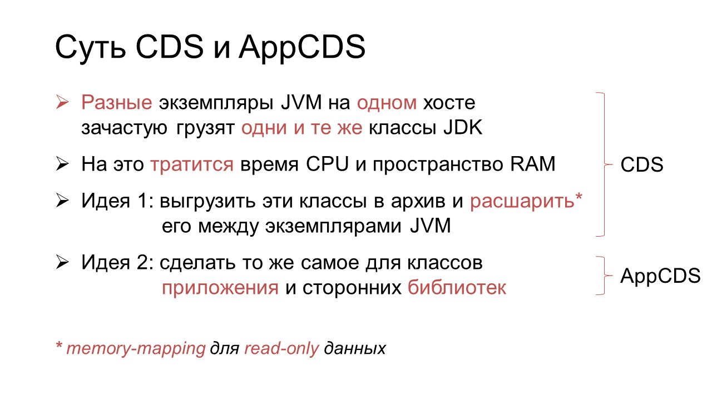
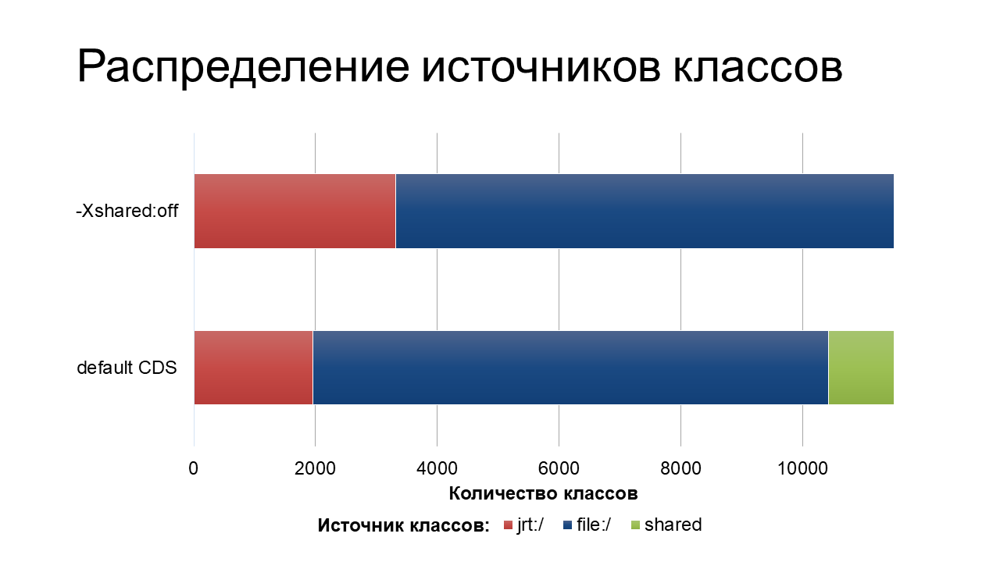
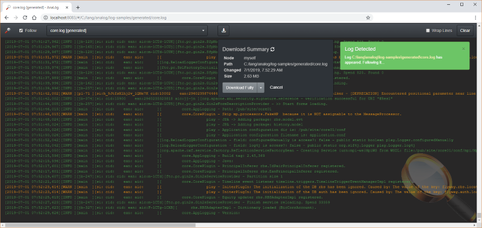
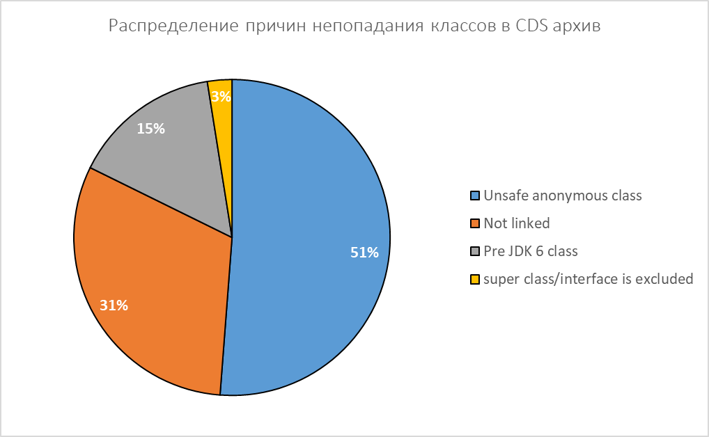
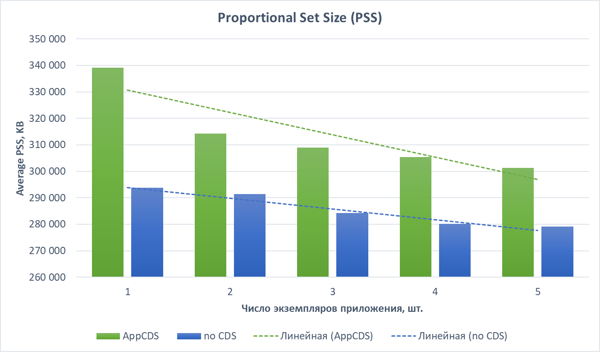
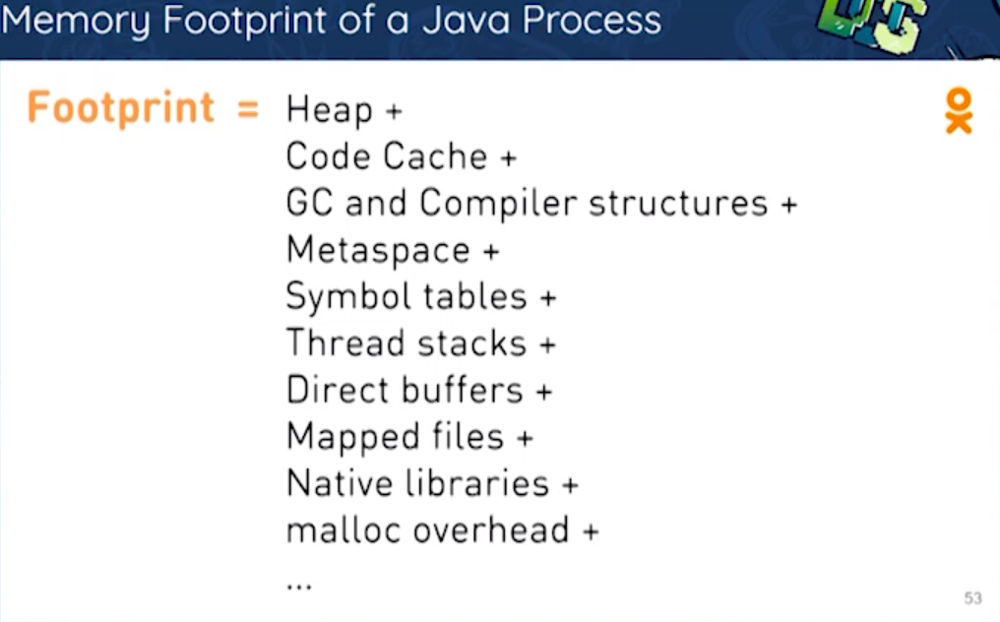
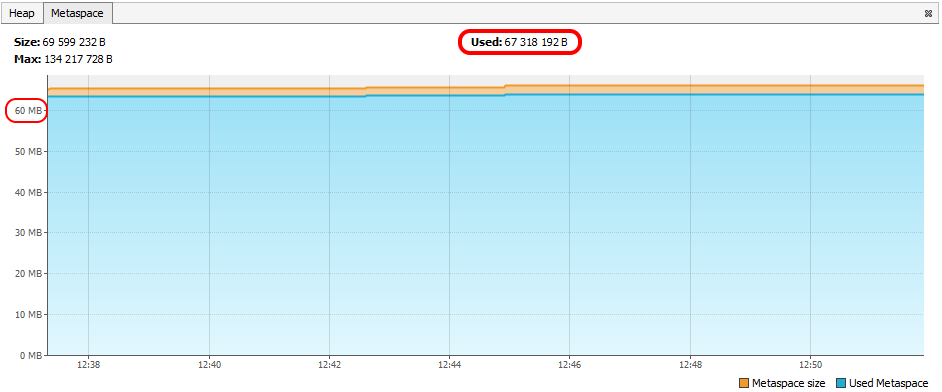
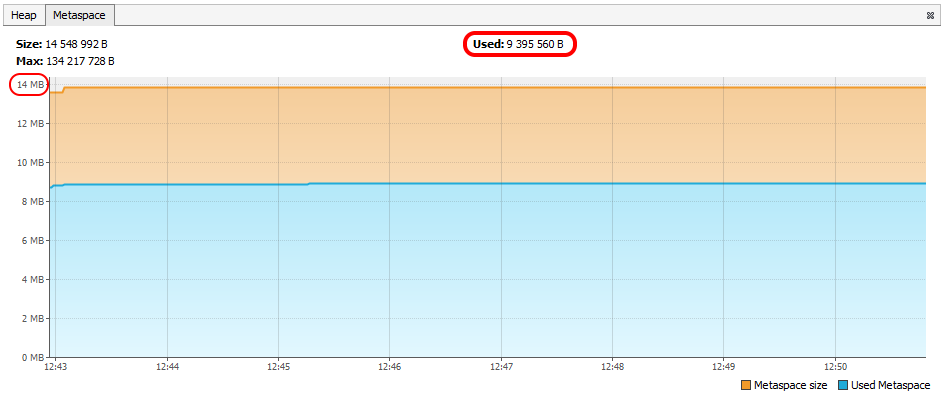

**Application Class Data Sharing (AppCDS)** – фича JVM для ускорения запуска и экономии памяти. [Появившись](https://docs.oracle.com/javase/1.5.0/docs/guide/vm/class-data-sharing.html) в HotSpot в зачаточном виде ещё в JDK 1.5 (2004 г.), она долгое время [оставалась](https://simonis.github.io/JBreak2018/CDS/cds.xhtml#/3) весьма ограниченной, да ещё и отчасти коммерческой. Лишь только с OpenJDK 10 (2018 г.) её [сделали](http://openjdk.java.net/jeps/310) доступной простым смертным, заодно расширив область применения. А недавно [вышедшая](https://habr.com/ru/company/jugru/blog/467789/) Java 13 попыталась сделать это применение более простым.

Идея AppCDS в том, чтобы “расшарить” однажды прогруженные классы между экземплярами одной и той же JVM на одном хосте. Кажется, это должно здорово зайти микросервисам, особенно “бройлерам” на Spring Boot с их тысячами библиотечных классов, ведь теперь эти классы не надо будет загружать (парсить и верифицировать) при каждом старте каждого инстанса JVM, и они не будут дублироваться в памяти. А значит, запуск должен стать скорее, а потребление памяти – ниже. Чудно, не правда ли?

Всё так, всё так. Но если ты, товарищ, привык верить не бульварным вывескам, а конкретным цифрам и примерам, то добро пожаловать под кат – попробуем разобраться, как оно на самом деле…

---

&nbsp;

{}

## Вместо disclaimer’а

Перед тобой не руководство по применению AppCDS, а сводка результатов небольшого исследования. Мне было интересно понять, насколько эта функция JVM применима в моем рабочем проекте, и я попытался оценить ее с позиции enterprise-разработчика, изложив результат в этой статье. Сюда не вошли такие темы, как применение AppCDS на module-path, реализация AppCDS на других виртуальных машинах (не HotSpot) и тонкости применения в контейнерах. Зато здесь есть теоретическая часть для знакомства с темой, а также часть экспериментальная, написанная так, чтобы ты мог повторить опыт самостоятельно. Никакие из полученных результатов пока ещё не применялись в production, но кто знает, каким будет завтра…

&nbsp;

## Теория

### Краткое введение в AppCDS

Знакомство с этой темой могло встречаться тебе в нескольких источниках, например:

* в [статье](https://blog.codefx.org/java/application-class-data-sharing/) у Николая Парлога (включая плюшки Java 13, но без Spring Boot)
* в [докладе](https://2018.jbreak.ru/talks/76so01njvm2a0eqgagysm/) и [статье](https://simonis.github.io/cl4cds/) у Фолькера Симониса (без Java 13, но с деталями)
* в [докладе](https://youtu.be/fmLW7VkSuN8?t=2499) автора этих строк (без Java 13, но с акцентом на Spring Boot)

Чтобы не заниматься пересказыванием, подсвечу лишь несколько пунктов, важных для этой статьи.

Во-первых, AppCDS – это расширение давно появившейся в HotSpot функции CDS, суть которой в следующем:



Чтобы воплотить обе идеи в жизнь, нужно сделать следующее (в общих чертах):

1. Заполучить список классов, которые хочется расшарить между инстансами приложения
1. Слить эти классы в архив, пригодный для memory mapping’а
1. Подключить архив к каждому инстансу приложения при запуске

Казалось бы, алгоритм всего в 3 шага – бери да делай. Но тут начинаются новости, всякие.

Плохая в том, что в худшем случае каждый из этих пунктов превращается, как минимум, в один запуск JVM со своими специфичными опциями, а значит, весь алгоритм представляет из себя тонкое жонглирование однотипными опциями и файлами. Звучит не очень перспективно, не так ли?

Но есть и хорошая новость: работы по улучшению этого алгоритма [ведутся постоянно](https://bugs.openjdk.java.net/browse/JDK-8230168?jql=project%20%3D%20JDK%20AND%20issuetype%20in%20(Enhancement%2C%20JEP)%20AND%20labels%20in%20(appcds%2C%20cds)%20ORDER%20BY%20cf%5B11003%5D%20ASC), и с каждым релизом Java его применение становится проще. Так, например:

* В OpenJDK **10 и 11** можно пропустить **пункт 1**, если хочется расшарить только основные классы JDK, поскольку их список за нас уже составили и положили в `$JAVA_HOME\lib\classlist` (&approx;1200 шт.).
* В OpenJDK **12** можно пропустить **пункт 2**, так как в дистрибутив наряду со списком классов [вошёл](https://bugs.openjdk.java.net/browse/JDK-8204247) и готовый архив с ними, причем используется он “из коробки” и явного подключения не требует.
* На случай, если хочется расшарить всё остальное (а обычно только этого и хочется),
  в OpenJDK **13** [предусмотрены](https://openjdk.java.net/jeps/350) Dynamic CDS Archives – архивы, которые собираются по ходу работы приложения и сохраняются при его штатном завершении. Это позволяет схлопнуть **пункты 1 и 2** в один не слишком замороченный пункт (хотя не всё так просто, но об этом позже).

Таким образом, что бы из себя не представлял процесс приготовления AppCDS, за ним всегда стоят перечисленные выше 3 шага, просто в некоторых случаях они завуалированы.

Как ты наверняка подметил, с приходом AppCDS многие классы приложения начинают двойную жизнь: они живут одновременно и в своих прежних местах (чаще всего JAR-файлах), и в новом разделяемом архиве. При этом разработчик продолжает менять/убирать/дополнять их в прежнем месте, а JVM при работе берет их из нового. Не нужно быть прорицателем, чтобы увидеть опасность такого расклада: если ничего не предпринять, рано или поздно копии классов разъедутся, и мы получим многие прелести типичного “JAR hell”. Понятно, что JVM не может предотвратить изменение классов, зато ей должно быть под силу вовремя сдетектировать расхождение. Однако делать это путем попарного сравнения классов, пусть даже по контрольным суммам, – так себе затея; она может свести на нет весь остальной прирост производительности. Вероятно, поэтому JVM инженеры в качестве объекта сравнения выбрали не отдельные классы, а весь classpath, и в документации на AppCDS [заявили](https://docs.oracle.com/en/java/javase/13/docs/specs/man/java.html#creating-a-shared-archive-file-and-using-it-to-run-an-application): “Classpath при создании разделяемого архива должен быть таким же (или хотя бы префиксом), как и при последующих запусках приложения.” 

> Note that the classpath used at archive creation time must be the same as (or a prefix of) the classpath used at run time.

Но это не однозначная формулировка, ведь, как ты помнишь, classpath может формироваться разными способами, как то:

* считыванием “голых” `.class`-файлов из директорий скомпилированных пакетов,  
  например, `java com.example.Main`
* сканированием директорий с JAR-файлами при использовании wildcard,  
  например, `java -cp mydir/* com.example.Main`
* явным перечислением JAR- и/или ZIP-файлов,  
  например, `java -cp lib1.jar;lib2.jar com.example.Main`

(это не считая того, что classpath может еще и задаваться по-разному, например, через JVM-опции `-cp/-classpath/--class-path`, переменную окружения `CLASSPATH` или атрибут запускаемого JAR-файла `Class-Path`)

Из этих способов в AppCDS поддерживается только один – явное перечисление JAR-файлов. Видимо, инженеры HotSpot JVM посчитали, что сравнение classpath’ов в AppCDS-архиве и в запускаемом приложении будет достаточно быстрым и надежным лишь в том случае, если они будут заданы [максимально](https://bugs.openjdk.java.net/browse/JDK-8211723) четко – обычным исчерпывающим списком.

> CDS/AppCDS supports archiving classes from JAR files only.

Здесь важно отметить, что это утверждение не рекурсивно, т.е. не распространяется на JAR файлы внутри JAR файлов  (если только речь не о Dynamic CDS, см. ниже). А это значит, что привычные нам JAR-матрёшки, выдаваемые Spring Boot’ом, просто так с AppCDS не заработают, придётся присесть. 

Еще одной заковыркой в работе CDS является то, что разделяемые архивы проецируются на память с фиксированными адресами (обычно начиная с `0x800000000`). Само по себе это не плохо, но поскольку в большинстве операционных систем по умолчанию включена рандомизация назначения адресов (Address Space Layout Randomization (ASLR)), требуемый диапазон памяти может оказаться частично занят. Как поступить HotSpot JVM в таком случае решает специальная [опция](https://docs.oracle.com/en/java/javase/13/docs/specs/man/java.html#extra-options-for-java) `-Xshare`, поддерживающая три значения:

* `-Xshare:on` – режим принудительного включения CDS/AppCDS; если диапазон занят, JVM завершает работу с ошибкой. Такой режим **не рекомендуется использовать в production**, так как это может привести к спорадическим сбоям при запусках приложений.
* `-Xshare:off` – (вы)рубильник CDS/AppCDS; отключает использование расшаренных данных полностью (в том числе встроенных архивов)
* `-Xshare:auto` – умолчательное поведение JVM, когда она, в случае невозможности аллоцировать требуемый диапазон памяти, тихонько сдаётся и грузит классы как обычно

В дни написания этой статьи в Oracle как раз [ведется работа](https://bugs.openjdk.java.net/browse/JDK-8231610) по сглаживанию таких проблем, однако номер релиза еще не назначен.

Эти опции частично пригодятся нам позже, а пока посмотрим на…

### Варианты применения AppCDS

Есть несколько способов, как можно при помощи AppCDS ~~испортить себе жизнь~~ оптимизировать работу микросервисов. Они сильно разнятся по сложности и потенциальному профиту, поэтому важно сразу определиться, о каком из них пойдет речь дальше.

Самым простым является применение даже не AppCDS, а просто CDS – это когда в разделяемый архив попадают только платформенные классы (см. [Введение](#краткое-введение-в-appcds)). Такой вариант вычеркиваем сразу, так как в применении к микросервисам на Spring Boot он дает слишком малый профит. Это видно по доле количества shared-классов в их общем распределении на примере одного реального микросервиса (см. зеленый сегмент):



Более сложным, но перспективным видится применение полноценного AppCDS, то есть включение и библиотечных, и прикладных классов в тот же архив. Это целое семейство вариантов, которое выводится из комбинаций числа участвующих приложений и количества их экземпляров. Ниже приведены субъективные авторские оценки пользы и сложности различных вариантов применения AppCDS.

| №     | Приложений | Инстансов     | Профит по CPU | Профит по RAM | Сложность                       |
| ----- | ---------- | ------------- | ------------- | ------------- | ------------------------------- |
| 1     | Одно       | Один          | :+1:          | :-1:          | :small_blue_diamond: Низкая     |
| **2** | **Одно**   | **Несколько** | :+1::+1:      | :+1::+1:      | :small_blue_diamond: **Низкая** |
| 3     | Несколько  | По одному     | :+1::+1:      | :+1::+1:      | :large_orange_diamond: Высокая  |
| 4     | Несколько  | По несколько  | :+1::+1::+1:  | :+1::+1::+1:  | :large_orange_diamond: Высокая  |

Обрати внимание:

* В варианте применения к одному приложению в одном экземпляре (№1) профит по памяти может оказаться нулевым или даже отрицательным (особенно при измерениях [под Windows](https://docs.oracle.com/en/java/javase/12/vm/class-data-sharing.html#GUID-EC975B2E-B4AB-45B4-B91F-51C3A264D0CE))
* Создание правильного разделяемого архива требует действий, сложность которых не зависит от того, в скольких экземплярах потом будет запускаться приложение (сравни пары вариантов №1-2 и №3-4)
* В то же время переход от одного инстанса к нескольким, очевидно, даёт увеличение профита по обоим показателям, но на сложность подготовки не влияет.

В этой статье  мы дойдем **только до варианта №2** (через №1), так как он (1) достаточно прост для близкого знакомства с AppCDS и (2) только к нему применим вышедший недавно [JEP-350](http://openjdk.java.net/jeps/350) Dynamic CDS Archives, который хочется пощупать в действии.

### Dynamic CDS Archives

[JEP-350](http://openjdk.java.net/jeps/350) Dynamic CDS Archives – одно из главных новшеств Java 13 – призвано упростить применение AppCDS. Чтобы ощутить упрощение, нужно сначала понять сложность. Напомню, что классический, “чистый” алгоритм применения AppCDS состоит из 3 шагов: :one: получить список разделяемых классов, :two: создать из них архив и :three: запустить приложение с подключенным архивом. Из этих шагов фактически полезным является только :three:-ий, остальные – лишь подготовка к нему. И хотя получение списка классов (шаг :one:) может показаться очень простым (в некоторых случаях он даже необязателен), на деле при работе с нетривиальными приложениями именно он оказывается наиболее сложным, особенно применительно к Spring Boot. Так вот JEP-350 нужен как раз для того, чтобы устранить этот шаг, точнее, автоматизировать его. Идея в том, чтобы JVM сама составляла список нужных приложению классов, а потом еще сама же формировала из них так называемый “динамический” архив. Согласись, звучит годно. Но загвоздка в том, что теперь становится непонятно, в какой момент прекращать накапливать классы и приступать к их помещению в архив. Раньше, в классическом AppCDS, мы выбирали такой момент сами и даже могли вклиниться между этими действиями, чтобы поменять что-нибудь в списке классов перед его превращением в архив. Теперь же это происходит автоматически и только в один момент, в качестве которого JVM-инженеры выбрали, пожалуй, единственный компромиссный вариант – штатное завершение работы JVM. Это значит, что архив не будет создан до тех пор, пока приложение не остановится. У такого решения есть парочка важных следствий:

* В случае аварийного завершения JVM, архив создан не будет, каким бы замечательным не был накопленный к тому времени список классов (извлечь его потом штатными средствами нельзя).
* Архив будет создан только из тех классов, что успели загрузиться за сеанс работы приложения. Для веб-приложений это значит, что создавать архив путем запуска и тут же остановки не правильно, так как в архив тогда не попадет множество важных классов. Нужно выполнить хотя бы один HTTP-запрос к приложению (а лучше как следует погонять его по всем сценариям), чтобы прогрузились все реально используемые им классы. 

Важным отличием динамических архивов от статических является еще и то, что они всегда представляют собой “надстройку” над базовыми статическими архивами, которыми могут быть как [встроенные](http://openjdk.java.net/jeps/341) в дистрибутив Java архивы, так и созданные отдельно классическим 3-х шаговым способом. 

Синтаксически применение Dynamic CDS Archives сводится к двум запускам JVM с двумя опциями:

1. Триальный прогон с опцией `-XX:ArchiveClassesAtExit=archive.jsa`, в конце которого будет создан динамический архив (можно задать любой путь и имя)
2. Полезный запуск с опцией `-XX:SharedArchiveFile=archive.jsa`, в котором будет задействован созданный ранее архив

Вторая опция с виду ничем не отличается от подключения обычного статического архива. Но если вдруг базовый статический архив лежит не в умолчательном месте (внутри JDK), то эта опция может включить в себя еще и указание пути к нему, например: 

```bash
-XX:SharedArchiveFile=base.jsa:dynamic.jsa
```

*(под Windows разделителем путей должен быть символ “;”)*

&nbsp;

## Практика

### Подопытный кролик

Чтобы наше применение AppCDS на практике не ограничивалось типичным HelloWorld’ом, возьмем за основу реальное приложение на Spring Boot. Мне и моим коллегам часто приходится смотреть логи приложений на удаленных тестовых серверах, причем смотреть “в живую”, прям как они пишутся. Применять для этого полновесный агрегатор логов (вроде ELK) зачастую не уместно; без конца скачивать файлы логов – долго, а глядеть в серый консольный вывод `tail`а – уныло. Поэтому я сделал веб-приложение, которое умеет выводить любые логи в реальном времени прямо в браузер, раскрашивать строчки по уровням важности (заодно форматируя XML), агрегировать несколько логов в один, а также другие фокусы. Оно называется **АнаЛ&oacute;г** (типа “анализатор логов”, хоть это и не  правда) и лежит [на GitHub](https://github.com/Toparvion/analog).

[](images/analog-screenshot-full.png)

Технически это приложение на Spring Boot + Spring Integration, под капотом которого работает `tail`, `docker` и `kubectl` (для поддержки логов из файлов, Docker-контейнеров и Kubernetes-ресурсов  соответственно). Поставляется оно в виде классического “толстого” JAR-файла Spring Boot. В runtime в памяти приложения болтается **&approx;10К классов**, из которых подавляющее большинство – классы Spring и JDK. Очевидно, что эти классы меняются довольно редко, а значит, их можно положить в разделяемый архив и переиспользовать во всех инстансах приложения, экономя память и CPU.

### Одиночный эксперимент

Теперь давай применим имеющиеся знания о Dynamic AppCDS к подопытному кролику. Поскольку всё познаётся в сравнении, нам понадобится некая референтная точка – состояние программы, с которым мы будем сравнивать полученные в ходе эксперимента результаты. 

#### Вводные замечания

- Все дальнейшие команды приведены для Linux. Отличия для Windows и macOS не принципиальны.
- На получаемые результаты может заметно влиять JIT-компиляция и, по идее, для чистоты эксперимента ее можно было бы выключить (опцией `-Xint`, как это сделано в упоминавшейся [статье](https://simonis.github.io/cl4cds/)), однако ради максимальной правдоподобности это решено не делать. 
- Приведенные ниже цифры о времени запуска получены на шустром тестовом сервере. На рабочих машинах аналогичные цифры, как правило, получаются скромнее, но поскольку нас интересуют не абсолютные значения, а их процентные приращения, считаем эту разницу несущественной. 
- Чтобы преждевременно не вдаваться в сложности измерения разделяемой памяти, мы пока опустим получение точных показателей в байтах. Вместо них введем понятие “**потенциал CDS**” – выраженное в процентах отношение числа расшаренных классов к общему числу загруженных классов. Это, конечно, абстрактная величина, но зато она напрямую влияет на фактическое потребление памяти; к тому же её определение вообще не зависит от ОС, а ещё для её расчёта достаточно только логов.

#### Референтная точка

Пусть такой точкой будет состояние свежескачанного приложения, т.е. без явного применения всяких AppCDS’ов и прочего. Для его оценки нам понадобится:

1. Поставить OpenJDK 13 (например, отечественный дистрибутив [Liberica](https://bell-sw.com/pages/java-13/), только не lite-версию).
   Его также нужно добавить в переменную окружения `PATH` или в `JAVA_HOME`, например, так:

   ```bash
   export JAVA_HOME=~/tools/jdk-13
   ```

1. [Скачать](https://github.com/Toparvion/analog/releases/tag/v0.12.1) АнаЛ&oacute;г (на момент написания последней версией была v0.12.1).

   При необходимости можно прописать в файле `config/application.yaml` в параметре `server.address` внешнее имя хоста для обращения к приложению (по умолчанию там указан `localhost`).

1. Включить логирование загрузки классов JVM.
   Для этого можно взвести переменную окружения `JAVA_OPTS` вот с таким значением:

   ```bash
   export JAVA_OPTS=-Xlog:class+load=info:file=log/class-load.log
   ```

   Эта опция будет передана JVM и скажет ей, что нужно [залогировать](https://docs.oracle.com/en/java/javase/13/docs/specs/man/java.html#enable-logging-with-the-jvm-unified-logging-framework) источник каждого класса.

1. Выполнить контрольный прогон:

   1. Запустить приложение скриптом `bin/analog`
   1. Открыть http://localhost:8083 в браузере, потыкать кнопки и галки
   1. Остановить приложение нажатием `Ctrl+C` в консоли скрипта `bin/analog`

1. Снять результат (по файлам в директории  `log/`)
   
   - Общее число загруженных классов (по файлу  `class-load.log`):
     ```bash
     cat class-load.log | wc -l
     10463
     ```
   
   - Сколько из них загружены из разделяемого архива (по нему же):
      ```bash
      grep -o 'source: shared' -с class-load.log
      1146
      ```

   - Среднее время старта (после серии запусков; по  `analog.log`):
      ```bash
      grep -oE '\(JVM running for .+\)' analog.log | grep -oE '[0-9]\.[0-9]+' | awk '{ total += $1; count++ } END { print total/count }'
      4.5225
      ```

Итак, на этом шаге потенциал CDS составил `1146/10463=0,1095` **&approx;11%**. Если тебя удивляет, откуда вообще взялись расшаренные классы (ведь мы еще не включали никакой AppCDS), то напомню, что начиная с 12-ой версии, в состав JDK [входит](http://openjdk.java.net/jeps/341) готовый CDS-архив `$JAVA_HOME/lib/server/classes.jsa`, построенный по не менее готовому списку классов:

```bash
cat $JAVA_HOME/lib/classlist | wc -l
1170
```

Теперь, оценив исходное состояние приложения, мы можем применить к нему AppCDS и путем сравнения понять, что это даёт.

#### Основной опыт

Как завещает нам [документация](https://docs.oracle.com/en/java/javase/13/docs/specs/man/java.html#dynamic-cds-archive), для создания динамического AppCDS архива нужно выполнить только один триальный прогон приложения с опцией `-XX:ArchiveClassesAtExit`. Уже со следующего запуска архив можно будет использовать и получать профит. Чтобы убедиться в этом на том же подопытном кролике (АнаЛоге), нужно:

1. Добавить указанную опцию в команду запуска:

   ```bash
   export JAVA_OPTS="$JAVA_OPTS -XX:ArchiveClassesAtExit=work/classes.jsa"
   ```

2. Расширить логирование:

   ```bash
   export JAVA_OPTS="$JAVA_OPTS -Xlog:cds=debug:file=log/cds.log"
   ```

   Эта опция заставит логироваться процесс построения CDS-архива при останове приложения.

3. Выполнить такой же контрольный прогон, как с референтной точкой:

   1. Запустить приложение скриптом `bin/analog`
   2. Открыть http://localhost:8083 в браузере, потыкать кнопки и галки
   3. Остановить приложение нажатием `Ctrl+C` в консоли скрипта `bin/analog`
      После этого в консоль должна выпасть большущая портянка со всякими warning’ами, а файл `log/cds.log` должен наполниться подробностями; они нас пока не интересуют.

4. Переключить режим запуска с триального на полезный:

   ```bash
   export JAVA_OPTS="-XX:SharedArchiveFile=work/classes.jsa -Xlog:class+load=info:file=log/class-load.log -Xlog:class+path=debug:file=log/class-path.log"
   ```

   Здесь мы не дополняем переменную `JAVA_OPTS`, а перезатираем ее новыми значениями, которые включают (1) использование разделяемого архива, (2) логирование источников классов и (3) логирование проверки class-path. 
   
5. Выполнить полезный запуск приложения по схеме из пункта 3. 

6. Снять результат (по файлам в директории  `log/`)

   - Проверка, что AppCDS действительно применился (по файлу `class-path.log`):
   
     ```text
     [0.011s][info][class,path] type=BOOT 
     [0.011s][info][class,path] Expecting BOOT path=/home/upc/tools/jdk-13/lib/modules
     [0.011s][info][class,path] ok
     [0.011s][info][class,path] type=APP 
     [0.011s][info][class,path] Expecting -Djava.class.path=/home/upc/tmp/analog/lib/analog.jar
     [0.011s][info][class,path] ok
     ```
   
     Отметки `ok` после строчек `type=BOOT` и `type=APP` говорят об успешном открытии, проверке и загрузке встроенного и прикладного CDS-архивов соответственно.
   
   - Общее число загруженных классов (по файлу `class-load.log`):
   
     ```bash
     cat class-load.log | wc -l
     10403
     ```
   
   - Сколько из них загружены из разделяемого архива (по нему же):
   
     ```bash
     grep -o 'source: shared' -c class-load.log
     6910
     ```
   
   - Среднее время старта (после серии запусков; по файлу  `analog.log`):
   
     ```bash
     grep -oE '\(JVM running for .+\)' analog.log | grep -oE '[0-9]\.[0-9]+' | awk '{ total += $1; count++ } END { print total/count }'
     4.04167
     ```

А вот на этом шаге потенциал CDS составил уже `6910/10403≈0,66` **=66%**, то есть вырос **на 55%** по сравнению с референтной точкой. При этом среднее время запуска сократилось на `(4,5225-4,04167)=0,48` секунд, т.е. старт стал быстрее на **&approx;10,6%** от исходного значения.

#### Анализ результата

> Рабочее название пункта: “А чё так мало?”

Мы, вроде как, сделали всё по инструкции, однако в архив попали далеко не все классы. Их число влияет на время запуска ничуть не меньше, чем вычислительная мощность машины экспериментатора, поэтому сконцентрируемся именно на этом числе.

Если помнишь, мы оставили без внимания файл `log/cds.log`, созданный во время останова подопытного приложения после триального прогона. В этом файле HotSpot JVM любезно отметила warning’ами каждый класс, не попавший в CDS архив. Вот сколько всего таких отметок:

```bash
grep -o '[warning]' cds.log -c
3591
```

Учитывая, что всего в логе `class-load.log` упоминается 10К+ классов и из них 66% загружено из архива, не трудно понять, что перечисленные в `cds.log` 3600 классов – это и есть “недостающие” 44% потенциала CDS. Теперь нужно выяснить, почему они были пропущены. 

Если повникать в лог `cds.log`, окажется, что уникальных причин для пропуска классов всего 4 штуки. Вот примеры каждой из них:

```text
Skipping org/springframework/web/client/HttpClientErrorException: Not linked
Pre JDK 6 class not supported by CDS: 49.0 org/jrobin/core/RrdUpdater
Skipping java/util/stream/Collectors$$Lambda$554: Unsafe anonymous class
Skipping ch/qos/logback/classic/LoggerContext: interface org/slf4j/ILoggerFactory is excluded
```

Среди всех 3591 пропущенных классов эти причины встречаются вот с такой частотой:



Взглянем на них поближе:

* ` Unsafe anonymous class`  
  Такими словами JVM обозначает всяческие “небезопасные” для архивации классы, в первую очередь анонимные классы от лямбда-выражений, не пригодные для расшаривания в силу их динамической природы.

* `Not linked`  
  Пока еще не разгаданное мною заклинание, “отравившее” добрую долю всех классов приложения, как библиотечных, так и прикладных. Выяснить его причину пока не удалось, а заданный мною на [StackOverflow вопрос](https://stackoverflow.com/questions/58072964/what-does-not-linked-mean-in-dynamic-cds-archive-log) еще не получил исчерпывающего ответа. Удалось, однако, обойти проблему путем запуска приложения из “тонкого” (сконвертированного) JAR-файла на обычном, не динамическом AppCDS. Но поскольку это заметно более сложный путь, оставим его за скобками (могу рассказать отдельно).

* `Pre JDK 6 class`  
  Если помнишь, первые зачатки CDS появились еще в Java 5. В те же древние времена в формат class-файлов были внесены изменения, на которые CDS опирается по сей день. По этой причине классы, скомпилированные на более ранних, чем 6, версиях Java, не могут быть помещены в разделяемый архив. Многие библиотеки и сейчас поддерживают свой байт-код в таких версиях, чтобы быть совместимыми с большинством runtime-окружений (например, slf4j).

* `Skipping ... : super class/interface ... is excluded`  
  Сюда попали классы, которым “повезло” быть наследниками других исключенных классов. То есть если базовый класс или интерфейс был пропущен CDS’ом, его наследники тоже пролетят. Например:

  ```text
  [warning][cds] Pre JDK 6 class not supported by CDS: 49.0 org/slf4j/spi/MDCAdapter
  [warning][cds] Skipping ch/qos/logback/classic/util/LogbackMDCAdapter: interface org/slf4j/spi/MDCAdapter is excluded
  ```

**Вывод**

{}
Потенциал CDS любого нетривиального приложения не может достигнуть 100%.
{}

Конечно, к этому идеалу можно стремиться, но давай, помня о синице в руках и журавле в небе, лучше посмотрим, чем может пригодиться результат имеющийся. Для этого проведем еще один эксперимент.

### Множественный эксперимент

Если верить описанию [JEP-310](https://openjdk.java.net/jeps/310), AppCDS должен приносить профит при запуске нескольких экземпляров одного и того же приложения на одном и том же хосте из одного и того же дистрибутива JDK. Попробуем это проверить. Здесь время запуска уже не так важно, поэтому оставим его без внимания. А вместо потенциала CDS (который, очевидно, не зависит от числа инстансов) сконцентрируемся на более конкретных показателях потребления памяти.

#### Подготовка

Чтобы клонировать подопытного кролика (запустить АнаЛог в нескольких инстансах), нам нужно кое-что поменять в настройках; это позволит поднимаемым процессам не “толкаться локтями”. Благодаря Spring Boot, сделать это можно без правки или копирования каких-либо файлов; любые настройки можно перекрыть опциями JVM. Проброс этих опций из переменной окружения `ANALOG_OPTS` обеспечивает скрипт запуска, любезно сгенерированный Gradle’ом. 

```bash
export ANALOG_OPTS="-Djavamelody.enabled=false -Dlogging.config=classpath:logging/logback-console.xml"
export ANALOG_OPTS="$ANALOG_OPTS -Dnodes.this.agentPort=7801 -Dserver.port=8091"
```

Первая строчка отключает встроенный мониторинг JavaMelody, чтобы в его рабочей директории не образовалась каша из данных от разных инстансов, и заодно оставляет логирование только в консоли, чтобы логи не лились в один файл. Вторая строчка задает отдельные TCP-порты для текущего экземпляра приложения; их потребуется менять для каждого нового процесса.

Кроме того, нам нужно сделать так, чтобы логи JVM о загрузке классов и работе AppCDS писались в разные файлы. Для этого можно воспользоваться уже знакомой переменной окружения `JAVA_OPTS` и фишкой из [JVM Unified Logging Framework](https://docs.oracle.com/en/java/javase/13/docs/specs/man/java.html#enable-logging-with-the-jvm-unified-logging-framework):

```bash
export JAVA_OPTS="-Xlog:class+load=info:file=log/class-load-%p.log -Xlog:class+path=debug:file=log/class-path-%p.log"
export JAVA_OPTS="$JAVA_OPTS -XX:SharedArchiveFile=work/classes.jsa"
```

Первая строка содержит в именах логов комбинацию `%p`, которая будет заменена JVM на идентификатор процесса в ОС (PID). Вторая активирует AppCDS и указывает, откуда брать разделяемый архив (он должен быть одним и тем же на все процессы).

#### Основной опыт

Теперь, в принципе, можно запустить сразу несколько инстансов приложения и броситься их обмерять. Однако чуть любопытнее запускать их по одному и снимать показатели потребления памяти с каждого экземпляра на каждой итерации. Сделать это можно следующим образом:

1. Указать незанятые порты в параметрах `server.port` и `nodes.this.agentPort`, как например в [предыдущем](#подготовка):

   ```bash
   export ANALOG_OPTS="$ANALOG_OPTS -Dnodes.this.agentPort=7801 -Dserver.port=8091"
   ```

   Разумеется, сделать это можно любым другим способом (или вовсе автоматизировать и забыть).

2. Запустить приложение скриптом `bin/analog`

   *(Опционально)* Открыть http://localhost:8091 в браузере, потыкать кнопки и галки

3. Выяснить PID процесса (или нескольких процессов), например:

   ```bash
   pgrep -f analog
   13792
   ```

4. Запросить полный расклад памяти утилитой `pmap` (синтаксис команды стащен из [этой статьи](https://simonis.github.io/cl4cds/)):

   ```bash
   pmap -XX 13792 | sed -n -e '2p;$p'
            Address Perm   Offset Device   Inode    Size KernelPageSize MMUPageSize    Rss    Pss Shared_Clean Shared_Dirty Private_Clean Private_Dirty Referenced Anonymous LazyFree AnonHugePages ShmemPmdMapped Shared_Hugetlb Private_Hugetlb Swap SwapPss Locked ProtectionKey                   VmFlagsMapping
                                                 3186952           1548        1548 328132 325183         3256            0         10848        314028     212620    314024        0             0              0              0               0    0       0 325183             0 KB 
   ```

   Это нужно сделать для всех экземпляров приложения и пока просто сохранить; вникать будем позже.

5. Повторить пункты 1-4 для нескольких новых инстансов (например, штук четырех).


#### Анализ результатов

Примененная нами утилита `pmap` выводит подробный расклад по использованию памяти указанным процессом с точки зрения операционной системы. Использование этой программки для оценки экономии памяти CDS’ом здорово описано в [статье у Фолькера Симониса](https://simonis.github.io/cl4cds/). Чтобы не пересказывать ее, скажу лишь, что одной из наиболее показательных величин является PSS:

> The "proportional set size" (PSS) of a process is the count of pages it has in memory, where each page is divided by the number of processes sharing it. So if a process has 1000 pages all to itself, and 1000 shared with one other process, its PSS will be 1500.

Грубо говоря, это показатель потребления, учитывающий “степень расшаривания” памяти. Он описывает далеко не всю картину распределения памяти, но для верхнеуровневой оценки кажется достаточным.

Если свести значения PSS в таблицу из всех итераций проведенного эксперимента, должно получиться примерно так:

|     Iteration: | 1       | 2       | 3       | 4       | 5       |
| -------------: | ------- | ------- | ------- | ------- | ------- |
| PSS of inst#1: | 339 088 | 313 778 | 305 517 | 301 153 | 298 604 |
| PSS of inst#2: |         | 314 904 | 306 567 | 302 555 | 299 919 |
| PSS of inst#3: |         |         | 314 914 | 311 008 | 308 691 |
| PSS of inst#4: |         |         |         | 306 563 | 304 495 |
| PSS of inst#5: |         |         |         |         | 294 686 |
|     *Average:* | 339 088 | 314 341 | 308 999 | 305 320 | 301 279 |

И хотя в таком виде результат не очень нагляден, по нему уже можно сделать кое-какие наблюдения:

* Запуск каждого нового инстанса почти всегда обходится “дешевле” предыдущего
* По мере запуска новых инстансов, PSS старых уменьшается
* Чем “старше” процесс, тем сильнее снижается его PSS по мере запуска новых экземпляров

Эти наблюдения довольно любопытны, но для практических нужд дают мало. Куда полезнее сравнить их с аналогичными показателями без AppCDS. Для этого потребуется повторить приведенную выше серию опытов, только на сей раз вместо опции `-XX:SharedArchiveFile=work/classes.jsa` нужно указать `-Xshare:off`, то есть отключить CDS полностью. После сведения результатов этой серии на один график со средними значениями из таблицы выше, получится примерно такая картина.



Отсюда можно сделать несколько более конкретных наблюдений:

* Значения PSS при AppCDS явно превосходят аналогичные значения без CDS.
  Свидетельство и частичное объяснение этому есть в упомянутой выше [статье](https://simonis.github.io/cl4cds/). В частности, там показано, что даже на HelloWorld-программе JVM в режиме CDS аллоцирует на 2 МБ больше хипа, чем без CDS. Но при этом и снижение PSS при переходе от одного экземпляра к двум значительно заметнее в случае CDS, чем в случае без него. Это же самое видно и в нашем случае:

* Наиболее существенное снижение PSS наблюдается у AppCDS при запуске именно 2-го инстанса приложения; 3-ий и последующие запуски влияют гораздо меньше. 
  Если мысленно отбросить первую пару столбцов и представить, как тогда будут выглядеть линии тренда, будет не трудно понять, что эти линии практически параллельны. Это значит, что профит от расшаривания памяти что с AppCDS, что без него, остается примерно одинаковым, когда речь идет о запуске 3-х и более экземпляров приложения.
  Но вопрос: откуда берется расшаренная память, если мы выключили CDS? На этот вопрос отвечает следующее наблюдение:

* Даже при выключенном CDS/AppCDS процессы JVM все равно делят между собой память, поэтому PSS снижается по мере запуска новых инстансов приложения. Чтобы понять, что это за память, достаточно позвать всё ту же `pmap`, только без “схлопывания” ее результатов `sed`‘ом. В сокращенном и урезанном виде для случая с одним процессом это может выглядеть так:

  ```bash
  pmap -X `pgrep -f analog`
  14981: # ...
           Address Perm   Offset Device   Inode    Size    Rss    Pss ... Mapping
      # ...                                                               ...
      7faf5e31a000 r-xp 00000000  08:03  269427   17944  14200  14200 ... libjvm.so
      # ...                                                               ...
      7faf5f7f9000 r-xp 00000000  08:03 1447189    1948   1756     25 ... libc-2.27.so
  ```

  В самом правом столбце этой портянки (`Mapping`) указаны библиотеки, “спроецированные” в память и используемые многими процессами. Это могут быть как специфичные для JVM библиотеки (`libjvm.so` в примере выше), так и более общие (`libc-2.27.so` там же). В той самой [статье](https://simonis.github.io/cl4cds/) Фолькер Симонис поясняет это весьма просто и ясно:

  > For the Java VM, the read-only parts of the loaded shared libraries (i.e. `libjvm.so`) can be shared between all the VM instances running at the same time. This explains why, taking together, the two VM’s consume less memory (i.e. have a smaller memory footprint) than the simple sum of their single resident set sizes when running alone.

Приведенные выше наблюдения опираются на довольно грубые и местами неоднозначные цифры. Однако для верхнеуровневой оценки их, в принципе, достаточно. Кроме того, если вваливаться в детальный анализ потребления памяти несколькими инстансами приложения, можно вскоре обнаружить себя погрязшим в дебрях устройства JVM и управления памятью в ОС, ведь отпечаток памяти Java-процесса формируется из множества составляющих. Это отлично демонстрируется слайдом из недавнего [доклада Андрея Паньгина](https://vimeo.com/364039638#t=2760s) на GeekOut:



Мы, конечно, молодцы, что попытались оценить профит от AppCDS со стороны операционной системы, т.е. извне по отношению к Java-приложению. Однако нельзя забывать, что расшариваемые мета данные классов имеют вполне конкретное место в модели памяти JVM, а значит, какие-то изменения должны быть видны и изнутри.

Если подключиться к подопытному приложению через VisualVM и понаблюдать за уровнями в Metaspace в режимах с AppCDS и без, то можно увидеть вот такую разницу:

**Без AppCDS**



**При AppCDS**



Здесь можно видеть, что при одном и том же потолке в 128 МБ фактически занятый объем Metaspace при включенном AppCDS может оказаться в `64.2 MiB / 8.96 MiB` **&approx;7,2 раз меньше**, чем без CDS вообще. Это однако не мешает виртуальной машине резервировать память с большим запасом (см. нижний график) и этим снижать фактическую разницу до ` 66.4 MiB / 13.9 MiB` **&approx;4,8 раз**. Сама по себе разница объясняется тем, что при включенном AppCDS виртуальной машине не нужно самой парсить, верифицировать и размещать все классы в Metaspace. Многие из них достаются ей готовыми и тогда берутся не из Metaspace, а из области памяти, на которую смаплен CDS архив.

&nbsp;

## Вместо заключения

В этой статье я поделился с тобою своими наработками по применению Spring Boot и AppCDS – фичи JVM, призванной оптимизировать потребление памяти и время старта приложений.

* Мы пробежались по теоретическим [основам](#%D1%82%D0%B5%D0%BE%D1%80%D0%B8%D1%8F) темы и чуть подробнее [остановились](#dynamic-cds-archives) на JEP-350 Dynamic CDS Archives – новшестве недавно вышедшей JDK 13.
* Затем на примере Spring Boot приложения [АнаЛ&oacute;г](https://github.com/Toparvion/analog) провели небольшой [эксперимент](#%D0%BE%D0%B4%D0%B8%D0%BD%D0%BE%D1%87%D0%BD%D1%8B%D0%B9-%D1%8D%D0%BA%D1%81%D0%BF%D0%B5%D1%80%D0%B8%D0%BC%D0%B5%D0%BD%D1%82) по замеру времени старта и потенциала CDS (доли расшаренных классов). Оказалось, что с динамическими архивами потенциал не может даже приблизиться к 100% и остается где-то в районе **66%**. Прирост скорости запуска тоже не шокирует, так как оказывается равным лишь **&approx;11%** (в отдельных экспериментах до 15%, но все равно не в разы).
* Мы провели и [второй эксперимент](#%D0%BC%D0%BD%D0%BE%D0%B6%D0%B5%D1%81%D1%82%D0%B2%D0%B5%D0%BD%D0%BD%D1%8B%D0%B9-%D1%8D%D0%BA%D1%81%D0%BF%D0%B5%D1%80%D0%B8%D0%BC%D0%B5%D0%BD%D1%82), где запустили подопытное приложение сразу в 5-ти экземплярах и замерили их PSS (объем памяти с учетом доли расшаренных страниц). Здесь оказалось, что AppCDS действительно даёт некоторую экономию памяти, однако она **не очень велика** и хорошо проявляется лишь при переходе от одного экземпляра к двум, **достигая 8%** (PSS). В остальных же случаях разница такая же, как и без CDS, то есть когда расшариваются области, не связанные с метаданными классов. При этом абсолютные цифры в случае с AppCDS оказались **заметно выше**.
* Мы также [понаблюдали](#%D0%B0%D0%BD%D0%B0%D0%BB%D0%B8%D0%B7-%D1%80%D0%B5%D0%B7%D1%83%D0%BB%D1%8C%D1%82%D0%B0%D1%82%D0%BE%D0%B2) за тем же с позиции заполнения Metaspace, и оказалось, что занятая доля этой области памяти при включенном AppCDS почти **в 5 раз меньше**, чем без CDS.

Конечно, судя по таким результатам AppCDS, мягко говоря, не заслуживает звания “killer feature”. Однако и область его применения далеко не исчерпывается микросервисами на Spring Boot. Я вполне допускаю, что в других, более ресурсоемких приложениях AppCDS может проявить себя куда более перспективно. Кроме того, напомню, что здесь мы не рассмотрели варианты применения AppCDS ко множеству *разных* приложений на Spring Boot. В своем проекте я протоптал этот путь и обнаружил на нем немало интересных спецэффектов, однако это уже совсем другая тема…

{}
Эта статья была изначально [опубликована](https://habr.com/ru/post/472638/) на Хабре.
{}

