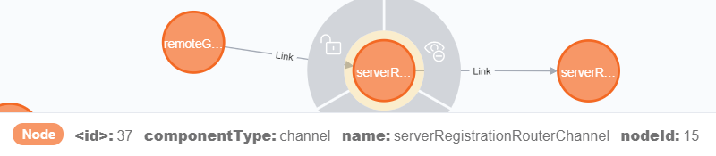

Фреймворк Spring Integration [умеет](https://docs.spring.io/spring-integration/docs/5.2.5.RELEASE/reference/html/system-management.html#integration-graph) отдавать текущее состояние всех [EIP](https://www.enterpriseintegrationpatterns.com/)-компонентов и их связей в виде JSON-графа. Это кажется очень удобным для изучения и отладки, но увы, ни один из нагугливаемых инструментов (коих всего-то [раз](https://github.com/spring-projects/spring-flo/tree/angular-1.x/samples/spring-flo-si) /[два](https://ordina-jworks.github.io/architecture/2018/01/27/Visualizing-your-Spring-Integration-components-and-flows.html)) не даёт достаточной гибкости для визуализации и анализа такого графа. В этой заметке я покажу, как решить эту проблему путем импорта графа в графовую СУБД [Neo4j](https://neo4j.com/), где такая гибкость стоит на первом месте.

### Короче (tl;dr;)

Если некогда/не охота вникать, то вот что надо сделать:

1. **Установить** библиотеку APOC в свой экземпляр Neo4j.
1. Выполнить **этот** Cypher-скрипт, поменяв в нём URL на свой.

Ну, а если просто так не завелось или стали интересны подробности, то добро пожаловать дальше.

### Как получить описание графа в JSON?

Есть 2 не взаимоисключающих способа:

1. Если используется модуль `spring-integration-http` (или `spring-integration-webflux`), то граф можно получить, дёрнув [Integration Graph Controller](https://docs.spring.io/spring-integration/docs/5.2.5.RELEASE/reference/html/system-management.html#integration-graph-controller).
1. Если используется модуль `spring-integration-core` **вместе** со Spring Boot Actuator, то граф можно получить через его endpoint под названием [integrationgraph](https://docs.spring.io/spring-boot/docs/2.2.5.RELEASE/reference/html/production-ready-features.html#production-ready-endpoints) (который [по умолчанию](https://docs.spring.io/spring-boot/docs/2.2.5.RELEASE/reference/html/production-ready-features.html#production-ready-endpoints-exposing-endpoints) не доступен через web).

В обоих случаях ответ будет выглядеть примерно так:

```json
{
  "contentDescriptor": {
    "providerVersion": "5.2.4.RELEASE",
    "providerFormatVersion": 1.1,
    "provider": "spring-integration",
    "name": "analog"
  },
  "nodes": [
    {
      "nodeId": 3,
      "componentType": "ExecutorSubscribableChannel",
      "name": "brokerChannel"
    },
    // ...
  ],
  "links": [
    {
      "from": 19,
      "to": 8,
      "type": "output"
    },
    // ...
  ]
}
```

На верхнем уровне ответа всегда только 3 поля:

- Объект `contentDescriptor` – общий описатель графа; поле `name` в нём берется из имени приложения (свойство `spring.application.name`). 
- Массив `nodes` содержит описания узлов графа – собственно EIP-компонентов, бины которых и составляют интеграционный конвейер. Наряду с именем `name`, типом `componentType` и идентификатором `nodeId`, в него также могут входить метрики и другие данные, но нас они не интересуют.
- Массив `links` описывает рёбра графа, т.е. связи между EIP-компонентами. Поля `from` и `to` указывают на значения `nodeId` исходящего и входящего узлов соответственно. А поле `type` содержит тип связи, коих всего 5: `input`, `output`, `route`, `error`, `discard`.

:point_up: *Каналы в терминах EIP **не** являются связями в графе!*  
Вместо этого они представлены такими же узлами, как например, адаптеры и фильтры, разве что их `componentType` обычно заканчивается словом *channel*.

Подробнее модель графа описана в [этом разделе](https://docs.spring.io/spring-integration/docs/5.2.5.RELEASE/reference/html/system-management.html#integration-graph) документации на Spring Integration.

#### На всякий случай

Прежде чем дёргать граф прямо из Neo4j, настоятельно рекомендую получить его чем-то попроще, например, обычным браузером, перейдя по ссылке [http://localhost:8080/actuator/integrationgraph](http://localhost:8080/actuator/integrationgraph) (для случая со Spring Boot Actuator). Если ответ не похож на приведенный выше JSON, то нет смысла двигаться дальше, нужно разобраться здесь.

Чаще всего проблема либо в ограничениях [CORS](https://ru.wikipedia.org/wiki/Cross-origin_resource_sharing), либо в недоступности отдающего граф компонента. Если приложение на Spring Boot (+Actuator) и развернуто локально, то обе проблемы можно решить добавлением в его настройки следующих [строк](https://docs.spring.io/spring-boot/docs/2.2.5.RELEASE/reference/html/production-ready-features.html#production-ready-endpoints-cors):

```yaml
management:
  endpoints:
    web:
      exposure:
        include: '*'
      cors:
        allowed-origins: '*'
        allowed-methods: '*'
```

*(только не надо делать так на production :pray: )*

А если приложение на чистом Spring Integration, то см. подсказки на [этой странице](https://docs.spring.io/spring-integration/docs/5.2.5.RELEASE/reference/html/system-management.html#integration-graph-controller) документации.

### Как импортировать граф в Neo4j

#### Входные требования

Чтобы залить граф в Neo4j, нам понадобится 2 вещи:

1. Собственно **СУБД Neo4j** *(неожиданно, правда?)*  
   Подойдёт любая бесплатная поставка:

   - Настольная [Neo4j Desktop](https://neo4j.com/download-center/#desktop)
   - Серверная [Neo4j Community Server](https://neo4j.com/download-center/#community)
   - Облачная песочница [Neo4j Sandbox](https://neo4j.com/sandbox/)  
     *Не требует инсталляции*

1. Библиотека полезных Cypher-процедур **APOC**

   Это де-факто стандартная библиотека от разработчиков Neo4j, поэтому её можно найти и поставить прямо с их [официального сайта](https://neo4j.com/docs/labs/apoc/current/introduction/#installation). В облачной песочнице Neo4j Sandbox она уже предустановлена.

При написании статьи использовалась Neo4j версии **4.0.1**, но поскольку на внутренности СУБД мы здесь не полагаемся, всё должно работать и на других версиях.[^1] При установке библиотеки APOC важно, чтобы первые 2 цифры её версии совпадали с такими же цифрами у самой Neo4j.

#### Подход 1: прямая визуализация

Поскольку граф Spring Integration, судя по его JSON-модели, содержит всё необходимое для визуализации, можно просто взять его “как есть” (узлы – к узлам, связи – к связям, свойства – к свойствам) и залить в графовую СУБД. Из всех свойств узлов мы возьмём только основные: `nodeId`, `nodeName` и `componentType`. Они поставляются базовым классом `org.springframework.integration.graph.IntegrationNode`, поэтому должны присутствовать у всех без исключения узлов (но это не точно).

Теперь основная идея сводится к тому, чтобы прямо из Neo4j сказать что-то вроде: 

> *Возьми JSON вот по **этому** URL, обойди вот **такие** его поля и разложи их данные по вот **таким** вершинам и рёбрам вот с **такими** свойствами.*

На языке Cypher это распоряжение может выглядеть примерно так:[^2]

```cypher
// (1) load JSON from URL:
WITH "http://localhost:8080/actuator/integrationgraph" AS url
CALL apoc.load.json(url) YIELD value	  
WITH value AS json, value.contentDescriptor AS jsonDescriptor
// (2) descriptor:
MERGE (descriptor:Descriptor {name: jsonDescriptor.name}) 
    ON CREATE SET 
    descriptor.providerVersion = jsonDescriptor.providerVersion, 
    descriptor.providerFormatVersion = jsonDescriptor.providerFormatVersion,
    descriptor.provider = jsonDescriptor.provider
// (3) nodes:
WITH json, descriptor
UNWIND json.nodes AS jsonNode
MERGE (node:Node {nodeId: jsonNode.nodeId})
    ON CREATE SET
    node.componentType = jsonNode.componentType,
    node.name = jsonNode.name
// (4) links:
WITH json, descriptor, node 
UNWIND json.links AS jsonLink
MATCH (a:Node {nodeId: jsonLink.from}), (b:Node {nodeId: jsonLink.to})
MERGE (a)-[link:Link {type: jsonLink.type}]->(b)
// (5) result:
RETURN descriptor, node, link
```

Не вдаваясь в пересказ [синтаксиса](https://neo4j.com/docs/cypher-refcard/4.0/) языка Cypher, обозначу основные части этого запроса (по цифрам в комментариях):

1. С помощью APOC-процедуры `apoc.load.json(url)` мы загружаем JSON-граф целиком и для краткости и наглядности переименовываем его корень в `json`, а объект с дескриптором – в `jsonDescriptor`.
1. Теперь создаём в графе отдельный узел с меткой `Descriptor`, дословно перекладывая в его свойства данные из объекта `jsonDescriptor`.  
   :information_source: Здесь и далее используется именно операция `MERGE`, чтобы запрос можно было выполнять многократно по мере роста графа, не порождая дубликаты. Если это не важно, `MERGE` можно заменить на `CREATE`.
1. Обходим узлы JSON-графа (массив `nodes`) операцией `UNWIND` и для каждого из них создаём в целевом графе узел с меткой `Node`, попутно перекладывая свойства `name` и `componentType`.
1. Тоже самое проделываем из со связями (массив `links`), но перед созданием ребра с меткой `Link` отыскиваем соединяемые вершины отдельной операцией `MATCH`, чтобы не порождать дубликаты этих вершин.
1. В результат работы запроса включаем всё, что тут понасоздавали: узлы, связи и дескриптор. 

Если выполнить этот запрос в [Neo4j Browser](https://neo4j.com/developer/neo4j-browser/) на примере [вот такого](export/analog.json) JSON-графа, то он будет визуализирован примерно так:



В целом, результат достигнут: EIP-компоненты превращены в узлы графа, между ними проставлены связи с нужными направлениями, а если поводить курсором по элементам графа в Neo4j Browser, то в нижней части панели будут отображаться всякие дополнительные свойства, которые мы перекладывали в Cypher-запросе:



И даже “разобщенность” элементов графа (наличие множества остовов) в этом примере не является ошибкой импорта, так как это особенность анализируемого приложения.

&nbsp;

&nbsp;

&nbsp;

&nbsp;


---

- [ ] Особенности развертывания в облачной песочнице упомянуты:
  - ~~Версия 3.5.11~~
  - Недоступность загрузки с `localhost`. Альтернатива:
    https://deploy-preview-1--toparvion.netlify.app/export/analog.json
  - Урезанная сигнатура методов `merge`
- [ ] Стиль оформления выложен и учтён в тексте

[^1]: В облачной песочнице на дату 16.04.20 использовалась Neo4j версии 3.5.11, для которой некоторые процедуры APOC имели отличия в сигнатурах от версии 4.0. Подробнее об этом см. ниже. 
[^2]: Если Neo4j развёрнута на удалённом сервере или в Sandbox’е, то этот запрос не выполнится, т.к. `localhost` для неё будет другим. Придётся либо обеспечить свой JSON-граф внешним адресом, либо хотя бы взять [готовый пример](export/analog.json) графа от приложения [АнаЛ&oacute;г](/project/analog).