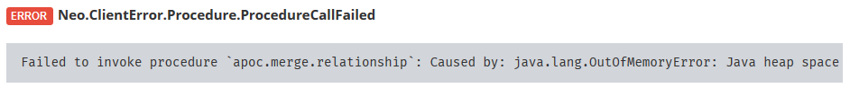

Фреймворк Spring Integration [умеет](https://docs.spring.io/spring-integration/docs/5.2.5.RELEASE/reference/html/system-management.html#integration-graph) отдавать текущее состояние всех [EIP](https://www.enterpriseintegrationpatterns.com/)-компонентов и их связей в виде JSON-графа. Это кажется очень удобным для изучения и отладки, но увы, ни один из нагугливаемых инструментов (коих всего-то [раз](https://github.com/spring-projects/spring-flo/tree/angular-1.x/samples/spring-flo-si) /[два](https://ordina-jworks.github.io/architecture/2018/01/27/Visualizing-your-Spring-Integration-components-and-flows.html)) не даёт достаточной гибкости для визуализации и анализа такого графа. В этой статье я покажу, как решить эту проблему путем импорта графа в графовую СУБД [Neo4j](https://neo4j.com/), где такая гибкость стоит на первом месте.

### Короче (tl;dr)

Если вкратце, то вот что надо сделать:

1. Обеспечить [отдачу](#как-получить-описание-графа-в-json) графа в виде JSON по известному URL.
1. Выполнить [этот](#расширенный-запрос) Cypher-запрос в Neo4j Browser, подставив туда URL.
1. Профит 😋

Ну, а если просто так не завелось или стали интересны подробности, то добро пожаловать дальше.

{}

Статья рассчитана на тех, кто знаком с экосистемой Spring и имеет базовое представление о графовой СУБД Neo4j и её языке запросов Cypher. Но если нет, не беда – в тексте есть ссылки на поясняющие источники.

{}

### Как получить описание графа в JSON?

Есть 2 не взаимоисключающих способа:

1. Если используется модуль `spring-integration-http` (или `spring-integration-webflux`), то граф можно получить, дёрнув [Integration Graph Controller](https://docs.spring.io/spring-integration/docs/5.2.5.RELEASE/reference/html/system-management.html#integration-graph-controller).
1. Если используется модуль `spring-integration-core` **вместе** со Spring Boot Actuator, то граф можно получить через его endpoint под названием [integrationgraph](https://docs.spring.io/spring-boot/docs/2.2.5.RELEASE/reference/html/production-ready-features.html#production-ready-endpoints) (который [по умолчанию](https://docs.spring.io/spring-boot/docs/2.2.5.RELEASE/reference/html/production-ready-features.html#production-ready-endpoints-exposing-endpoints) не доступен через web).

В обоих случаях ответ будет выглядеть примерно так:

```json
{
  "contentDescriptor": {
    "providerVersion": "5.2.4.RELEASE",
    "providerFormatVersion": 1.1,
    "provider": "spring-integration",
    "name": "analog"
  },
  "nodes": [
    {
      "nodeId": 3,
      "componentType": "ExecutorSubscribableChannel",
      "name": "brokerChannel"
    },
    // ...
  ],
  "links": [
    {
      "from": 19,
      "to": 8,
      "type": "output"
    },
    // ...
  ]
}
```

На верхнем уровне ответа всегда только 3 поля:

- Объект `contentDescriptor` – общий описатель графа; поле `name` в нём берется из имени приложения (свойство `spring.application.name`).
- Массив `nodes` содержит описания вершин графа – собственно EIP-компонентов, бины которых и составляют интеграционный конвейер. Наряду с именем `name`, типом `componentType` и идентификатором `nodeId`, в него также могут входить метрики и другие данные, но нас они не интересуют.
- Массив `links` описывает рёбра графа, т.е. связи между EIP-компонентами. Пол*я* `from` и `to` указывают на значения `nodeId` исходящей и входящей вершины соответственно. А поле `type` содержит тип связи, их всего 5: `input`, `output`, `route`, `error`, `discard`.

 *Каналы (в терминах EIP) **не** являются рёбрами в графе!*  
Вместо этого они представлены такими же вершинами, как например, адаптеры и фильтры, разве что их `componentType` обычно заканчивается словом *channel*.

Подробнее модель графа описана в [этом разделе](https://docs.spring.io/spring-integration/docs/5.2.5.RELEASE/reference/html/system-management.html#integration-graph) документации на Spring Integration.

{}

Далее по тексту вершины графа будут часто называться “узлами”, а рёбра – “связями”, чтобы более явно ссылаться на предметную область: массивы  `nodes` и `links` соответственно. Смысловых отличий в этих терминах нет.

{}

#### На всякий случай

Прежде чем дёргать граф прямо из Neo4j, настоятельно рекомендую получить его чем-то попроще, например, обычным браузером, перейдя по ссылке [http://localhost:8080/actuator/integrationgraph](http://localhost:8080/actuator/integrationgraph) (для случая со Spring Boot Actuator). Если ответ не похож на приведенный выше JSON, то нет смысла двигаться дальше, нужно разобраться здесь.

Чаще всего проблема либо в ограничениях [CORS](https://ru.wikipedia.org/wiki/Cross-origin_resource_sharing), либо в недоступности отдающего граф компонента. Если приложение на Spring Boot (+Actuator) и развернуто локально, то обе проблемы можно решить добавлением в его настройки следующих [строк](https://docs.spring.io/spring-boot/docs/2.2.5.RELEASE/reference/html/production-ready-features.html#production-ready-endpoints-cors):

```yaml
management:
  endpoints:
    web:
      exposure:
        include: '*'
      cors:
        allowed-origins: '*'
        allowed-methods: '*'
```

*(только не надо делать так на production! :pray: )*

А если приложение на чистом Spring Integration, то см. подсказки на [этой странице](https://docs.spring.io/spring-integration/docs/5.2.5.RELEASE/reference/html/system-management.html#integration-graph-controller) документации.

### Как импортировать граф в Neo4j?

#### Входные требования

Чтобы залить граф в Neo4j, нам понадобится 2 вещи:

1. Собственно **СУБД Neo4j** *(неожиданно, правда?)*  
   Подойдёт любая бесплатная поставка:

   - Настольная [Neo4j Desktop](https://neo4j.com/download-center/#desktop)
   - Серверная [Neo4j Community Server](https://neo4j.com/download-center/#community)
   - Облачная песочница [Neo4j Sandbox](https://neo4j.com/sandbox/)  
     *Не требует инсталляции*

1. Библиотека полезных Cypher-процедур **APOC**

   Это де-факто стандартная библиотека от разработчиков Neo4j, поэтому её можно найти и поставить прямо с их [официального сайта](https://neo4j.com/docs/labs/apoc/current/introduction/#installation). В облачной песочнице Neo4j Sandbox она уже предустановлена.

При написании статьи использовалась Neo4j версии **4.0.1**, но поскольку на внутренности СУБД мы здесь не полагаемся, всё должно работать и на других версиях.[^1] При установке библиотеки APOC важно, чтобы первые 2 цифры её версии совпадали с такими же цифрами у самой Neo4j.

#### Подход 1: прямая визуализация

Поскольку граф Spring Integration, судя по его JSON-модели, содержит всё необходимое для визуализации, можно просто взять его “как есть” и залить в графовую СУБД: узлы – к вершинам, связи – к рёбрам, свойства – к свойствам. Из всех свойств узлов мы возьмём только основные: `nodeId`, `nodeName` и `componentType`. Они поставляются базовым классом `org.springframework.integration.graph.IntegrationNode`, поэтому должны присутствовать у всех без исключения узлов (но это не точно).

Теперь основная идея сводится к тому, чтобы прямо из Neo4j сказать что-то вроде:

> *Возьми JSON вот по этому URL, обойди вот такие его поля и разложи их данные по вот таким вершинам и рёбрам вот с такими свойствами.*

На языке [Cypher](https://neo4j.com/developer/cypher-query-language/) это распоряжение может выглядеть примерно так:[^2]

```cypher
// (1) load JSON from URL:
WITH "http://localhost:8080/actuator/integrationgraph" AS url
CALL apoc.load.json(url) YIELD value	  
WITH value AS json, value.contentDescriptor AS jsonDescriptor
// (2) descriptor:
MERGE (descriptor:Descriptor {name: jsonDescriptor.name})
    ON CREATE SET
    descriptor.providerVersion = jsonDescriptor.providerVersion,
    descriptor.providerFormatVersion = jsonDescriptor.providerFormatVersion,
    descriptor.provider = jsonDescriptor.provider
// (3) nodes:
WITH json, descriptor
UNWIND json.nodes AS jsonNode
MERGE (node:Node {nodeId: jsonNode.nodeId})
    ON CREATE SET
    node.componentType = jsonNode.componentType,
    node.name = jsonNode.name
// (4) links:
WITH json, descriptor, node
UNWIND json.links AS jsonLink
MATCH (a:Node {nodeId: jsonLink.from}), (b:Node {nodeId: jsonLink.to})
MERGE (a)-[link:Link {type: jsonLink.type}]->(b)
// (5) result:
RETURN descriptor, node, link
```

Не вдаваясь в пересказ [синтаксиса](https://neo4j.com/docs/cypher-refcard/4.0/) языка Cypher, обозначу основные части этого запроса (по цифрам в комментариях):

1. С помощью [APOC-процедуры](https://neo4j.com/docs/labs/apoc/current/import/load-json/) `apoc.load.json(url)` мы загружаем JSON-граф целиком в память и ради краткости и наглядности переименовываем его корень в `json`, а объект с дескриптором – в `jsonDescriptor`.
1. Теперь создаём в графе отдельную вершину с меткой `Descriptor`, дословно перекладывая в её свойства данные из объекта `jsonDescriptor`.  
    Здесь и далее используется именно [команда](https://neo4j.com/docs/cypher-manual/4.0/clauses/merge/) `MERGE`, чтобы запрос можно было выполнять многократно по мере роста графа, не порождая ошибки и дубликаты. Если это не важно, `MERGE` можно заменить на `CREATE`.
1. Обходим узлы JSON-графа (массив `nodes`) операцией `UNWIND` и для каждого из них создаём в целевом графе вершину с меткой `Node`, попутно перекладывая свойства `name` и `componentType`.
1. Тоже самое проделываем из со связями (массив `links`), но перед созданием ребра с меткой `Link` отыскиваем соединяемые вершины отдельной операцией `MATCH`, чтобы не порождать дубликаты этих вершин.
1. В результат работы запроса включаем всё, что тут понасоздавали: узлы, связи и дескриптор.

Если выполнить этот запрос в [Neo4j Browser](https://neo4j.com/developer/neo4j-browser/) на примере [вот такого](export/analog.json) JSON-графа, то он будет визуализирован примерно так:



В общем-то, цель достигнута: EIP-компоненты превращены в вершины графа, между вершинами проведены рёбра в нужных направлениях, а если поводить курсором по элементам графа в Neo4j Browser, то в нижней части панели будут отображаться всякие дополнительные свойства, которые мы перекладывали в Cypher-запросе:


И даже “разобщенность” графа (наличие множества остовов) в этом примере не является ошибкой импорта, это особенность анализируемого приложения. Казалось бы, всё ОК.

Однако на практике быстро выясняется, что такое представление графа не очень удобно:

* Плохо видно, какой именно EIP-компонент скрывается за каждым узлом, потому что все узлы имеют одинаковый цвет и размер, а имена обрезаны и зачастую содержат только префикс имени, который у многих узлов совпадает, например, `serverR...` Можно, конечно, наводить курсор на каждый узел и видеть его имя целиком в строке статуса, но это так себе решение.
* Трудно понять назначение связей, потому что все они имеют одинаковый неинформативный тип `Link`, а реальный тип хранится в свойстве `type`. И это не изъян написанного запроса, а ограничение языка Cypher, в котором “из коробки” нельзя генерировать типы рёбёр и метки вершин динамически.
* Дескриптор никак не связан с остальными элементами графа, поэтому нельзя понять, к какому приложению относится тот или иной узел, равно как и наоборот – нельзя понять, какие узлы и связи описывает тот или иной дескриптор.

Если такие недостатки не смущают, то дальше можно не читать, а если дух прагматика всё же взбунтовался, то нам понадобится…

#### Подход 2: визуализация с предобработкой

Чтобы граф стал более информативным, нам нужно возложить часть смысловой нагрузки на внешний вид его узлов: форму, размер, цвет. Но если форма в Neo4j Browser не под нашем контролем (там только круги, для других форм нужны [сторонние](https://neo4j.com/developer/tools-graph-visualization/) визуализаторы), то размер и цвет мы вполне можем поменять за счёт применения стилей в формате [**GraSS**](https://neo4j.com/developer/neo4j-browser/#browser-styling-adv) (Graph Style Sheet), поддерживаемых Neo4j Browser’ом. Пример такого стиля [прилагается](export/style.grass) к этой статье, а чтобы его применить, нужно выполнить команду `:style` и перетащить скачанный файл стиля на открывшуюся панель (заштрихованная область):



Но это ещё не всё.  Стили в Neo4j Browser привязываются не к свойствам узлов, а к их меткам, однако у нас сейчас все узлы (кроме описателя) имеют одну и ту же метку `Node`. И даже безотносительно к тонкостям Neo4j Browser, в графовых СУБД часто рекомендуется привязывать метки узлов к ролям, выполняемым моделируемыми ими сущностями. В нашем случае под понятие “роли” лучше всего подпадает тип EIP-компонента: канал, адаптер, фильтр и т.п. Но поскольку набор этих типов, как правило, заранее не известен, наш Cypher-запрос должен будет как-то “на лету” выводить их и превращать в метки узлов. К сожалению, язык Cypher “из коробки” такого делать не позволяет: для него метки – нечто сродни именам таблиц в реляционных БД, поэтому сгенерировать имя метки прямо по ходу выполнения запроса нельзя. Здесь нам снова пригодится библиотека APOC. В ней есть [процедура](https://neo4j.com/docs/labs/apoc/current/graph-updates/data-creation/) `apoc.merge.node`, которая умеет создавать/обновлять узлы, принимая их метки в виде переменных:

> merge **nodes with dynamic labels**, with support for setting properties ON CREATE or ON MATCH

Здесь важно не перестараться: типов может быть много, и если каждому типу будет отведен свой цвет/размер, то мы рискуем попасть в другую крайность – граф взрослого, богатого логикой приложения будет выглядеть как пёстрая мешанина разнородных кружочков. Чтобы этого избежать, мы добавим в Cypher-запрос дополнительный шаг своеобразной фильтрации типов узлов, которая будет “схлопывать” схожие типы в один, например, все разновидности каналов сведёт к одному типу `channel`. Это можно сделать при помощи [выражения](https://neo4j.com/docs/cypher-manual/4.0/syntax/expressions/#query-syntax-case) `CASE`.

То же касается и связей: во-первых, хорошо бы сделать их разными по цвету в зависимости от типа, во-вторых, для динамического выведения типа из обрабатываемого JSON-документа нам понадобится не встроенная в Cypher команда `MERGE`, а её аналог из библиотеки APOC – [процедура](https://neo4j.com/docs/labs/apoc/current/graph-updates/data-creation/) `apoc.merge.relationship`:[^1]

> merge **relationship with dynamic type**, with support for setting properties ON CREATE or ON MATCH

 Кроме того, нужно как-то “привязать” описатель графа к остальным элементам, чтобы можно было, с одной стороны, легко выяснить, какие элементы графа он описывает, а с другой – легко добыть мета информацию о любом элементе графа, не дублируя её в самом элементе. Плюс к тому, у нас должна быть возможность хранить несколько графов в одной БД так, чтобы они не путались, и каждый можно было вывести просто по имени приложения. Все эти хотелки легко удовлетворятся, если ввести в граф “искусственную” связь между описателем и каждым узлом его графа. Назовём эту связь `DESCRIBES` и оставим без каких-либо свойств.

##### Расширенный запрос

Итак, с учётом перечисленных пожеланий, наш прежний запрос может быть расширен примерно до такого:[^2]

```cypher
// (1) load JSON from URL:
WITH "http://localhost:8080/actuator/integrationgraph" AS url
CALL apoc.load.json(url) YIELD value
WITH value AS json, value.contentDescriptor AS jsonDesc
// (2) descriptor:
MERGE (descriptor:Descriptor {name: jsonDesc.name})
  ON CREATE SET
    descriptor.providerVersion = jsonDesc.providerVersion,
    descriptor.providerFormatVersion = jsonDesc.providerFormatVersion,
    descriptor.provider = jsonDesc.provider,
    descriptor.updated = localdatetime()
  ON MATCH SET
    descriptor.updated = localdatetime()
// (3) nodes:
WITH json, descriptor
UNWIND json.nodes AS jsonNode
CALL apoc.merge.node(
  /*labels*/ ['Node',
    CASE
      WHEN jsonNode.componentType IS NULL THEN "<unknown>"
      WHEN toLower(jsonNode.componentType) ENDS WITH "channel" THEN "channel"
      WHEN toLower(jsonNode.componentType) ENDS WITH "adapter" THEN "adapter"
      WHEN jsonNode.componentType CONTAINS '$' THEN "<other>"
      ELSE jsonNode.componentType
    END],
  /*identProps*/   {nodeId: jsonNode.nodeId, appName: descriptor.name},
  /*onCreateProps*/{name: jsonNode.name, componentType: jsonNode.componentType},
  /*onMatchProps*/ {}
) YIELD node
MERGE (descriptor)-[:DESCRIBES]->(node)
// (4) links:
WITH json, descriptor, node
UNWIND json.links AS jsonLink
MATCH (a:Node {nodeId: jsonLink.from})<-[:DESCRIBES]-(descriptor)-[:DESCRIBES]->(b:Node {nodeId: jsonLink.to})
CALL apoc.merge.relationship(a, toUpper(jsonLink.type), {}, {}, b, {}) YIELD rel
// (5) result:
RETURN descriptor
```

 *[Открыть запрос файлом](export/integraph.cypher)*

Несмотря на выросший объём, запрос по-прежнему состоит из тех же 5 частей (по номерам в комментариях):

1. Загружаем JSON в память и вводим алиасы для удобства и краткости;
1. Создаём/обновляем дескриптор как раньше, только для удобства снабжаем его меткой с текущими датой и временем;
1. Создаём/обновляем каждый узел, безусловно присваивая ему метку `Node` (чтобы между узлами всё же осталось что-то общее), а также приделываем вторую метку со значением:

   - `<unknown>`, если у данного узла вообще не указан тип (что, конечно, дичь, но иногда бывает, например, у компонента `UnzipTransformer`);
   - `channel`, если полное название типа заканчивается на слово *channel*, например, `ExecutorSubscribableChannel`;
   - `adapter`, если заканчивается на *adapter*, например, `inbound-channel-adapter`;
   - `<other>`, если в названии типа встречается знак `$`, обозначающий анонимный класс с динамическим (бесполезным для нас) именем, например, `ServerConfig$$Lambda$994/0x00000008010fd440`;
   - сам тип, если ни одно из условий выше не выполнено, например, `"componentType": "gateway"`.  
     При этом оригинальное имя типа всё же сохраняем в свойстве `componentType` на всякий случай. Здесь же по задумке выше связываем дескриптор с каждым узлом связью типа `DESCRIBES`.
1. Создаём/обновляем связи, на сей раз выбирая тип на основе поля `type` из JSON-графа и приводя его к верхнему регистру для соответствия лучшим [практикам](https://neo4j.com/docs/cypher-manual/4.0/syntax/naming/#_recommendations) графовых БД.   
  Здесь мы также требуем явной связи дескриптора с соединяемыми узлами. Это нужно лишь для того, чтобы случайно не соединить узлы чужих графов, у которых есть такие же `nodeId`. Если граф в данной базе всего один, то это условие можно выкинуть вместе с полем `appName` в узлах.
1. Возвращаем дескриптор как результат выполнения всего скрипта.  
  Конечно, лучше бы вернуть весь граф, но по какой-то причине это существенно замедляло выполнение скрипта во всех моих тестах. Тема на подумать.

В зависимости от размера графа в Spring Integration, выполнение скрипта может занять заметное время (несколько десятков секунд на моей рабочей машине для графа из 350+ узлов и 330+ связей, см. [примеры](#примеры)). Время может сильно зависеть от объёма доступной Neo4j памяти, поэтому не стоит на ней экономить, ведь если сервер будет постоянно замирать в ожидании сборки мусора, то импорт может сильно затянуться или даже кончиться так:



По умолчанию Neo4j не особо стесняется в потреблении памяти, поэтому наткнуться на такую ошибку непросто. Но если хочется найти компромисс между потреблением и производительностью, то в поставке Neo4j есть отличная утилита `bin/neo4j-admin`, которая при помощи команды `memrec` умеет подсказывать, какой и сколько памяти нужно прописать в конфигурации, чтобы жить хорошо.

Напомню, что перед визуализацией результатов нужно ещё применить стиль оформления путем перетаскивания GraSS-файла (например, [этого](export/style.grass)) на панель Neo4j Browser’а, открытую командой `:style`.

#### Визуализация графа

Пока в нашей БД всего один граф, вывести его можно даже простейшим запросом типа `MATCH (a) RETURN a`, но из-за искусственной связи дескриптора с каждым узлом граф будет выглядеть запутанным. Поэтому лучше вывести его так, чтобы в результат попали все узлы, относящиеся к данному дескриптору, но не сам дескриптор. А его проще всего найти по имени приложения (поле `name`):

```cypher
WITH "analog" AS appName
MATCH (:Descriptor {name: appName})-[:DESCRIBES]->(n:Node)-[l*0..1]-(:Node)
RETURN n, l
```

Этот запрос находит все узлы, в которые есть входящие связи от дескриптора, а также все ближайшие связи этих узлов (допуская отсутствие таких связей). Подобный подход заодно позволяет выбрать граф только одного приложения в случае, если их в БД уже несколько.

Результат выполнения запроса и применения [стиля](export/style.grass) должен выглядеть примерно так:



Помимо цветов и размеров, в этой версии графа изменились подписи на узлах и связях. Для связей мы задали подписи сами в Cypher-запросе (см. п.4 выше), а подпись узлов задана через файл стилей оформления [style.grass](export/style.grass), в котором сказано использовать поле `componentType` в качестве подписи для всех узлов с меткой `Node`. Это удобно в тех случаях, когда читателю схемы не сильно важны имена компонентов и он готов смотреть их в строке статуса при наведении курсора на каждый узел. А если это не так, то в том же GraSS-файле нужно вернуть использование имени EIP-компонента в качестве подписи узла:

```scss
node.Node {
  defaultCaption: "<id>";
  caption: "{name}";
}
```

Тогда для понимания цветовых обозначений читателю придётся поглядывать на верхнюю часть панели с графом в Neo4j Browser – там есть легенда:



Работать с графом в таком виде теперь должно стать гораздо проще и приятнее. Но даже если нет, скорее всего, дело лишь в интерфейсе Neo4j Browser, а не в самих данных. В таком случае рекомендую взглянуть на [другие инструменты](https://neo4j.com/developer/tools-graph-visualization/) визуализации графов.

### Примеры

Будучи правильно поставленной на службу, Neo4j может стать ценным помощником в визуализации графов приложений на Spring Integration. Это особенно ценно, когда эти графы не тривиальны и запутаны, как например те, с которыми мне доводилось встречаться:



### Резюме и перспективы

В этой статье мы разобрались, [как получить](#как-получить-описание-графа-в-json) JSON-представление текущего состояния графа EIP-компонентов приложения на Spring Integration. Определились с [требованиями](#входные-требования) к СУБД Neo4j для заливки графа в неё. [Составили](#подход-1-прямая-визуализация) запрос на языке Cypher для визуализации такого графа “как есть” и поняли, что работать с ним не очень удобно. Тогда [применили](#подход-2-визуализация-с-предобработкой) кастомное оформление и [расширили](#расширенный-запрос) запрос предобработкой узлов и связей. И хотя запрос не стал совершенным, он вполне справляется со своей основной задачей (что видно по [примерам](#примеры)) и может послужить основой для написания более мощного Cypher-скрипта, оптимизированного под конкретные цели.

Мы применяли только один инструмент визуализации – встроенный [Neo4j Browser](https://neo4j.com/developer/neo4j-browser/). Он удобен для быстрого старта, но не всемогущ; к счастью, есть [альтернативы](https://neo4j.com/developer/tools-graph-visualization/). Также важно понимать, что визуализация – далеко не единственная ценность импорта в графовую БД. С помощью языка Cypher и различных [библиотек](https://neo4j.com/docs/graph-data-science/current/) можно извлекать из графа много полезной информации для разработчика, тестировщика и аналитика. Например, узнать число компонентов по типам/свойствам/связям, найти самую длинную/короткую цепочку связей, выявить недостижимые участки, обнаружить избыточные/паразитные узлы и/или связи, определить наиболее зависимые/востребованные компоненты и т.п.

 Если у тебя, дорогой читатель, есть вопросы/замечания/уточнения по этой теме, то добро пожаловать в комментарии под статьёй – я с удовольствием на них отвечу. Также буду благодарен, если ты поделишься статьёй с другими (share-ссылки чуть ниже) – так она с большей вероятностью станет для кого-то действительно полезной :+1:

&nbsp;

[^1]: В APOC-процедурах `apoc.merge.(relationship|node)` версии **3.x** (как например, в Neo4j Sandbox на апрель 2020) не поддерживается последний параметр `onMatchProps`, поэтому его нужно стирать из здешних примеров. Также при работе в Sandbox нужно учитывать примечание 2 (ниже).
[^2]: Если Neo4j развёрнута на удалённом сервере или в Sandbox’е, то этот запрос не выполнится, т.к. `localhost` для неё будет другим. Придётся либо обеспечить свой JSON-граф внешним адресом, либо хотя бы подставить адрес [готового примера](export/analog.json) графа от приложения [АнаЛ&oacute;г](/project/analog).
