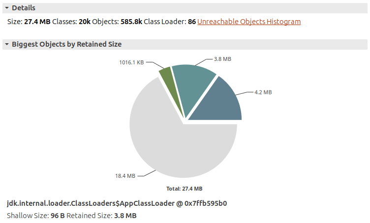
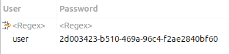
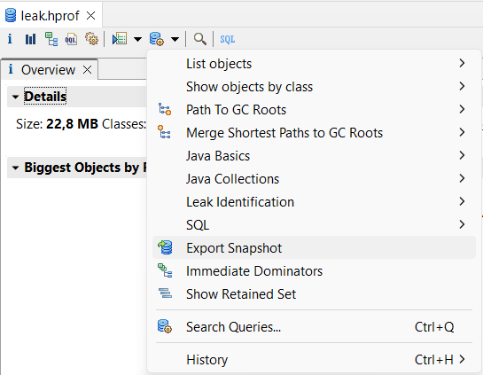
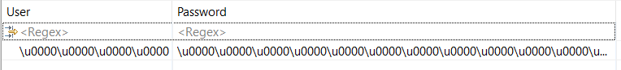
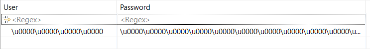
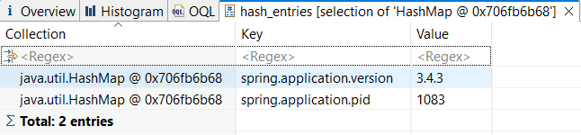
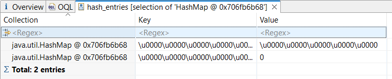

&nbsp;

{}

Heap-дампы JVM – бесценный источник информации при разборе аварий с OutOfMemory и оптимизации производительности. Но вместе с тем они же – потенциальные каналы утечки данных, ведь будучи снятыми с боевого сервиса, дампы уносят в себе всё, с чем работал сервис на момент снимка: логины, пароли (иногда в открытом виде), важные ID и т.п. – словом, всяческие sensitive данные, которые не нужны для анализа, но которые навлекают на получателя дампа серьёзную ответственность и риски. Как этого избежать без ущерба делу – разбираемся в этой статье.

### Введение

Для начала возьмём лабораторный, но реалистичный пример – [Spring PetClinic REST](https://github.com/spring-petclinic/spring-petclinic-rest) – бэкендовую версию популярного демо-приложения. Эта версия из коробки [включает](https://github.com/spring-petclinic/spring-petclinic-rest?tab=readme-ov-file#security-configuration) Spring Security, который, в свою очередь, при каждом запуске генерирует пароль для ограничения доступа к методам API. И хотя пароль там “игрушечный” (логируется в открытом виде на старте приложения), механизм его попадания в память и дальнейшего распространения вполне соответствует реальным кейсам у других конфиденциальных данных, поэтому для примера он нам подходит.

Прежде чем искать варианты решения проблемы, надо её **увидеть**. Благо, на выбранном примере для этого достаточно:

1. Склонировать репозиторий:  
  `git clone https://github.com/spring-petclinic/spring-petclinic-rest.git`
2. Открыть его в OpenIDE или другой среде разработки
3. Открыть там же (или отдельно) терминал и выполнить:  
   `./mvnw spring-boot:run`.

Эта команда запустит PetClinic с дефолтными настройками (со встроенной БД). 

Дальше снимаем дамп памяти и открываем его для анализа, например, с помощью [Eclipse MAT](https://eclipse.dev/mat/download/) (`File -> Acquire Heap Dump…`):



Среди этих полумиллиона объектов конфиденциальными данными может оказаться что угодно, поэтому ни в Eclipse MAT, ни в других популярных opensource-инструментах нет волшебной кнопки “*Покажи мне все возможные утечки*”. Зато в них (в частности, в MAT и VisualVM) есть возможность выполнять SQL-подобные запросы к дампу, выуживая таким образом наиболее подозрительные объекты для проверки.

Основная идея этого подхода в том, что каждый класс представляется как таблица, каждое поле класса – как столбец таблицы, а каждый экземпляр – как её строка. Подробнее об этом можно узнать, например, из моего [доклада](https://toparvion.pro/event/2024/joker/) на Joker 2024.

В данном случае из описания и исходников проекта мы знаем, что Spring Security используется в самом простом режиме, когда все данные для доступа хранятся прямо в памяти, а сами явки-пароли представлены классом `org.springframework.boot.autoconfigure.security.SecurityProperties.User`:

```java
public static class User {
  /**
   * Default user name.
   */
  private String name = "user";

  /**
   * Password for the default user name.
   */
  private String password = UUID.randomUUID().toString();
```

Этого достаточно, чтобы составить вот такой OQL–запрос к дампу:

```sql
SELECT toString(user.name) AS User, toString(user.password) AS Password 
FROM org.springframework.boot.security.autoconfigure.SecurityProperties$User user
```

 Запрос вернёт логин и пароль, действовавший на момент снятия дампа:



**:dart: Вот от этих данных нам и нужно избавиться перед передачей дампа кому бы то ни было.**

Аналогичным образом, опираясь на знания бизнес-логики и внутреннего устройства приложения, можно составить несколько OQL-запросов, точечно проверяющих присутствие sensitive данных в дампе.

А дальше нужно понять, как и чем их можно вычистить.


### Способ 1. Eclipse MAT

Раз уж мы упомянули [Memory Analyzing Tool](https://eclipse.dev/mat/), было бы логично прояснить его возможности по устранению конфиденциальных данных в дампах. Возможности такие у него есть, правда, расположены не в самом очевидном месте – нужно вызвать контекстное меню какого-либо элемента дампа и выбрать **Export Snapshot**:



Вообще, это довольно мощная фича MAT’а, с помощью которой можно выделять из дампа различные срезы, всячески их преобразовывать и сохранять в виде нового дампа так, будто он изначально был снят таким. Как не трудно догадаться, на эти рельсы хорошо ложится и обфускация данных. Для неё в диалоге экспорта предусмотрено несколько параметров. Главный из них – **redact** – поддерживает следующие значения:

* **NONE** – не меняет ничего;
* **NAMES** – пытается обфусцировать только имена классов, полей и методов. Работает в связке с параметром **map** (см. ниже). Здесь ключевое слово “пытается”, потому что этот подход сопряжен с кучей условностей и ограничений. Подробнее см. в [справке](https://help.eclipse.org/latest/topic/org.eclipse.mat.ui.help/tasks/exportdump.html?cp=40_3_13) на MAT.
* **BASIC** – обнуляет все массивы `char`, `int` и `byte`, а также поля классов с типами `char` и `byte`. Это позволяет устранить большинство строковых паролей, а также приватных ключей, которые нередко представлены объектами `BigInteger`. Но оставляет нетронутыми поля всех остальных примитивных типов, а также их массивов, что может быть как полезно для анализа, так и опасно с т.з. утечек. Если же безопасность превыше всего, то есть вариант:
* **FULL** – обнуляет вообще все поля и массивы, а заодно и `false`-ифицирует все `boolean`'ы. Щадит только ссылки на объекты и размеры массивов, чтобы не ломать структуру дампа и сохранить его пригодность для анализа.

Второй релевантный нам параметр – **map** – указывает на `properties`-файл, в который прописываются соответствия между оригинальными именами классов приложения и их обфусцированными версиями. Это может пригодиться, если вы собираетесь отдать дамп на анализ внешнему подрядчику и не хотите, чтобы он знал, чем занимается ваше приложение. Eclipse MAT генерирует этот файл сам, но если у вас есть лишний рабочий день и вы хотите наверняка сбить с толку вероятного противника, можете прописать эти сопоставления сами: для рассматриваемого примера их понадобится всего 77,5 тысяч. Столько набегает за счёт того, что в маппинг также попадают имена статических полей, а ещё сгенерированные и анонимные классы (включая лямбды). Выглядит это примерно так:

```properties
org.springframework.boot.web.server.WebServer=xod.kloblaiwaiwreen.quak.lur.thiarm.Seotreure
org.jspecify.annotations.NonNull=xod.sheopluy.pouprukliel.Trawuak
org.h2.engine.User@passwordHash=xod.gj.exiosy.Knud@tuhoucudruag
jdk.proxy3.$Proxy105@m9=vuz.briarb.$Fliwoorm@EI
io.swagger.v3.core.util.PrimitiveType@NUMBER=ar.gioliob.is.wras.kind.Graclanaiflob@KREART
org.apache.logging.log4j.MarkerManager$$Lambda=xod.froark.pooniek.luand.Cequiayuaniats$Klourt
```

Чтобы не перестараться и не сломать парсинг самому себе, Eclipse MAT по умолчанию исключает из обфускации классы пакетов `java.*` и даёт исключить другие через параметр **skip** (регулярное выражение).

Наконец, чтобы провернуть обратную операцию, т.е. восстановить дамп с исходными именами классов, можно воспользоваться параметром **undo**, а именно:

1. Открыть обфусцированный дамп в MAT
2. Снова выбрать пункт *Export Snapshot*
3. Указать путь для сохранения восстановленного дампа
4. Указать путь к `properties`-файлу с маппингом (он будет только читаться)
5. Поставить галочку **undo** (параметр **redact** должен остаться в **NONE**)

Таким образом можно не хранить у себя исходную копию дампа с оригинальными именами классов, а при необходимости воссоздать её из обфусцированной версии, используя файл маппинга в качестве своеобразного “ключа восстановления”. Только важно помнить, что этот финт не годится для полей/массивов/примитивов внутри классов, так как если они были обфусцированы режимами **redact=BASIC** или **FULL**, то этот фарш назад уже не провернуть…

Давайте вспомним, что наша основная задача – вычистить пароль Spring Security, а не засекретить все имена классов, поэтому проверим наличие пароля в дампе тем же OQL-запросом после обфускации в режиме **redact=BASIC**:



Как видно, здесь теперь царит безопасность…

В целом, неплохо, но смущает, что для экспорта дампа нам потребовалось открыть его исходную версию и что-то поделать с ней руками, а значит, мы могли увидеть в ней “лишние” данные, что уже влечёт за собой риски, ответственность и вот это всё. К счастью, Eclipse MAT поддерживает т.н. [Batch Mode](https://help.eclipse.org/latest/topic/org.eclipse.mat.ui.help/tasks/batch.html?cp=40_3_14) – возможность выполнять некоторые операции без пользовательского ввода, то есть через CLI. Входной точкой этого режима является скрипт `ParseHeapDump.[sh|bat]` в корневой директории MAT. Как подсказывает имя, изначально скрипт предназначен для автономного парсинга (больших) дампов, но его же можно использовать для других задач, указывая их имена в качестве аргументов. Для экспорта дампа с обфускацией это может выглядеть примерно так:

```shell
./ParseHeapDump.sh plain.hprof -output=redacted.hprof -redact=BASIC org.eclipse.mat.hprof:export
```

Здесь же можно указывать и другие опции из диалога *Export Heap Dump…*, например, файл маппинга имен классов `-map=myheapdump2.map`. А если и этого мало, то можно вызвать всё это программно через [Memory Analyzer API](https://help.eclipse.org/latest/topic/org.eclipse.mat.ui.help/doc/org/eclipse/mat/hprof/ExportHprof.html) и докрутить нужные поведения уже на уровне Java.

{}
Для тех, у кого приведенные здесь манипуляции вызвали больше вопросов, чем понимания, или кто в принципе мало знаком с дампами и их анализом в Eclipse MAT, есть [специальный тренинг](https://java-perf-training.github.io/#plan), где можно не только разобраться с этой темой в теории, но и закрепить знания на практике с лабораторным приложением.
{}

И вот, казалось бы, у нас есть всё, что нужно – и гибкие настройки обфускации, и автономный режим, и, конечно, желаемый результат. Но за всё это приходится платить, и валюта здесь – память и время:

* для работы с дампом Eclipse MAT должен его распарсить, а для этого ему нужно, в среднем, столько же **оперативной памяти**, сколько весит сам дамп;
  *  как парсить большие дампы при малом объёме RAM, можно почитать в [этой заметке](https://t.me/stopshelf/227).
* при парсинге MAT производит много вспомогательных индексов, размер которых может *в разы* превосходить размер исходного дампа, поэтому нужно много **места на диске**;
  * при этом удалить исходный дамп после парсинга нельзя – он всё равно остаётся частью общей структуры данных;
* парсинг состоит из множества этапов, включающих многократные обходы исходного дампа, поэтому на больших объёмах это может занимать **много времени**;
  * у автора этих строк был период оптимизации одного сервера (64 GB RAM), когда можно было делать фиксы не чаще раза в день, потому что каждый новый дамп парсился по 4-5 часов (по ночам).

Да и сам Eclipse MAT – тот ещё комбайн: его дистрибутив весит под 100 МБ, поэтому если стоит задача включить его в состав CI/CD в качестве автоматического этапа обфускации дампов, полученных с боевого сервера, то этот инструмент – не лучший выбор. К счастью, есть альтернативы.


### Способ 2. Heap Dump Tool

Компания PayPal, тесно работая с платёжными данными и имея часть приложений на JVM, вероятно, много сталкивалась с необходимостью анализа “опасных” heap-дампов, поэтому разработала для этого специальный инструмент **[heap-dump-tool](https://github.com/paypal/heap-dump-tool)** и выложила его в open source.

Это CLI-инструмент под конкретную задачу – на вход подаёте исходный дамп, на выходе получаете “дезинфицированный”: 

```shell
$ java -jar heap-dump-tool.jar sanitize leak.hprof sanitized.hprof
INFO  Application - heap-dump-tool (1.3.4 ca0325a, 2025-11-29T02:48:26.000-0800)
INFO  SanitizeCommandProcessor - Pre-processing ...
INFO  SanitizeCommandProcessor -     String fields to exclude from sanitization: java.lang.Thread#name,java.lang.ThreadGroup#name
INFO  SanitizeCommandProcessor -     Force match String.coder: true
INFO  SanitizeCommandProcessor - Input File: leak.hprof
INFO  SanitizeCommandProcessor - Starting heap dump sanitization ...
INFO  SanitizeCommandProcessor - Input File: leak.hprof
INFO  SanitizeCommandProcessor - Output File: sanitized.hprof
INFO  SanitizeCommandProcessor - Finished heap dump sanitization in 13s
```

Если на получившемся дампе выполнить тот же OQL-запрос на выявление пароля, то он выдаст примерно следующее:



, т.е. сплошную безопасность.

Однако это не вся картина – на самом деле, по умолчанию Heap Dump Tool очищает **только байтовые и символьные массивы**, а целочисленные, дробные и другие значения (в том числе массивы) сохраняет нетронутыми. Это может оставить лазейку для утечки, если, например, в каком-то целочисленном поле хранился персональный ID клиента или сумма денег на его счету (кое-где есть практика хранить денежные суммы в минимальных единицах валюты). Для таких случаев при вызове утилиты нужно добавить флажок `--sanitize-byte-char-arrays-only=false` (или кратко `-s=false`), и тогда вообще все примитивы и их массивы пойдут “под нож”.

Такой режим не включен по умолчанию, вероятно, потому, что может усложнить дальнейший анализ. Разберём на примере. Допустим, нам нужно сопоставить данные дампа с метриками ОС или иной внешней телеметрией. Одним из главных “мостиков” для этого послужит PID процесса. И хотя его можно получить разными способами, удобнее всего было бы взять его напрямую из дампа – в случае Spring Boot для этого достаточно выполнить вот такой OQL-запрос:

```sql
SELECT OBJECTS s.source
 FROM org.springframework.boot.ApplicationInfoPropertySource s
```

Для исходного (“сырого”) дампа он вернёт HashMap примерно с таким содержимым:

 

Однако после обфускации этот результат, очевидно, изменится. И если `spring.application.version` нам не спасти в любом случае (так как это строковое значение), то целостность `spring.application.pid` целиком зависит от флага `--sanitize-byte-char-arrays-only`:

* при значении `true` (по умолчанию) PID уцелеет
* а при `false` содержимое мапы будет примерно таким:



, т.е. максимально “безопасным”.

Если бы PID был записан в отдельное поле какого-либо класса, его ещё можно было бы спасти опцией ` --exclude-string-fields` (кратко `-e`), которая говорит обфускатору, какие поля каких классов нужно оставить нетронутыми. По умолчанию такими полями являются только имена потоков и их групп (см. фрагмент лога выше).

У особо ~~занудного~~ внимательного читателя здесь может возникнуть вопрос:
> Зачем указывать команду `sanitize`, если инструмент и так создан для этого?

Дело в том, что он умеет не только обрабатывать готовые дампы, но и снимать их, причём снимать с приложений в контейнерах (в том числе когда сам запущен в контейнере). Для этого нужно сменить команду `sanitize` на `capture`, а путь к дампу – на имя целевого контейнера. В этом случае снятый дамп будет лежать внутри **целевого** контейнера и его нужно будет забрать оттуда руками (если успеете, пока его не прибил какой-нибудь Kubernetes).

Даже не вникая в остальные возможности этого инструмента, уже должно стать ясно, что он хорошо подходит для нашей задачи:

* вычищает пароли из дампа даже с умолчательными настройками
* позволяет влиять на степень “дезинфекции”
* не требует парсинга дампа
* поставляется одним JAR-файлом (сделан на Spring Boot + PicoCLI)
* хорошо встраивается в CI/CD за счёт CLI-интерфейса.

Но куда ж без минусов:

* На огромных дампах инструмент может потребовать приседаний: под капотом он [использует](https://github.com/paypal/heap-dump-tool/blob/76a45d56540ecf39773675b8c028d4f9f662a1e4/src/main/java/com/paypal/heapdumptool/sanitizer/SanitizeStreamFactory.java#L34) обычный `BufferedInputStream` с размером буфера 100 Мб. И если на небольших дампах этого вполне хватает, то по мере роста их размера можно оказаться перед неприятным выбором: либо дольше ждать при их чтении/записи, либо выделять сильно больше памяти под буфер.
* В особо ~~упоротых~~ специфичных случаях может потребоваться кастомная логика обфускации, но heap-dump-tool не предоставляет возможностей по её модификации, а форкать его ради этого – затея сомнительная. 

Едва ли много кто сталкивается с этими проблемами, но если вдруг, то вот вариант и на этот случай:


### Способ 3. Hprof-redact

Широко известный в узких кругах JVM-спец [Johannes Bechberger](https://mostlynerdless.de/blog/author/parttimenerd/) является автором множества полезных утилит для анализа и оптимизации производительности. И недавно [с подачи](https://mostlynerdless.de/blog/2026/02/13/redacting-sensitive-data-from-java-flight-recorder-files/#comment-57251) другого известного в Java мире эксперта Volker’а Simonis’а он выпустил **[hprof-redact](https://github.com/parttimenerd/hprof-redact)** – инструмент для обфускации дампов памяти перед передачей на анализ.

Инструмент во многом похож на описанный выше Heap Dump Tool:

* тоже CLI
* тоже поставляется одним JAR-архивом
* тоже предлагает разные режимы редактирования данных.

Но на этом основные сходства заканчиваются и начинаются различия:

* по [заявлению](https://github.com/parttimenerd/hprof-redact?tab=readme-ov-file#:~:text=This%20is%20currently%20just%20an%20early%20prototype) автора, это не полноценный инструмент, а прототип (proof-of-concept) 
* читает дампы в поточном режиме:
  * из плюсов: не требует тюнинга буфера для больших дампов
  * из минусов: делает два полных прохода по дампу, поэтому работает всё равно не мгновенно;
* управляет редактированием через т.н. *трансформеры*, коих из коробки в версии 0.2.1 (февраль 2026) было три:
  * **zero** (умолчательный) – обнуляет все примитивы и заменяет содержимое строк нулями;
  * **zero-strings** – тоже заменяет содержимое строк нулями, но оставляет примитивы нетронутыми;
  * **drop-strings** – делает все строки пустыми (нулевой длины), но оставляет примитивы нетронутыми.

Последний пункт, к слову, является главным дизайнерским отличием hprof-redact от heap-dump-tool, поскольку трансформер – это часть публичного API инструмента, что позволяет при необходимости написать собственную логику обфускации, имплементировав развесистый, но полностью опциональный интерфейс [HprofTransformer](https://github.com/parttimenerd/hprof-redact/blob/main/src/main/java/me/bechberger/hprof/transformer/HprofTransformer.java).

Отдельно для hrpof-redact стоит упомянуть **сжатие дампа при обработке**. Оно есть и в других инструментах, но Eclipse MAT и heap-dump-tool реализуют его обычным GZip-ом, а у hprof-redact [иной подход](https://github.com/parttimenerd/hprof-redact?tab=readme-ov-file#compression-format) –  он опустошает строки и примитивные массивы, сохраняя при этом информацию об их исходной длине. В этом смысле такое сжатие не совсем честно, ведь оно теряет данные без возможности восстановления. Однако и цель у него немного иная – оно призвано сократить объём дампа, сохранив его *структурную*, но не содержательную идентичность.

В отличие от heap-dump-tool, утилита hprof-redact по умолчанию вычищает не только строки, но и примитивы (включая их массивы), поэтому оба приведенных выше OQL-запроса (для выявления пароля и получения PID+версии приложения) вернут большое… ничего. Всё на радость отделу ИБ.

В целом, hprof-redact пока сложно считать полноценным решением, поскольку он создан совсем недавно и пока что предоставляет не особо много возможностей. Однако он может стать достойной альтернативной тому же heap-dump-tool’у в случаях, когда требуется особая логика обфускации данных в дампе и вы готовы прописать её программно.


### ~~Способ 4. JDK~~

Вообще, прежде чем рассматривать какие-то сторонние инструменты, было бы логичнее поинтересоваться, а нет ли в самом JDK чего-то готового? Ответ: сейчас нет, но обсуждения ведутся.

В JIRA проекта OpenJDK есть тикет [JDK-8337517](https://bugs.openjdk.org/browse/JDK-8337517), в котором предлагается доработать утилиту jcmd, а также добавить новую JVM-опцию `-XX:+HeapDumpRedacted`, чтобы и та, и другая на выходе давали дезинфицированный дамп с занулёнными примитивами.  Под него также есть соответствующий [Pull Request](https://github.com/openjdk/jdk/pull/20409) на Github, однако он в статусе *Closed*, а сам тикет хоть и имеет статус *Open*, но поле *Fix Version(s)* у него в `tbd`, т.е. “когда-нибудь”.

Основными причинами такого расклада стали невысокий приоритет задачи и отсутствие (пока) у разработчиков и ревьюеров единого взгляда на то, как должна быть имплементирована эта фича: что именно нужно очищать, какими должны быть аргументы вызова и как быть с тем, что если JVM выдаст обфусцированный дамп, то взять оригинальный будет уже негде. В этом обсуждении участвует и небезызвестный нам Алексей Шипилёв, [комментируя](https://bugs.openjdk.org/browse/JDK-8337517?focusedId=14695155&page=com.atlassian.jira.plugin.system.issuetabpanels:comment-tabpanel#comment-14695155) в свойственной себе манере:

> … while most of the time the confidential data is in primitive arrays (key material, cipher buffers, string contents), primitive fields carry identifiable data as well, e.g. numeric account/transaction IDs. Even double/floats contain data often, think financial data or even (pants heavily) LLM weights.

hprof-redact является попыткой имплементировать эту фичу по исходной (авторской) задумке. Насколько (не)удачной она получилась – судить, в том числе, нам с вами, её пользователям, поэтому если у вас есть опыт её использования и соображения на его счёт, не стесняйтесь делиться ими, например, на [странице](https://mostlynerdless.de/blog/2026/02/24/redacting-data-from-heap-dumps-via-hprof-redact/) разработчика или через [GitHub issues](https://github.com/parttimenerd/hprof-redact/issues).


### Заключение

Для дезинфекции дампов перед их анализом существует не так уж много бесплатных инструментов. А основных среди них и вовсе только два:

* [**Eclipse MAT**](https://eclipse.dev/mat/) – мощный, но тяжелый; требует многих приседаний, но предоставляет максимальную свободу действий (GUI / CLI / API);
* [**heap-dump-tool**](https://github.com/paypal/heap-dump-tool) – не богатый, зато лёгкий; отлично встраивается в pipeline’ы; умеет не всё, но многое (CLI / API).

Особнячком от них стоит совсем новый инструмент [hprof-redact](https://github.com/parttimenerd/hprof-redact), во многом похожий на heap-dump-tool, но делающий ставку на гибкость Java API и поддержку больших дампов.

Чуть более формальное сравнение этих инструментов, во многом основанное на субъективных оценках автора, приведено в этой таблице:

| Фича\инструмент               | Eclipse MAT | Heap Dump Tool | Hprof-redact |
| ----------------------------- | ----------- | -------------- | ------------ |
| Работа с большими дампами     | 👍           | 👍👍             | 👍👍👍          |
| Поддержка Docker контейнеров  | ❌           | ✅              | ❌            |
| Гибкость настроек обфускации  | 👍👍👍         | 👍              | 👍👍           |
| Сжатие при обфускации         | ✅ (zip)     | ✅ (zip)        | ✅ (hprof)    |
| Гибкость API                  | 👍👍👍         | 👍              | 👍👍           |
| Загрузка дампов в формате TAR | ❌           | ✅              | ❌            |
| Пригодность для CI/CD         | 👍           | 👍👍             | 👍👍           |

Если вам доводилось решать такую задачу с помощью этих или иных инструментов, расскажите, пожалуйста, об этом в комментариях – ваш опыт станет отличным дополнением к этой статье.
