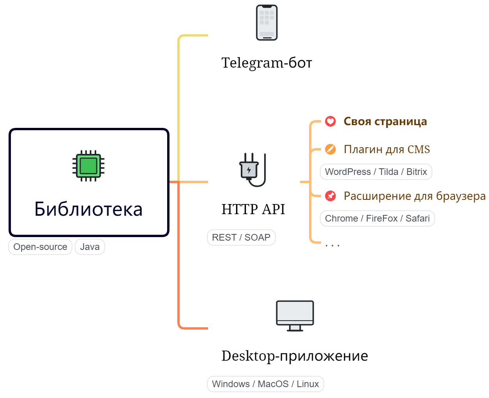
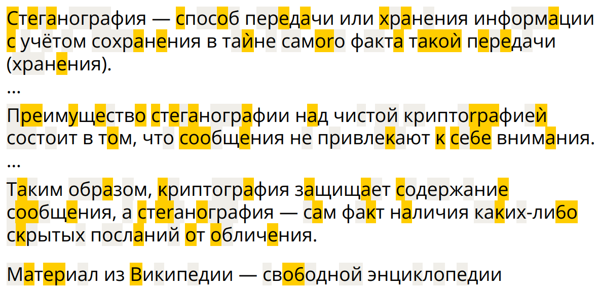

**StegoText** &mdash; программный сервис для работы с прозрачными метаданными в цифровых текстах. Другими словами, это семейство приложений (и библиотека), которые позволяют добавлять в цифровой текст дополнительную информацию таким образом, что внешний вид текста не меняется. Считывать её тоже умеют.

#### Предыстория

Родившийся как инженерная головоломка ещё в студенческие годы, основной алгоритм сервиса несколько раз заставлял меня почесать затылок (с перерывами в несколько лет). И вот на очередной итерации осенью 2022-го года мне в голову пришло решение, достойное проверки в виде программной имплементации. Как вскоре выяснилось, схожее решение до меня уже [предлагали](https://www.researchgate.net/publication/308044170_Content-preserving_Text_Watermarking_through_Unicode_Homoglyph_Substitution) учёные из Университета Болоньи в Италии, но всё же отличий в реализации было достаточно много, чтобы я не отказался от своей идеи.

Больше того, весной 2023-го года я озвучил её на т.н. открытом микрофоне (“Easy Pitch”) перед экспертами Новосибирского [АкадемПарка](https://academpark.com) и получил от них позитивную обратную связь, а вместе с ней и бесплатный билет на прохождение бизнес-акселератора А:Старт, проводимого там же. Проект StegoText стал одним из [победителей](https://academpark.com/media/news/26442/) акселератора, благодаря чему я получил статус резидента бизнес-инкубатора АкадемПарка.

#### Компоненты

Чтобы быть полезным в максимальном числе областей применения, StegoText проектируется и поставляется как семейство программных компонентов для разных уровней интеграции — от встраиваемой библиотеки до пользовательского интерфейса:

Из них на момент написания этих строк (14.10.24) в публичном доступе есть только [бот](https://t.me/StegoTextBot) в Telegram, своя [страница](https://stegotext.ru) и HTTP (REST) API.

#### Принцип действия

Внутри StegoText применяется две методики кодирования. Обе они эксплуатируют особенности кодирования символов в Юникоде, но одна опирается на невидимые символы (т.н. ZWC – zero-width characters), а вторая – на омоглифы – символы схожего начертания. Схематично результат применения второй методики выглядит так:

Здесь символы с желтым фоном – подмененные, символы с серым фоном – не подменённые, но значимые, а символы без фона – оставленные как есть. Разумеется, обычно такой подсветки нет, поэтому отличить исходный текст от стеготекста без специальных средств, как правило, нельзя.

Подробнее о внутреннем устройстве сервиса, его возможностях и ограничениях можно почитать в посвящённом ему Telegram-канале [StegoTrend](https://t.me/StegoTrend).
